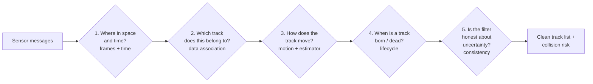
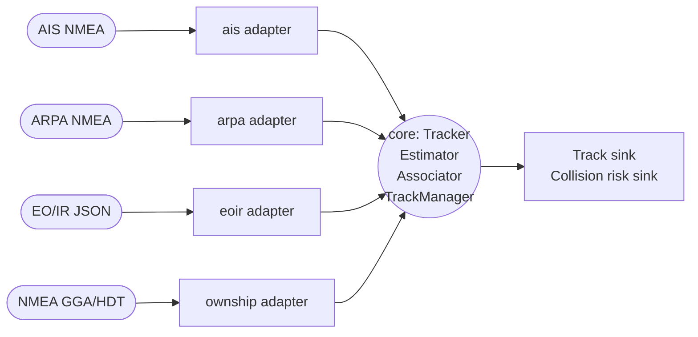

# 01 — Introduction to maritime tracking

> Prerequisites: none.
> Next: [02 — Probability refresher](02-probability-refresher.md).

## 1. What is this thing called "tracking"?

Imagine you are standing on the bridge of a ship. Around you, the
sea is full of other vessels. Some are big and broadcast their
identity over **AIS** (Automatic Identification System). Some are
small fishing boats with no AIS at all. Some are seen by your
**radar** as bright blobs that move. Some are seen by your **camera**
as a tiny dot on the horizon. Some you see by all four sensors at
once. Some are not really there — a wave, a bird, a radar reflection
from a wave crest.

You want **one clean list** of the vessels around you:
*"There are seven vessels. Vessel #3 is at this position, moving at
that speed, heading there. We last heard from it 0.4 seconds ago.
It is the same vessel #3 we have been seeing for the past 12 minutes."*

That clean list is what navtracker produces. The act of producing
it is called **tracking**.

Three properties matter:

1. **Fusion** — the list does not care which sensor saw what.
   AIS, ARPA, EO/IR, own-ship — all flow into the same track.
2. **Identity** — vessel #3 is the same `track_id` from one second
   to the next, even when a sensor drops out for a while.
3. **Uncertainty** — every position and velocity comes with a
   covariance. The user (or the autopilot) needs to know how much
   to trust the number.

## 2. Why is this hard?

If every sensor was perfect, this would not be a problem. You would
just take the measurement and write it down. But every sensor lies in
a different way:

```
Sensor      What it sees                What can go wrong
─────────────────────────────────────────────────────────────────
AIS         Vessel-reported lat/lon,    Vessel turned off AIS.
            COG, SOG, MMSI              Spoofed identity.
                                        Stale (30+ s old).

ARPA        Range, bearing from         Wave clutter (false blobs).
            ship's radar                Sea state hides small targets.
                                        Two targets close → one blob.

EO/IR       Pixel position of a hot     Sun glare, clouds, false
            object. Sometimes a class   detections, no range info.

Own-ship    Our own GPS lat/lon,        Heading bias from gyro drift.
            heading, speed              GPS dropout in covered areas.
```

So the fundamental problem of tracking is: **given a noisy, biased,
intermittent, sometimes-lying flood of measurements from different
sensors, recover the underlying truth about each vessel.**

This is *exactly* the problem **Bayesian estimation** was invented
to solve. Everything in this codebase is, at heart, an instance of
Bayesian estimation. That is why chapter 03 spends so much time on
it.

## 3. The five sub-problems

To go from "messy sensor input" to "clean list of vessels", we
split the problem into five sub-problems. Each chapter in this
series belongs to one of them.



| Sub-problem                  | Covered by chapters             |
|------------------------------|---------------------------------|
| Frames and time              | 10                              |
| Estimation (state + cov)     | 02, 03, 04, 05, 06, 07, 08, 09  |
| Data association             | 11, 12, 14                      |
| Detection model + clutter    | 13                              |
| Track lifecycle              | 15                              |
| Consistency (sanity)         | 16                              |
| Multi-sensor / bias          | 17                              |
| Output (CPA)                 | 18                              |

## 4. The "state" of a vessel

When we say *"the state of vessel #3 at time t"* we mean a small
vector of numbers that fully describes where the vessel is and how
it is moving. The simplest is:

```
x = [ px, py, vx, vy ]ᵀ
```

— east position, north position, east velocity, north velocity.
Four numbers. Coordinates are in a **local east-north-up (ENU)** plane
centred on a chosen point (the **datum**, usually own-ship).

This is the *Constant Velocity* (CV) state. It is the default in
navtracker. A richer state adds turn rate — chapter 08 explains why.

The state is never observed directly. Sensors observe **functions of
the state** with noise. AIS sees `[px, py, vx, vy]` plus error.
ARPA sees `[range, bearing]` plus error. EO/IR sees `[bearing]` plus
error. The tracker's job is to invert all these noisy observations
back into a best estimate of `x`, and a covariance matrix `P` that
says how sure we are.

## 5. The "track" is a state-with-history

A **track** is the running estimate of a vessel's state, plus its
history: when it was first seen, by which sensors, when it was last
seen, its lifecycle stage (Tentative, Confirmed, Coasting, Deleted),
its provenance. The state `(x, P)` is the bayesian part. The history
and identity are the bookkeeping part. Chapter 15 covers the
bookkeeping. Chapters 02–09 cover the bayesian part.

## 6. The architecture, briefly

navtracker is built **hexagonally**. There is a pure **core** that
knows about tracks, states, and Bayesian math but knows *nothing*
about AIS strings or radar protocols. Around the core there are
**adapters** that translate sensor messages into the core's
internal format. The adapters depend on the core, never the
reverse.



For library consumers there are two concrete types worth knowing
about up front:

- `Measurement` (`core/types/Measurement.hpp`) — what you feed in.
- `OwnShipPose` (`adapters/own_ship/OwnShipProvider.hpp`) — your GPS.

Everything else is internal. Read `CLAUDE.md` for the library
contract.

## 7. Words you will hear all the time

We define these properly in chapter 19, but for the rest of this
series you will see them constantly:

- **state** — the small vector of numbers we track per vessel.
- **measurement** — one noisy observation from one sensor.
- **predict step** — push the state forward in time using the
  motion model.
- **update step** — fold in a measurement; sharpen the state.
- **covariance** — the matrix that says how uncertain we are about
  the state.
- **innovation** — `measurement − predicted measurement`. The
  surprise.
- **gate** — a region around the predicted measurement; if a real
  measurement falls outside the gate, we do not associate it.
- **track** — the state plus its history and identity.

## 8. What this series will *not* teach you

- **NMEA parsing.** The adapters do that. Out of scope.
- **Specific sensor wire formats.** Same.
- **Generic C++.** We assume you already write C++.
- **All of probability theory.** Just enough.

When in doubt, prefer to teach less but better. If something is
unclear, please open a PR fixing the doc — these chapters are
living documents.

---

Next: [02 — Probability refresher](02-probability-refresher.md) →
