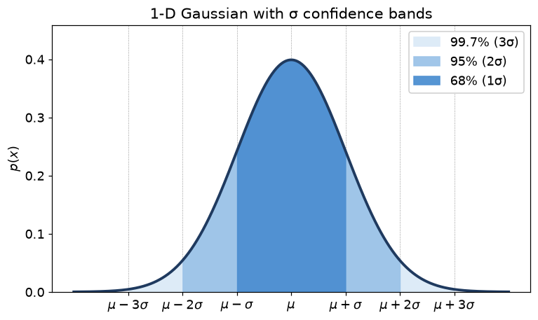
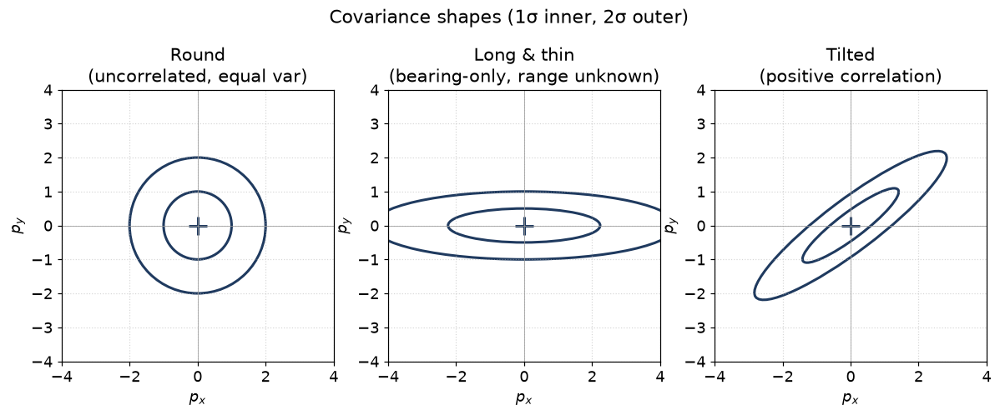
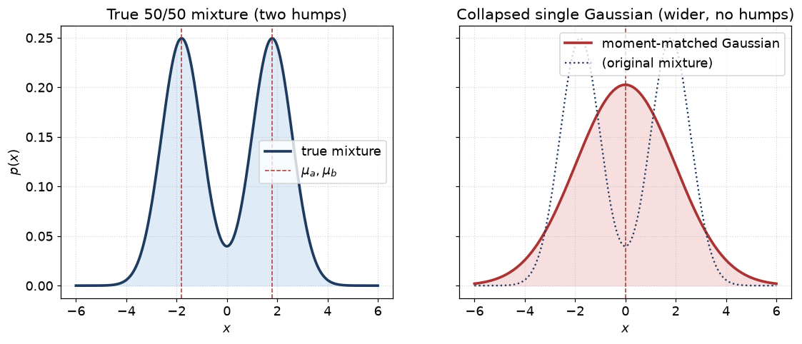

# 02 — Probability refresher

> Prerequisites: high-school statistics (mean, variance, normal
> distribution). Nothing more.
> Next: [03 — Bayes' rule and recursive estimation](03-bayes-and-recursion.md).

This chapter introduces the small amount of probability you need to
follow the rest of the series. We will not prove theorems. We will
build the *intuition* you need to read a Kalman filter or an MHT
hypothesis tree and understand what the numbers mean.

If you already think confidently in terms of multivariate Gaussians,
covariance matrices, conditional probability, and the law of total
probability, you can skip to chapter 03.

## 1. Random variables in one sentence

A **random variable** is a number that has uncertainty attached to
it. Instead of saying *"the vessel is at x = 1200 m"*, we say
*"the vessel is around x = 1200 m, give or take a few metres"*.

We describe the random variable by a **probability distribution**:
a function that tells us, for every possible value, how plausible
that value is.

In this codebase we almost always use one family of distributions:
the **Gaussian** (also called **normal**) distribution. Two
reasons:

1. It is fully described by just two numbers (mean + variance) for
   scalars, or a mean vector + covariance matrix for vectors. Easy
   to store, easy to compute with.
2. Sums of independent random things tend to be Gaussian (this is
   the **Central Limit Theorem**). So when many small errors stack
   up — sensor noise, vibration, integration drift — the result is
   usually Gaussian-shaped.

That is why we can build an entire tracker on top of "the state is
a Gaussian" without giving up too much accuracy.

## 2. Gaussian in one dimension

A scalar Gaussian is written:

```
x ~ N(μ, σ²)
```

— "x is a normal random variable with mean μ and variance σ²".
Its probability density is the bell curve you know:

```
p(x) = 1/(σ·√(2π)) · exp( -(x-μ)² / (2σ²) )
```

Picture, with the 68/95/99 % bands shaded:



The dark inner band is `μ ± σ` (≈ 68 %), the next is `μ ± 2σ`
(≈ 95 %), and the lightest is `μ ± 3σ` (≈ 99.7 %).

- **μ** (mean) is where the peak is.
- **σ** (standard deviation) is how wide the bell is.
- **σ²** is the variance. It is what the math actually uses.
  Standard deviation is just `√variance`.

Two facts to memorize:

- About **68 %** of the probability mass is within `μ ± σ`.
- About **95 %** is within `μ ± 2σ`.

These percentages are why people draw "1-sigma" and "2-sigma"
ellipses on radar displays. If a track has σ = 10 m, you are 95 %
sure the truth is within ±20 m.

## 3. Why we use the variance, not the standard deviation

Two reasons.

1. **Variances of independent random variables add.** If `a` has
   variance `σ_a²` and `b` has variance `σ_b²`, and they are
   independent, then `a + b` has variance `σ_a² + σ_b²`. Standard
   deviations *don't* add like this. So variance is the natural
   currency.
2. **The matrix generalisation is positive-semi-definite.** In
   multiple dimensions, "variance" becomes a **covariance matrix**.
   That matrix is positive-semi-definite (`xᵀPx ≥ 0` for all `x`),
   which lets us use Cholesky decomposition, square roots, and so
   on. The standard-deviation generalisation would not have those
   properties.

## 4. Going to many dimensions: the covariance matrix

Now imagine `x` is not a scalar but a vector. For us, often
`x = [px, py, vx, vy]ᵀ`. We need:

- A **mean vector** `μ` (length 4).
- A **covariance matrix** `P` (4×4).

`P` looks like this:

```
P =  ⎡ Var(px)      Cov(px,py)   Cov(px,vx)   Cov(px,vy) ⎤
     ⎢ Cov(py,px)   Var(py)      Cov(py,vx)   Cov(py,vy) ⎥
     ⎢ Cov(vx,px)   Cov(vx,py)   Var(vx)      Cov(vx,vy) ⎥
     ⎣ Cov(vy,px)   Cov(vy,py)   Cov(vy,vx)   Var(vy)    ⎦
```

The **diagonal** entries are variances — they describe how spread
out each component is on its own.

The **off-diagonal** entries are covariances — they describe how
two components vary *together*.

- `Cov(a, b) > 0`: when `a` is above its mean, `b` tends to also be
  above its mean.
- `Cov(a, b) < 0`: opposite.
- `Cov(a, b) = 0`: they vary independently of each other (well,
  approximately — see "uncorrelated ≠ independent" at the end).

For a tracker this matters because position and velocity are *not*
independent. If we know the vessel was at `px = 1200` and is moving
at `vx = +5 m/s`, in the next second it must be near `px = 1205`.
So `Cov(px, vx)` will be non-zero after even one time step. The KF
keeps track of this for you, automatically.

### Picturing it: the covariance ellipse

For a 2-D Gaussian (e.g. `[px, py]`), the level sets of the density
are **ellipses**. The covariance matrix `P` defines the shape and
orientation of those ellipses.

Three canonical shapes you will see daily in tracker output:



- **Round** (left) — uncorrelated and equal variance in both
  directions; we know position equally well in both.
- **Long & thin** (centre) — typical for *bearing-only* sensors:
  the cross-range is tightly constrained, the range is wide open.
- **Tilted** (right) — positive `Cov(px, py)` means *"when `px`
  is high, `py` tends to be high too"*; the axes of the ellipse
  rotate to reflect this.

- **Round** ellipse → uncertainty is the same in all directions.
- **Long, thin** ellipse → uncertainty is highly directional.
  Often this happens for a bearing-only sensor: you know the angle
  but not the distance, so the ellipse stretches along the line of
  sight.
- **Tilted** ellipse → the components are correlated.

The numbers `√λ_i` (where `λ_i` are the **eigenvalues** of `P`) tell
you the axis lengths. The **eigenvectors** tell you the axis
directions. Don't worry about eigenvalues now — when you see an
ellipse drawn in this series, just remember "covariance defines the
shape".

## 5. Conditional probability — what is it really?

`P(A | B)` is read as *"the probability of A, given that B has
happened"*. It is what you should believe about A after you have
been told B.

The formula:

```
P(A | B) = P(A and B) / P(B)
```

A picture in plain words: imagine all possible worlds. Some of them
have property A. Some of them have property B. Some have both.
`P(A | B)` says: *restrict to the worlds where B is true, and ask
what fraction of those also have A*.

Conditional probability is *the* central idea behind every filter
in this codebase. Every tracker is, fundamentally, a machine that
maintains

```
p(x_t  |  all measurements up to time t)
```

— *"what should I believe about the vessel state x_t, given
everything I have seen so far?"* — and updates this belief every
time a new measurement arrives. Chapter 03 makes this concrete.

## 6. Independence

Two random variables are **independent** when knowing one tells
you nothing about the other:

```
P(A and B) = P(A) · P(B)
```

Equivalently `P(A | B) = P(A)`.

For Gaussians, **uncorrelated implies independent** (this is *not*
true in general for non-Gaussians — be careful). So if we say two
Gaussian components have zero covariance, we are also saying they
are independent.

In navtracker we often *assume* sensor noises are independent of
each other and of the state. This is what lets us use simple
Bayes-rule updates instead of much harder joint inference.

## 7. The Law of Total Probability and marginalisation

Suppose you have a variable `x` (state) and a variable `m` (a
discrete mode, e.g. "vessel is in CV mode" vs "vessel is in CT
mode"). The joint distribution is `p(x, m)`. The **marginal**
distribution of `x` is what you get if you do not care about the
mode:

```
p(x) = Σ_m p(x, m) = Σ_m p(x | m) · p(m)
```

— *"sum the joint over all modes, weighted by mode probability"*.

This is exactly how the **IMM** filter (chapter 09) produces a
single best-estimate state from a bank of per-mode filters. It is
also how the **MHT** (chapter 14) produces a single best estimate
from a bank of per-hypothesis tracks.

For continuous variables, the sum becomes an integral. The idea is
the same.

## 8. Combining two Gaussians (product, mixture, sum)

This is so important we devote a section to it.

### 8.1 Product of two Gaussians — "what do they agree on?"

If you have two independent Gaussian beliefs about the *same*
quantity, you can combine them into a single sharper Gaussian. In
1D:

```
N(μ_a, σ_a²) · N(μ_b, σ_b²)  ∝  N(μ_c, σ_c²)
σ_c²  = 1 / (1/σ_a² + 1/σ_b²)
μ_c   = σ_c² · (μ_a/σ_a² + μ_b/σ_b²)
```

The new variance is *always smaller* than either of the input
variances. The new mean is a precision-weighted average. **This is
the Kalman-filter update step, in one line.** Chapter 04 will show
this in full.

### 8.2 Mixture of two Gaussians — "either one or the other"

A mixture is `p(x) = w_a · N(μ_a, P_a) + w_b · N(μ_b, P_b)` with
`w_a + w_b = 1`. It is *not* Gaussian — it can have two humps.

Picture (a 50/50 mixture of two 1-D Gaussians, and what happens
when we moment-match collapse it to a single Gaussian):



Left: the true mixture has two humps. Right: the moment-matched
single Gaussian is centred between them and is *wider* than
either component — its variance includes the gap between the
means. The collapse loses information — we cannot recover the two
humps afterwards — but is cheap. **JPDA and IMM both do this every
step.**

When we collapse a mixture to a single Gaussian (for storage or
display), we use **moment matching**:

```
μ = w_a μ_a + w_b μ_b
P = w_a (P_a + (μ_a − μ)(μ_a − μ)ᵀ)
  + w_b (P_b + (μ_b − μ)(μ_b − μ)ᵀ)
```

The new variance has two parts: the **average of the input
variances**, plus a **spread term** that accounts for the gap
between the input means. This is the JPDA and IMM collapse step.

### 8.3 Sum of two independent Gaussians — "stack uncertainties"

If `c = a + b` and `a ⊥ b`:

```
μ_c = μ_a + μ_b
P_c = P_a + P_b
```

Used everywhere. The KF predict step is one instance: the new
position uncertainty is the old position uncertainty *plus* the
new uncertainty from process noise over the interval.

## 9. The likelihood function

Given a Gaussian measurement model `z = h(x) + v` with
`v ~ N(0, R)`, the **likelihood** of observing `z` if the state
were `x` is:

```
ℓ(z | x) = N(z; h(x), R)
        ∝ exp( - ½ · (z − h(x))ᵀ R⁻¹ (z − h(x)) )
```

The exponent `(z − h(x))ᵀ R⁻¹ (z − h(x))` is so important it has a
name: **Mahalanobis distance squared**. We will spend chapter 11
on it.

It is the right way to ask *"how surprising is this measurement?"*
because it accounts for the noise level `R`. A 5-metre error is a
big surprise for a precise sensor (small `R`) but no surprise at
all for a noisy sensor (big `R`).

## 10. The log-likelihood

When likelihoods get very small (which they do, when you multiply
many of them together over time), they underflow to zero in
double-precision floating point. Solution: work in **log space**.

```
log ℓ(z | x) = − ½ · d² − ½ · log |2π R|
```

where `d²` is the Mahalanobis distance squared.

- Products become sums.
- Tiny numbers stay representable.
- The MHT score is exactly the log-likelihood-ratio over a track
  hypothesis, accumulated over many measurements. Without log
  space, scores would underflow within seconds.

## 11. Two warnings

**Uncorrelated ≠ independent (in general).** For two general
random variables, zero covariance does not imply independence. It
only does for Gaussians. We can rely on it because we assume
Gaussians.

**A "Gaussian" estimate is not the truth.** If the real
posterior is multimodal or skewed, the Gaussian we carry is a
*projection* of it onto the family of Gaussians. We lose
information. This is the original sin of every KF-family filter.
The UKF (06), the particle filter (07), and the MHT (14) each
fight back in a different way.

## 12. Cheat sheet

| Concept                          | Notation       | Meaning                                                   |
|----------------------------------|----------------|-----------------------------------------------------------|
| Mean                             | μ              | "Best guess"                                              |
| Variance / Covariance            | σ², P          | "How wrong might I be"                                    |
| Conditional                      | p(A \| B)      | "Probability of A given that B happened"                  |
| Independence                     | A ⊥ B          | Knowing one tells you nothing about the other             |
| Marginal                         | p(x) = Σ_m … | Sum out the things you don't care about                   |
| Mahalanobis distance²            | d² = yᵀ S⁻¹ y  | Distance scaled by uncertainty                            |
| Log-likelihood                   | log ℓ(z\|x)    | Numerically stable likelihood                             |

That is all the probability you need to read the rest of the
series.

---

Previous: [01 — Introduction](01-introduction.md)
Next: [03 — Bayes' rule and recursive estimation](03-bayes-and-recursion.md) →
