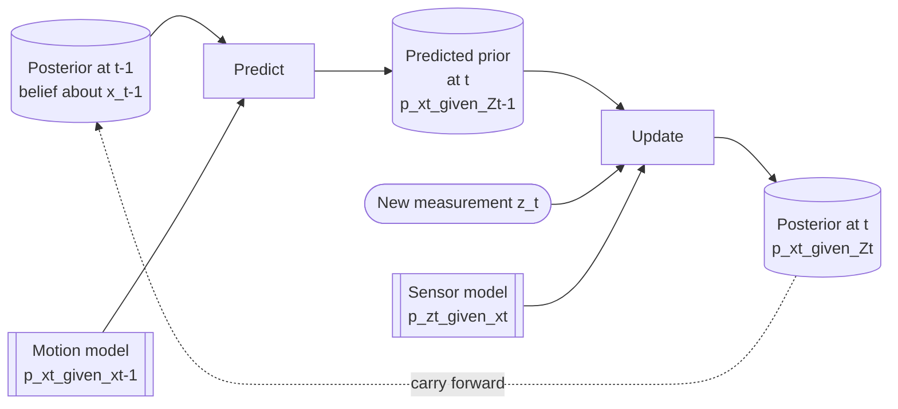

# 03 — Bayes' rule and recursive estimation

> Prerequisites: [02 — Probability refresher](02-probability-refresher.md).
> Next: [04 — The Kalman filter](04-kalman-filter.md).

This is the most important chapter in the series. **Every filter
in this codebase is an implementation of one equation.** If you
internalise this chapter, the next six chapters are just
"how do we make this equation cheap to compute for our case?".

## 1. The question we are answering

At time `t`, after observing a stream of measurements
`Z_t = {z_1, z_2, …, z_t}` from one or more sensors, we want to
know:

> **What should I believe about the state `x_t` of this vessel?**

The fully honest answer is a probability distribution:

```
p(x_t | Z_t)
```

— *"the probability density over states, given everything I have
seen so far"*. This thing is called the **posterior**.

That is the whole job. Tracking is "compute and maintain
`p(x_t | Z_t)` over time, for every vessel". Everything else is
implementation.

## 2. Bayes' rule

Bayes' rule rewrites the posterior in terms of two things you
*can* compute:

```
                    likelihood          prior
                 ┌──────────────┐  ┌────────────┐
                  p(z_t | x_t) · p(x_t | Z_{t-1})
p(x_t | Z_t) = ─────────────────────────────────────
                            p(z_t | Z_{t-1})
                         └──────────────┘
                            evidence
                         (normaliser)
```

In words:

- **Prior** `p(x_t | Z_{t-1})` — what I believed about `x_t`
  *before* I saw the new measurement `z_t`. This came from a
  predict step on yesterday's posterior.
- **Likelihood** `p(z_t | x_t)` — given a hypothetical state `x_t`,
  how likely is the measurement I just saw? This is *defined by
  the sensor model*. For Gaussian noise it is the Mahalanobis
  bell curve from chapter 02.
- **Evidence** `p(z_t | Z_{t-1})` — a scalar normalising constant
  that does not depend on `x_t`. We rarely compute it explicitly
  (often it cancels). When we *do* compute it, it has a great use
  in track scoring (chapter 15).
- **Posterior** `p(x_t | Z_t)` — what I believe *now*, after
  folding in `z_t`.

The intuition: *the posterior is proportional to the prior times
the likelihood*. We start with a guess, we see evidence, we update
the guess in proportion to how well the evidence fits.

## 3. Why "recursive" matters

A naïve implementation of Bayes would, on every update, re-process
*all* past measurements:

```
p(x_t | z_1, z_2, …, z_t)  ←  recompute from scratch
```

That is fine for one update, but after a few hours of sensor data
it is unworkable. Memory grows. CPU grows. Latency grows. For a
real-time tracker this is hopeless.

The way out is **recursive estimation**, which exploits the
**Markov property** of the state.

**Markov property.** *The current state contains everything you
need to predict the future. The past, given the present, is
irrelevant.*

For a vessel, this is approximately true: if I know its current
position and velocity, the past trajectory does not give me more
predictive power about the next second. (It is only approximate
because there are real maritime effects — manoeuvring intent,
crew habits — that violate strict Markov. We accept the
approximation.)

Under the Markov property, Bayes' rule splits into two
**recursive** steps that can be applied incrementally:

```
                Predict step          Update step
              ┌──────────────────┐   ┌──────────────────────┐
              │                  │   │                      │
p(x_{t-1}|Z_{t-1})  ──────▶  p(x_t|Z_{t-1})  ──────▶  p(x_t|Z_t)
   posterior at t-1            prior at t           posterior at t
```

The whole posterior history collapses to a single distribution
that we carry forward. **This is the Bayes filter.**

## 4. The two steps written out

### 4.1 Predict (a.k.a. "time update")

Given the posterior at `t-1` and a **motion model**
`p(x_t | x_{t-1})` that says how the state evolves through one
time step, compute:

```
p(x_t | Z_{t-1}) = ∫ p(x_t | x_{t-1}) · p(x_{t-1} | Z_{t-1}) dx_{t-1}
```

In words: *integrate over all possible previous states, weighted by
how likely each one was and by how each one would transition
forward*.

For a linear-Gaussian motion model this integral has a closed form
and reduces to two matrix lines (`x ← Fx`, `P ← FPFᵀ + Q`).
Without Gaussian assumptions you need particles (chapter 07).

### 4.2 Update (a.k.a. "measurement update")

Given the predicted prior and a new measurement `z_t` with sensor
model `p(z_t | x_t)`, apply Bayes:

```
p(x_t | Z_t) ∝ p(z_t | x_t) · p(x_t | Z_{t-1})
```

Normalise to make it a probability distribution. For
linear-Gaussian sensors this reduces to the Kalman update lines
in chapter 04.

## 5. The whole recipe in a picture



This loop runs forever, once per measurement, per track. Look at
this loop carefully. **Every chapter from here on is a different
way to compute the two boxes labelled "Predict" and "Update".**

| Family                   | How they compute predict/update                          |
|--------------------------|----------------------------------------------------------|
| Kalman filter (ch. 04)   | Closed form, assumes linear-Gaussian everything.         |
| EKF (ch. 05)             | Linearise nonlinearities (Jacobians), then KF math.      |
| UKF (ch. 06)             | Push *deterministic* sample points through nonlinearity. |
| Particle filter (ch. 07) | Push *random* samples through. No Gaussian assumption.   |
| IMM (ch. 09)             | Run several filters in parallel, mix between them.       |

The data-association story (chapters 11–14) is also Bayesian: when
you do not know which measurement belongs to which track, you
expand Bayes' rule over the unknown association. That is JPDA and
MHT.

## 6. Worked toy example (no matrices, just numbers)

Let us track a 1-D vessel position. The state is a single scalar
`x` (metres). The motion model says *"in one second, position
shifts by +5 m on average, but with ±1 m noise"*. The sensor sees
position with ±3 m noise.

### Step 0 — initial belief

We start out with a prior:

```
x_0 ~ N(μ=1000, σ²=100)   ← we are pretty sure it's near 1000 m
```

### Step 1 — predict to t = 1

Motion model is `x_t = x_{t-1} + 5 + w` with `w ~ N(0, 1²)`. The
predict step gives:

```
μ⁻ = 1000 + 5 = 1005
σ²⁻ = 100 + 1 = 101
```

The mean shifts forward. The variance grows (because the motion
noise adds uncertainty).

### Step 2 — receive measurement

Sensor reports `z_1 = 1008` with noise variance `R = 9`. The
likelihood says: *if x were 1008, this measurement is most likely;
if x were 990, this measurement is much less likely*.

### Step 3 — update

We combine `N(1005, 101)` (prior) and `N(1008, 9)` (likelihood)
using the product rule from chapter 02:

```
σ²⁺ = 1 / (1/101 + 1/9) ≈ 8.27
μ⁺  = σ²⁺ · (1005/101 + 1008/9) ≈ 1007.75
```

The posterior is `N(1007.75, 8.27)`. The variance shrunk from 101
to 8.27 — a huge gain. The mean snapped towards the sensor reading
(because the sensor is much more confident than the prior).

### Step 4 — back to predict for t = 2

We treat `N(1007.75, 8.27)` as the new posterior at `t = 1`. We
run the same predict step, get a prior at `t = 2`, update with the
next sensor reading, and so on, forever.

This is **the entire Kalman filter**. Chapter 04 just writes it
out in matrix form so it works for vectors.

## 7. Two intuitions to take with you

### 7.1 The filter is a weighted average

Every Kalman-family update is a weighted average between the
predict-step prior and the measurement. The weights are the
**inverse variances** (precisions). The component you trust more
gets a bigger weight. This is why the **Kalman gain** `K` (chapter
04) ends up being

```
K = P · Hᵀ · S⁻¹
```

— it is exactly the ratio of *prior precision* to *total
precision*, lifted into matrix form.

### 7.2 Uncertainty grows during predict, shrinks during update

If you remember nothing else, remember this:

```
Predict step  : variance grows (motion noise piles on).
Update step   : variance shrinks (a measurement removes uncertainty).
```

A healthy filter alternates between these two. If you predict for
too long without updates, uncertainty blows up. If you update
without predicting, you are using stale state. Both bugs occur in
real-world deployments.

## 8. What we have *not* solved yet

The Bayes-filter framework above assumes:

1. The **measurement clearly belongs to this track**. In a
   multi-target world this is not given. → chapters 11, 12, 14.
2. There is **always a measurement at every time step**. In
   reality, sensors miss detections. → chapter 13.
3. The motion model is **good enough**. In reality, vessels
   turn, accelerate, anchor. → chapters 08, 09.
4. The **uncertainty model is honest**. In reality, you may have
   tuned `R` and `Q` wrong. → chapter 16.

Each of those concerns gets its own chapter. But all of them sit
*on top* of the predict/update loop above. So you can never
forget the loop. It is the bedrock.

## 9. Why this matters in code

If you open any of the estimator classes
(`core/estimation/EkfEstimator.hpp`,
`core/estimation/UkfEstimator.hpp`,
`core/estimation/ParticleFilterEstimator.hpp`,
`core/estimation/ImmEstimator.hpp`), you will see two methods:

```cpp
void predict(Track& tr, Time t);
void update (Track& tr, const Measurement& z);
```

That is the Bayes-filter recursion. Different implementations,
same equation.

The orchestration around them (`core/pipeline/Tracker.cpp`,
`core/pipeline/MhtTracker.cpp`) is also Bayesian: it computes
likelihoods, normalises them across hypotheses, prunes
hypotheses with negligible posterior probability.

Once you see Bayes' rule, you cannot unsee it.

---

Previous: [02 — Probability refresher](02-probability-refresher.md)
Next: [04 — The Kalman filter](04-kalman-filter.md) →
