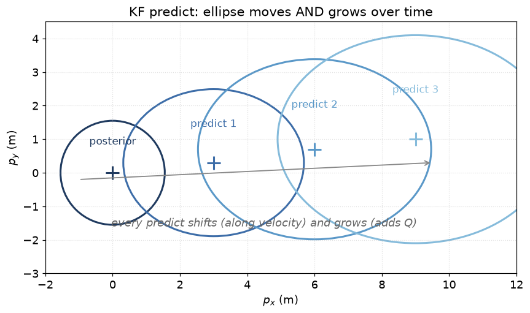
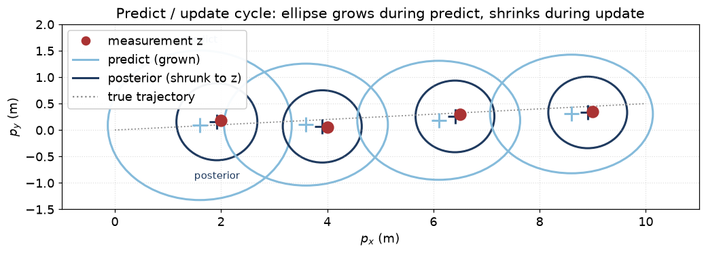
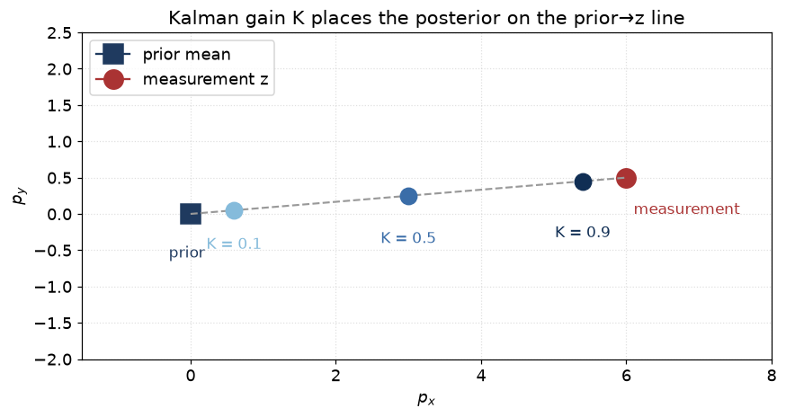

# 04 — The Kalman filter

> Prerequisites: [02 — Probability refresher](02-probability-refresher.md),
> [03 — Bayes' rule and recursive estimation](03-bayes-and-recursion.md).
> Next: [05 — The Extended Kalman Filter](05-extended-kalman-filter.md).

The Kalman filter (KF) is the **closed-form solution of the Bayes
recursion** when (a) the motion model is linear, (b) the sensor
model is linear, and (c) all noise is Gaussian. Under those three
assumptions, the posterior stays Gaussian forever, so you only
need to track two things — the mean and the covariance — instead
of an infinite-dimensional probability density.

That is why the KF is so efficient. It boils Bayes down to **a
handful of matrix lines per measurement**.

## 1. The model

A linear-Gaussian system:

```
x_t = F · x_{t-1} + w_t          (motion model)
z_t = H · x_t     + v_t          (measurement model)

w_t ~ N(0, Q)                    (process noise)
v_t ~ N(0, R)                    (measurement noise)
```

- `x_t` — the state vector (e.g. `[px, py, vx, vy]`).
- `F`   — the state transition matrix. For a 1-second predict with
  constant velocity, `F` shifts position by velocity·dt.
- `w_t` — process noise, captures everything the motion model
  cannot predict. Drawn fresh each step from `N(0, Q)`.
- `H`   — the measurement matrix. Picks out which parts of the
  state the sensor sees. For an AIS-style "position + velocity"
  measurement, `H = I_4`. For a "position only" measurement,
  `H = [[1,0,0,0],[0,1,0,0]]`.
- `v_t` — measurement noise, `N(0, R)`.

All four matrices may depend on `t` and `dt`; we drop the subscript
for readability.

## 2. The state of the world: `(x̂, P)`

The filter carries two things:

- `x̂` — the current best-guess mean of the state.
- `P`  — the current covariance, expressing how unsure we are.

Together `(x̂, P)` is the parameter pair of the Gaussian posterior
`p(x_t | Z_t) = N(x̂, P)`. Nothing else is needed. (No history of
old measurements, no history of old states. Markov, see chapter 03.)

## 3. The two steps

### 3.1 Predict

```
x̂⁻  = F · x̂                 (push the mean through F)
P⁻   = F · P · Fᵀ + Q         (push the covariance, add process noise)
```

The `⁻` superscript means "before the measurement at this time step
was applied".

Picture, in 2-D (position only), watching the ellipse move *and*
grow over time:



Every predict shifts the centre along the velocity direction and
inflates the ellipse by `Q`. Without an update to fold in new
evidence, this would grow forever.

Why does the covariance grow? Because the motion model is not
perfect — it loses information about the true state every step.
Mathematically, `Q` is added on top of `F P Fᵀ`. Geometrically, the
ellipse fattens.

### 3.2 Update

When measurement `z` arrives:

```
ŷ   = z − H · x̂⁻             (innovation: "surprise")
S   = H · P⁻ · Hᵀ + R          (innovation covariance: how surprising
                                we expected the surprise to be)
K   = P⁻ · Hᵀ · S⁻¹            (Kalman gain)
x̂   = x̂⁻ + K · ŷ              (posterior mean)
P   = (I − K · H) · P⁻         (posterior covariance)
```

This is it. Six lines. Everything that follows in this codebase is
either a special case, a nonlinear extension, or a multi-target
extension of these six lines.

## 4. What each line is doing in plain words

**`ŷ = z − H·x̂⁻`** — Take the measurement, predict what it
*should* have been if our state guess were right, subtract. The
difference `ŷ` is what we did not expect. Big innovation = big
update. Zero innovation = no change.

**`S = H·P⁻·Hᵀ + R`** — Estimate how big the innovation *should* be
on average, given our state uncertainty plus the sensor noise.
This is the predicted variance of `ŷ`. We will use it in two
places:
- as the denominator of the Kalman gain (line below);
- as the metric for **gating** (chapter 11) — anything whose
  Mahalanobis distance `ŷᵀ S⁻¹ ŷ` is huge is probably not from
  this track.

**`K = P⁻·Hᵀ·S⁻¹`** — The Kalman gain. Think of it as the *weight*
we give to the new measurement. Large `K` means "trust the
measurement, mostly ignore the prior"; small `K` means "trust the
prior, ignore the noisy measurement". Concretely:
- If `R` is tiny (precise sensor), `S` is small, `K` is large → we
  move a lot.
- If `P⁻` is tiny (very confident prior), `K` is small → we move
  little.

**`x̂ = x̂⁻ + K·ŷ`** — Apply the weighted update.

**`P = (I − K·H)·P⁻`** — Shrink the covariance, because we just
incorporated information. The fancier and numerically nicer
**Joseph form** `P = (I − KH) P⁻ (I − KH)ᵀ + K R Kᵀ` is sometimes
used; it stays symmetric and positive-definite even in the face of
roundoff. EKF/UKF in this codebase use the simple form because the
matrices are small and well-conditioned.

## 5. Picture: how the ellipse evolves



The light-blue ellipses are predicted priors (just grown by `Q`).
The dark-blue ellipses are posteriors after folding in the
red measurement: smaller *and* shifted toward the measurement.
This cycle repeats every measurement.

After many cycles the filter reaches a **steady state** where
predict and update growth/shrink balance out. The size of this
steady-state ellipse is the **track-quality** floor.

### What the Kalman gain actually does, geometrically

The Kalman gain `K` decides *how far along the line from prior mean
to measurement* the posterior mean lands.



When `R` is small (precise sensor) `K → 1`: posterior jumps to `z`.
When `P⁻` is small (confident prior) `K → 0`: posterior stays at
prior. Reality is always somewhere in between.

## 6. Why it works — the derivation in three sentences

You have a Gaussian prior `N(x̂⁻, P⁻)` and a Gaussian likelihood
`N(z; Hx̂⁻, HP⁻Hᵀ + R)`. Two Gaussians multiplied give another
Gaussian. The Kalman equations are simply the parameters of that
product.

That is the whole proof. Section 8.1 of chapter 02 already gave
you the 1-D version; the KF is just the matrix generalisation. If
you want the longhand derivation, any standard reference (e.g.
Bar-Shalom *Estimation with Applications to Tracking and
Navigation*, chapter 5) will spell it out. We do not need it for
the code review.

## 7. Assumptions, and what happens when they fail

| Assumption                  | What it means                  | What breaks if it fails                                |
|-----------------------------|--------------------------------|--------------------------------------------------------|
| Linear `F`                  | Motion is `x' = Fx + w`        | Predict step is wrong; biases in the mean.             |
| Linear `H`                  | Sensor is `z = Hx + v`         | Update step is wrong; ignored nonlinear info.          |
| Gaussian noises             | `w, v` are Gaussian            | Posterior is no longer Gaussian; KF best-fits it.      |
| Zero-mean noise             | `E[w]=E[v]=0`                  | Biased estimates; systematic error.                    |
| Independent noises          | `w ⊥ v`                        | Cross-covariance terms vanish; if violated, optimistic `P`. |
| `Q` and `R` correct         | True noise covariances known   | Filter under/overconfident — see NEES/NIS (ch. 16).    |
| Markov state                | All info in `x_t`              | Old measurements contain extra info; KF is suboptimal. |

For position-only AIS sensors, all of these hold near-perfectly,
so the KF *is* the right filter. For range/bearing radar, the
sensor model is nonlinear and we move to EKF (chapter 05). For
strongly nonlinear cases (e.g. bearing-only before range
converges), we move to UKF or PF (chapters 06, 07).

## 8. Why we can use the KF for the AIS path

AIS broadcasts position (lat/lon) and over-ground velocity (SOG,
COG → vx, vy). After we convert lat/lon to ENU (chapter 10), the
measurement model is:

```
z = [px, py, vx, vy]ᵀ + v
```

— exactly `H = I_4`. Linear. The motion model (constant velocity
with process noise) is also linear. Gaussian noise from
sensor-side filtering is a reasonable empirical model. So all KF
assumptions hold. We use a linear KF for the AIS update step
through the `Position2D`/`PositionVelocity2D` measurement models;
the EKF code path collapses to a plain KF in this case (because
`H` has no nonlinearity to linearise).

## 9. Numerical sanity points

A few things break KFs in the real world that you should know
about:

- **`P` losing symmetry** due to roundoff. We force-symmetrise by
  averaging `P ← (P + Pᵀ)/2` periodically.
- **`P` becoming non-positive-definite.** Joseph form prevents
  this. We can also clamp diagonal to a small positive number.
- **`S` ill-conditioned** (close to singular). Happens when two
  state components are nearly perfectly observed by two near-equal
  measurements. We add a tiny `εI` regulariser.
- **Wrong `dt`** — using wall-clock instead of message timestamp.
  In navtracker we *only* use `Measurement.time`. See
  `core/pipeline/Tracker.cpp`'s stale-input guard.

## 10. Where this lives in code

- `core/estimation/EkfEstimator.{hpp,cpp}` — When `h(x)` is linear
  (e.g. the `Position2D` or `PositionVelocity2D` models), the EKF
  reduces to a plain KF. There is no separate `KfEstimator`.
- `core/estimation/ConstantVelocity2D.{hpp,cpp}` — `F`, `Q`.
- `core/estimation/MeasurementModels.{hpp,cpp}` — `H`, `R`.
- `docs/algorithms/estimation.md` — the precise version of what
  the code does, with the exact `Q` blocks etc.

## 11. What to test next / alternatives

- Joseph-form covariance update for tougher numerics. **Already
  on the backlog**, see `docs/algorithms/improvement-backlog.md`.
- Square-root KF (UD or SVD form) if we ever see PD issues. Not
  needed at current sensor counts.
- Information filter form (`P⁻¹` instead of `P`) — better when you
  have many measurements at once. Not our regime.

---

Previous: [03 — Bayes' rule and recursive estimation](03-bayes-and-recursion.md)
Next: [05 — The Extended Kalman Filter](05-extended-kalman-filter.md) →
