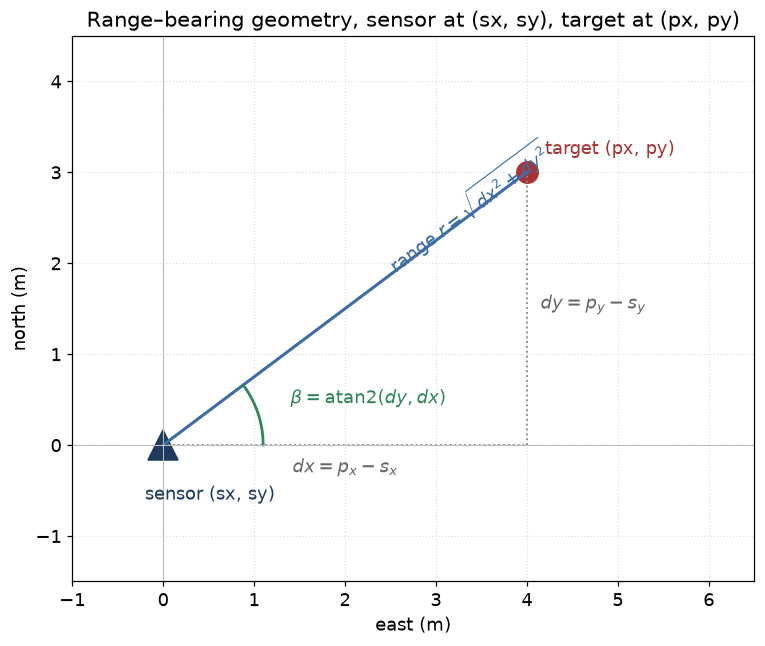
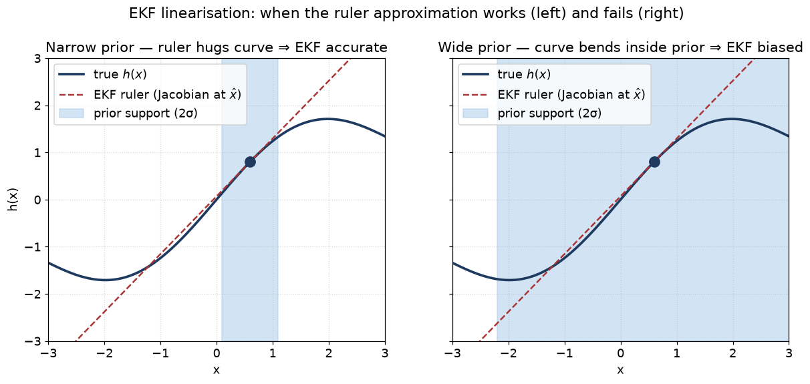

# 05 — The Extended Kalman Filter (EKF)

> Prerequisites: [04 — The Kalman filter](04-kalman-filter.md).
> Next: [06 — The Unscented Kalman Filter](06-unscented-kalman-filter.md).

The Kalman filter works *only* if the motion and measurement models
are linear. In real sensors they are often not. Radar gives you
**range** and **bearing**, both nonlinear functions of position.
Cameras give you bearing only, even more nonlinear (and
unobservable along the line of sight).

The Extended Kalman Filter (EKF) is the simplest extension that
handles nonlinear models: **linearise locally, then run the linear
KF**. It is the workhorse of navtracker.

## 1. The model

Same shape as the KF, but `F` and `H` are now nonlinear functions:

```
x_t = f(x_{t-1}) + w_t          motion model
z_t = h(x_t)     + v_t          measurement model
w_t ~ N(0, Q)
v_t ~ N(0, R)
```

We do not require closed-form Gaussianity any more — instead we
*assume* the posterior stays Gaussian and we propagate it
approximately. The approximation is a first-order Taylor expansion
around the current best guess.

## 2. The Jacobian — what it is, in plain words

A **Jacobian** is just the matrix of partial derivatives of a
vector function. If `h: R^n → R^m`, then

```
H_ij = ∂h_i / ∂x_j
```

— "how much does the i-th output change when the j-th input
changes a little bit?". Picture the Jacobian as a slope. It is
the local linear approximation to a curved function.

If you stand near a point `x̂` and look at the function `h`, the
Jacobian `H(x̂)` is the slope of the best straight line through
that point. It says: *"close to `x̂`, the function behaves like
`h(x̂) + H(x̂) · (x − x̂)`"*.

The EKF replaces `h(x)` by this local linear approximation, runs
the KF math, and re-linearises around the new mean at the next
step.

## 3. The recipe

### 3.1 Predict

```
x̂⁻  = f(x̂)                     (push the nonlinear motion)
F   = ∂f/∂x  evaluated at x̂     (Jacobian of motion model)
P⁻  = F · P · Fᵀ + Q
```

For us the motion is linear (CV, CV5, CT), so `f(x) = F·x` and
this collapses to plain KF predict. The interesting part is the
update.

### 3.2 Update

```
ẑ   = h(x̂⁻)                    (predicted measurement)
H   = ∂h/∂x  evaluated at x̂⁻    (Jacobian of measurement model)
ŷ   = z − ẑ                     (innovation; bearing residuals
                                are angle-wrapped to (−π, π])
S   = H · P⁻ · Hᵀ + R
K   = P⁻ · Hᵀ · S⁻¹
x̂   = x̂⁻ + K · ŷ
P   = (I − K · H) · P⁻
```

The only differences from the linear KF are:

1. `ẑ` is computed from the actual nonlinear `h`, not `H·x̂⁻`.
2. `H` is the Jacobian, not a fixed matrix. It is re-evaluated
   every update.
3. Angle residuals are wrapped (small but critical detail).

## 4. The range/bearing example, end to end

This is the central example in the codebase, used by ARPA radar
and by the camera adapter when range is fused in. State (CV):

```
x = [px, py, vx, vy]ᵀ
```

Measurement: range and bearing from the sensor at `(sx, sy)`:

```
dx = px − sx
dy = py − sy
r  = √(dx² + dy²)
β  = atan2(dy, dx)
z  = [r, β]ᵀ + v
```

Predicted measurement at `x̂⁻`:

```
ẑ = [ √(dx² + dy²),  atan2(dy, dx) ]
```

Jacobian (derivation by partial differentiation):

```
H = ⎡ dx/r     dy/r     0    0 ⎤
    ⎣ −dy/r²   dx/r²    0    0 ⎦
```

Things to notice:

- The Jacobian depends on the current state. We re-evaluate it
  every update.
- For very small `r` (target right on top of the sensor), `H`
  blows up. We guard `r > 1e-6` in the code.
- The first row is the unit vector along the line of sight. The
  range scales linearly with how the target moves along the line
  of sight.
- The second row is perpendicular to the line of sight, divided by
  range. A 1 m sideways move at 1 km range is a tiny angle change;
  at 10 m range it is a huge one. Geometry is built in.

The innovation for the bearing row is wrapped: `ŷ_2 ← wrap(z_2 −
ẑ_2)` so that a measurement at 179° and a prediction at -179° give
a 2° innovation, not 358°.

### Sensor pose

If the sensor is not at the origin, navtracker stores the sensor
position in the measurement and uses `dx = px − sx`, `dy = py − sy`
in both `h(x)` and the Jacobian. This is what makes **moving-sensor
bearing-only fusion** work — the parallax is captured in `h(x)`
directly, not faked elsewhere. See `MeasurementModels::RangeBearing2D`
in the code.

Picture: a target at `(px, py)` seen by a sensor at `(sx, sy)`:



`r` is the line-of-sight distance, `β` the bearing measured
counterclockwise from east. The Jacobian rows are
"`H[0] = unit vector along sight line`" and
"`H[1] = perpendicular to sight, scaled by 1/r`".

## 5. Why it works — the intuition

At every step we replace the curved measurement function `h` by a
straight ruler (the Jacobian) at the current best guess. We then
do the linear KF update with that ruler. If the curvature of `h`
is *not too sharp* over the size of `P⁻`, the ruler is a good
approximation and the update is nearly optimal.



Left: the ruler (red dashed) hugs the curve (blue) over the entire
prior support (blue shaded), so the EKF's linear approximation is
good — the predicted measurement is nearly correct. Right: with a
wide prior, the curve has already bent away from the ruler by the
edge of the support, so the EKF's predicted measurement is
biased. *That* is when you reach for the UKF (chapter 06) or PF
(chapter 07).

If the prior is sharp (small `P⁻`), the EKF is accurate even for
very curved `h`. If the prior is wide and `h` curves a lot inside
the prior's support, the linear approximation is wrong and the
update is biased. That is when you move to UKF or PF.

## 6. Assumptions, and where they pinch

| Assumption                                                | When it pinches in our setup                          |
|-----------------------------------------------------------|-------------------------------------------------------|
| `f, h` differentiable at `x̂`                              | Range/bearing at `r → 0` — guarded with `r > 1e-6`.   |
| Curvature small across `P⁻`                               | First few seconds of a new bearing-only track.        |
| Noise still Gaussian after the nonlinearity               | Range residuals fairly Gaussian; bearing approximate. |
| Mean and covariance fully describe the posterior          | True only if the above holds.                         |

When a brand-new EO/IR track has range uncertainty of kilometres,
the **bearing-only EKF is genuinely bad**. We have two coping
strategies in the codebase:

- Use a **range guard** (`BearingRangeGuard`) to wait until range
  uncertainty is bounded before fusing bearing-only updates.
- Fall back to a **particle filter** for bearing-only initialisation
  if the geometry truly requires it. See chapter 07.

## 7. Why we can use the EKF for ARPA radar

ARPA radar gives range and bearing. Range error is typically a few
metres; bearing error a small fraction of a degree. The covariance
of a *confirmed* track is much smaller than the curvature scale of
`h`. So the linearisation is accurate. Empirically the EKF gives
consistent NEES/NIS results (chapter 16) on radar updates against
known-truth scenarios. That is what makes us comfortable using it
as the default.

The same logic applies to AIS, which is linear anyway, and to
EO/IR once range has converged.

## 8. Numerical and coding details we care about

- **Joseph form** stays on the wishlist (also for plain KF).
- **Bearing-residual wrapping** is a real bug magnet. The
  `MeasurementModels` code wraps; downstream consumers must keep
  the wrap. The MHT code uses `wrap` even inside its score
  computation.
- **Cholesky of `S`** is used in the gating Mahalanobis distance to
  avoid forming `S⁻¹` explicitly. See chapter 11.
- **Re-symmetrise `P`** after the update.
- **Stale measurements** are dropped by the Tracker so the
  Jacobian is never evaluated against a state that has rewound.

## 9. Where this lives in code

- `core/estimation/EkfEstimator.{hpp,cpp}` — the implementation.
- `core/estimation/MeasurementModels.{hpp,cpp}` — `h(x)` and
  `H = ∂h/∂x` for each measurement family.
- `core/estimation/BearingRangeGuard.{hpp,cpp}` — the guard that
  delays bearing-only fusion until range is bounded.
- `docs/algorithms/estimation.md` §2, §3 — the precise reference.

## 10. What we did not pick, and why

- **Iterated EKF.** Re-linearise around the *posterior* mean and
  redo the update. Marginally better accuracy, twice the cost.
  Not worth it at our sensor SNR.
- **Smoother (RTS).** Useful for offline trajectory analysis, not
  for real-time tracking. Out of scope for now.
- **UKF as default everywhere.** UKF is better when `h` curves
  inside `P⁻`. We use UKF as an opt-in, not a default. See chapter 06.

---

Previous: [04 — The Kalman filter](04-kalman-filter.md)
Next: [06 — The Unscented Kalman Filter](06-unscented-kalman-filter.md) →
