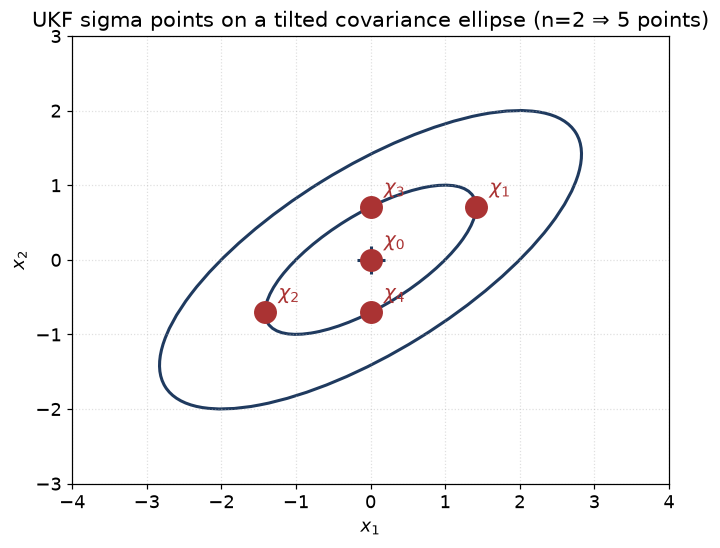
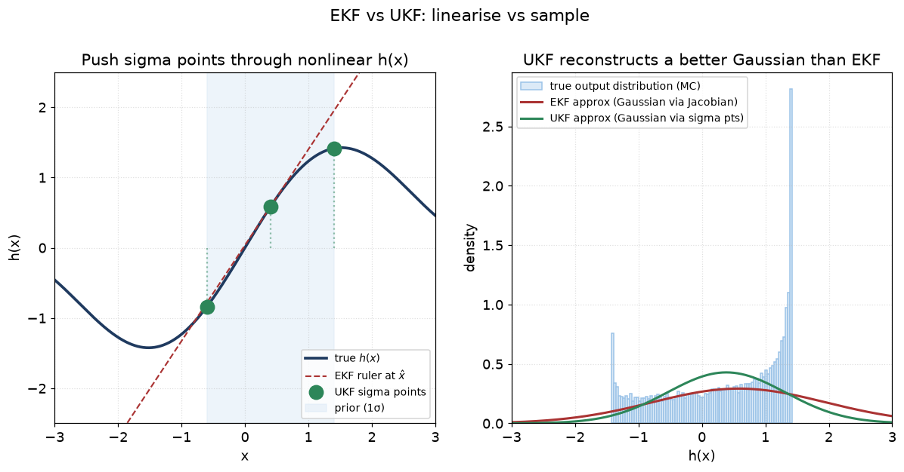

# 06 — The Unscented Kalman Filter (UKF)

> Prerequisites: [05 — EKF](05-extended-kalman-filter.md).
> Next: [07 — Particle filters](07-particle-filter.md).

The EKF approximates a nonlinear function by a **straight line**
(the Jacobian) at the current best guess. The UKF takes a different
route: it picks a small, deterministic set of **sample points**
called **sigma points**, pushes each of them through the
nonlinearity *exactly*, and rebuilds a Gaussian from the cloud that
comes out.

In one sentence: **EKF linearises the function. UKF samples it.**

For mild nonlinearity, EKF and UKF agree. For sharp nonlinearity
(bearing-only at long range, very wide priors), UKF is more
accurate and never needs a derivative.

## 1. The idea: "match the moments by sampling"

You have a Gaussian `N(x̂, P)` and a nonlinear function `g(x)`. You
want to know the mean and covariance of `g(x)` as `x` ranges over
the input Gaussian.

The exact answer needs an integral:

```
E[g(x)] = ∫ g(x) · N(x; x̂, P) dx
```

Hard. The UKF chooses `2n+1` sample points carefully (where `n` is
the state dimension), pushes them through `g`, and computes the
mean and covariance of the outputs as weighted sums:

```
g(x̂)  ≈  Σ_i W_m^i · g(χ_i)
Cov   ≈  Σ_i W_c^i · (g(χ_i) − ḡ) · (g(χ_i) − ḡ)ᵀ
```

The points `{χ_i}` and weights `{W_m^i, W_c^i}` are chosen so that,
for *small* nonlinearities, the result matches a Taylor expansion
to second order — strictly better than the EKF's first order.

## 2. Picking the sigma points

For state dim `n` and parameters `α`, `β`, `κ` (we use Julier's
default `α = 1e-3`, `β = 2`, `κ = 0`):

```
scale = α² · (n + κ)
λ     = scale − n
χ_0   = x̂
χ_i   = x̂ + (√(scale · P))_i           for i = 1..n
χ_{n+i} = x̂ − (√(scale · P))_i         for i = 1..n
```

The square root `√(scale · P)` is the Cholesky factor (or any
matrix square root). `(M)_i` means the i-th column.

For an `n = 2` state with a tilted covariance ellipse, the 5 sigma
points sit at the centre `χ_0` and at the four "shoulders" of the
ellipse, along the principal axes of `P`:



Each point will be pushed through the nonlinear `f` or `h`; the
output cloud is what we rebuild `(x̂⁻, P⁻)` or `(ẑ, S)` from.

For dim `n = 4` you get 9 sigma points: one at the mean, and four
pairs sprayed along the principal axes of `P`.

Weights:

```
W_m_0 = λ / scale
W_c_0 = λ / scale + (1 − α² + β)
W_m_i = W_c_i = 1 / (2 · scale)      for i = 1..2n
```

`W_m` is for the mean; `W_c` is for the covariance. The
`(1 − α² + β)` correction in `W_c_0` improves accuracy on the
covariance for Gaussian-like inputs.

These look opaque but you can ignore the choice of `α, β, κ` —
the code uses standard defaults and they almost never need to
change.

## 3. The predict step

```
For each sigma point χ_i:
   χ_i' = f(χ_i)                     push through motion model

x̂⁻  = Σ W_m_i · χ_i'                 reconstruct mean
P⁻  = Σ W_c_i · (χ_i' − x̂⁻)(χ_i' − x̂⁻)ᵀ + Q
```

For our linear motion model this gives the same answer as the KF
predict (just more expensive). It only becomes interesting when
the motion is nonlinear — e.g. coordinated turn at turn-rate near
zero, where `f` is curved.

## 4. The update step

```
Re-build sigma points from posterior-predict (x̂⁻, P⁻).

For each χ_i:
   Z_i = h(χ_i)                       push through measurement model

ẑ   = Σ W_m_i · Z_i                  predicted measurement mean
S   = Σ W_c_i · (Z_i − ẑ)(Z_i − ẑ)ᵀ + R
Pxz = Σ W_c_i · (χ_i − x̂⁻)(Z_i − ẑ)ᵀ   cross-covariance

K   = Pxz · S⁻¹
x̂   = x̂⁻ + K · (z − ẑ)               bearing residual wrapped
P   = P⁻ − K · S · Kᵀ
```

The big differences from the EKF update:

- We never compute a Jacobian. The function `h` is treated as a
  black box.
- The cross-covariance `Pxz` is computed directly from the sigma
  points. In the EKF we had `Pxz = P · Hᵀ`. Both are valid.
- The math reduces *exactly* to the KF when `f` and `h` are
  linear.

## 5. Picture: EKF vs UKF on a curved function



Left panel: the prior on `x` (shaded blue) covers a region where
the curve `h(x)` bends. The three UKF sigma points (green) sit
on the curve; the EKF ruler (red dashed) is the slope at the
centre and clearly misses the curve.

Right panel: the true output distribution (light histogram) is
non-Gaussian and skewed. The UKF's reconstructed Gaussian (green)
matches the *spread* of the true output. The EKF's Gaussian (red)
is far too wide because the ruler's slope is much steeper than
the average local slope of `h`.

When the prior is wide and `h` curves, the straight line is far
from the curve at the off-centre sigma points. The EKF would
underestimate variance; the UKF picks up the spread.

## 6. Cost

- Each predict/update is **`2n+1` evaluations** of `f` or `h`.
- For our `n = 4` (CV) or `n = 5` (CV5/CT) states, that is 9 or 11
  evaluations.
- For range/bearing, each evaluation is a tiny computation, so
  the UKF is only ~5–10× the cost of the EKF.

This is why the UKF is reasonable as a per-track estimator. For
the much more expensive **particle filter** (chapter 07), we
reserve it for the cases UKF cannot handle (multimodal).

## 7. Assumptions

| Assumption                                              | When it breaks                                                |
|---------------------------------------------------------|---------------------------------------------------------------|
| `P` is positive-definite                                | Cholesky fails → re-symmetrise, regularise diagonal           |
| Output of `h` is unimodal-Gaussian-like                 | Bearing-only at long range with wide prior — output bimodal   |
| `α, β, κ` give a well-conditioned spread                | Defaults are fine for `n ≤ 10`; tune for very large `n`       |

The UKF still assumes Gaussian posteriors. It just propagates the
moments better than the EKF. If the true posterior is multimodal,
**neither EKF nor UKF will catch it.** That is when you reach for
the particle filter.

## 8. Why we can use the UKF in this codebase

- For ARPA radar updates the curvature of range/bearing across `P`
  is small, so UKF gives near-identical results to EKF. We can
  drop it in by config when needed (e.g. very close-range
  manoeuvring target).
- For the EO/IR bearing-only path *before* the range guard fires
  (chapter 05), UKF is markedly better than EKF because the prior
  is wide along the line of sight.
- For coordinated-turn motion at very low turn rate, where the
  CT motion Jacobian becomes ill-conditioned, UKF avoids the
  numerical bad zone.

## 9. Where this lives in code

- `core/estimation/UkfEstimator.{hpp,cpp}` — implementation.
- `core/estimation/SigmaPoints.{hpp,cpp}` — sigma-point generator.
- `core/estimation/EstimatorDefaults.cpp` — chooses EKF vs UKF
  per measurement family by default.
- `docs/algorithms/estimation.md` §4 — exact formulae.

## 10. What we did not pick, and why

- **Square-root UKF (SRUKF).** Carries the Cholesky factor of `P`
  instead of `P` itself; more numerically stable. We would adopt
  it if we ever see PD problems; we have not.
- **Spherical simplex sigma points.** Fewer points (`n+2`), faster.
  But less accurate. Not worth it at our state sizes.
- **Cubature KF.** Variant of UKF with `2n` points; slightly
  cleaner derivation but practically identical to UKF for us.

---

Previous: [05 — EKF](05-extended-kalman-filter.md)
Next: [07 — Particle filters](07-particle-filter.md) →
