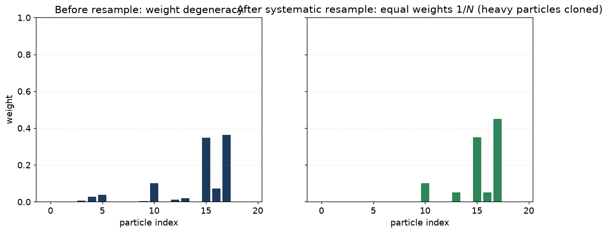
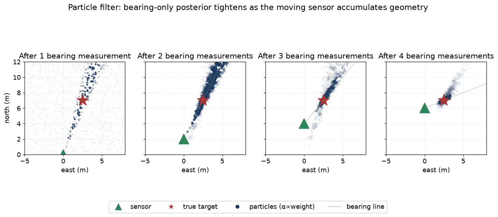

# 07 — Particle filters

> Prerequisites: [03 — Bayes' rule](03-bayes-and-recursion.md),
> [06 — UKF](06-unscented-kalman-filter.md).
> Next: [08 — Motion models](08-motion-models.md).

EKF and UKF both assume the posterior is approximately Gaussian.
What if it is not? What if you genuinely have **two possible
explanations** for the data, and the truth is one of them but you
do not know which?

This happens in maritime tracking. The clearest case:

> EO/IR camera reports a target bearing 047° from own-ship. We
> have no range. The target could be 200 m away, 2 km away, or
> 20 km away. The posterior over range is **flat for kilometres
> at a time** — definitely not Gaussian.

For situations like this we use **particle filters**: a
representation of the posterior as a swarm of weighted samples.
Each sample (a "particle") is a possible state. The cloud of
particles approximates the true posterior, however weird its
shape.

## 1. The idea

We approximate

```
p(x_t | Z_t) ≈ Σ_i w_t^i · δ(x − x_t^i)
```

— *"a sum of point masses, each with a weight"*. With enough
particles, this approximation can represent **any** posterior:
Gaussian, multimodal, skewed, banana-shaped, anything.

In practice we use a few hundred to a few thousand particles per
track in this codebase. Each is a state vector plus a scalar
weight.

## 2. Bootstrap particle filter — the basic recipe

The simplest variant, used as the default:

### 2.1 Initialise

Sample `N` particles from your prior:

```
x_0^i ~ p(x_0)
w_0^i = 1/N
```

For a bearing-only initialisation, we sample uniformly in range
along the bearing line, with a Gaussian spread in cross-track
direction. The result is a long sausage of particles along the
line of sight.

### 2.2 Predict

For each particle, push it through the motion model **including a
fresh draw of process noise**:

```
For each i:
   w_t^i ~ N(0, Q)
   x_t^i = f(x_{t-1}^i) + w_t^i
```

This is exact. No linearisation. The cloud spreads naturally
according to the true (possibly nonlinear) motion.

### 2.3 Update

Re-weight each particle by how well it explains the measurement:

```
For each i:
   w_t^i *= p(z_t | x_t^i)
Normalise: w_t^i /= Σ_j w_t^j
```

That is it. No Kalman gain, no Jacobian, no sigma points. Just
"how likely is this measurement under this hypothetical state?"
multiplied by the previous weight.

### 2.4 Resample (when needed)

After a few updates, most particles end up with weight near zero
and one or two particles carry almost all the weight. This is
called **weight degeneracy**, and it ruins variance estimates.



Left: a few particles carry most of the weight. Right: after
systematic resampling, all surviving particles have equal weight
`1/N`. The heavy particles got cloned (their bars now hold copies);
the empty ones died. Diversity is reduced but the ensemble still
represents the posterior.

We detect it with the **effective sample size**:

```
N_eff = 1 / Σ_i (w_t^i)²
```

`N_eff` ranges from `1` (all weight on one particle) to `N` (equal
weights). When `N_eff < N/2`, we resample.

Resampling produces `N` new particles by drawing from the existing
ones with probability proportional to weight, then resets all
weights to `1/N`. Particles with big weights get cloned; particles
with tiny weights die.

## 3. Picture: particles over time, bearing-only initialisation

A moving sensor takes 4 bearing measurements as it sails north.
After each measurement the particle cloud sharpens.



Each dot is one particle (its opacity is proportional to its
weight). The green triangle is the sensor; the red star is the
true target. After 1 measurement the cloud is a flat sausage
along the line of sight. By the 4th measurement, geometric
diversity has accumulated and the posterior collapses to a
unimodal blob near the truth — small enough to hand off to an
EKF/UKF.

## 4. Resampling methods

There are several. The two we have considered:

- **Multinomial.** Draw each new particle by independent
  cumulative-distribution sampling. Easy. High variance — the
  number of times a particular particle is selected fluctuates.
- **Systematic.** Single uniform `u ~ U(0, 1/N)` and stratified
  picks at `u + k/N`. Same expectation, lower variance, fewer
  duplicates. This is the default in our `Resampling.cpp`.

The **stratified** and **residual** schemes are variants; in
practice systematic is good enough.

After resampling there is a danger of **particle impoverishment**:
all particles collapse to a handful of distinct copies. We fight
this with **regularisation** (after resampling, add a small
Gaussian jitter to each particle) or **just letting process noise
naturally spread the cloud** the next predict step.

## 5. The likelihood `p(z|x)` in plain words

For Gaussian sensor noise:

```
p(z | x^i) = N(z; h(x^i), R)
```

— *"if particle `i` were the truth, how Gaussian-likely is the
measurement we just saw?"*. Log-space is recommended for
numerical reasons:

```
log p(z | x^i) = − ½ · (z − h(x^i))ᵀ R⁻¹ (z − h(x^i))
                 − ½ · log |2π R|
```

We accumulate **log weights** and only exponentiate / normalise
when needed. This avoids underflow when one log-likelihood is far
better than the others.

For bearing residuals: **wrap to (−π, π]**, same as in the EKF.

## 6. Worked toy: bearing-only initialisation

State `[px, py]`. Sensor at origin. Bearing measurement `β = 047°`
with `σ_β = 1°`.

After the first bearing measurement:

```
For particle i with position (px^i, py^i):
   pred_β^i = atan2(py^i, px^i)
   r_i      = wrap(β − pred_β^i)
   log_w_i += − ½ · r_i² / σ_β²
```

If we initialised particles uniformly in a 2-D box, the surviving
particles after this update form a **narrow wedge** along the
bearing line. After several bearing updates from a *moving*
sensor, the wedge intersects with itself at a single range — the
posterior collapses to roughly Gaussian, and we can hand off to
the EKF.

## 7. Why it works

The particle filter is a **Monte Carlo** implementation of the
Bayes recursion. The predict step samples from the motion model.
The update step is sequential importance sampling.

No linearisation. No Gaussian assumption. Just sampling and
re-weighting. With infinite particles it converges to the true
posterior.

## 8. Assumptions

| Assumption                                       | What goes wrong if it fails                          |
|--------------------------------------------------|------------------------------------------------------|
| `N` is large enough to cover the posterior       | Posterior coverage is patchy → biased estimates      |
| You can sample from the motion model             | True for us; `f` is a closed-form draw + noise       |
| You can evaluate `p(z|x)` at any `x`             | True for us; sensor models are closed-form           |
| You actually resample when `N_eff` is too small  | Otherwise degeneracy ruins variance                  |
| Resampling does not collapse to a single point   | Mitigated by regularisation / process-noise jitter   |

## 9. Cost

- Per-track CPU: `N · (cost of one `f`-eval + cost of one `h`-eval)`.
- Memory: `N · sizeof(state)` per track.

With `N = 500` and 30 tracks, this is real but tractable. We use
the PF only when it is needed — bearing-only initialisation, or
when the IMM mode posterior is genuinely bimodal — and we hand
off to a Gaussian filter once the posterior collapses.

## 10. Why we can use a PF here

The bearing-only initialisation problem is exactly the textbook
case the bootstrap PF was designed for. The state dimension is
small (4 or 5), the motion model is cheap, the sensor model is
cheap, and the posterior really is multimodal until enough
geometry diversity has accumulated. A few hundred particles
suffice.

We do **not** use the PF as the default estimator for all tracks,
because for already-converged Gaussian-shaped posteriors it is
strictly more expensive and no more accurate than the EKF/UKF.

## 11. Where this lives in code

- `core/estimation/ParticleFilterEstimator.{hpp,cpp}` —
  implementation.
- `core/estimation/Resampling.{hpp,cpp}` — systematic and
  multinomial resamplers, plus the `N_eff` check.
- `docs/algorithms/estimation.md` — exact formulae.

## 12. What we did not pick, and why

- **Auxiliary particle filter (APF).** Better when the
  measurement is very informative — propose particles weighted
  by the likelihood. We did not adopt because the bookkeeping is
  more complex; the bootstrap PF is good enough at our `N`.
- **Rao-Blackwellised PF (RBPF).** Marginalise out a linear
  subset of the state analytically; sample only the nonlinear
  part. Powerful but a bigger engineering investment; on the
  roadmap.
- **PF as default everywhere.** Way too expensive. Use only
  where Gaussians fail.

---

Previous: [06 — UKF](06-unscented-kalman-filter.md)
Next: [08 — Motion models](08-motion-models.md) →
