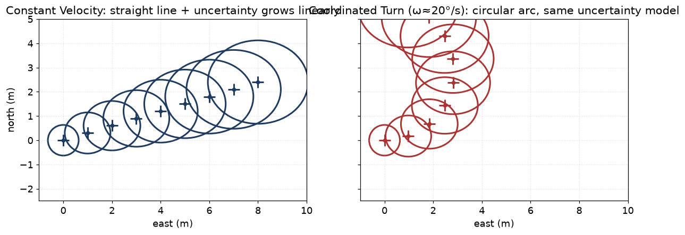

# 08 — Motion models

> Prerequisites: [04 — Kalman filter](04-kalman-filter.md).
> Next: [09 — IMM](09-imm.md).

A **motion model** answers one question: *"if I know the state
right now, what state should I expect in `dt` seconds?"*. It
defines `F` (deterministic step) and `Q` (process noise) for the
predict step of every filter in chapters 04–07.

This chapter walks through the three motion models in this
codebase: Constant Velocity (CV), Constant Velocity with turn rate
(CV5), and Coordinated Turn (CT). It also explains, in plain
words, **what process noise actually means and how to think
about `Q`**.

## 1. Why motion models matter

A filter is only as good as its motion model. If the model says
"vessel moves in a straight line" but the vessel is turning, the
predict step pushes the state in the wrong direction and the
filter has to absorb the error in the next update — making the
filter "soft" (responsive but noisy) or "stiff" (smooth but
late). Neither is good in a collision-risk system.

Two coping mechanisms:

1. **Process noise `Q`** — admit that the model is incomplete and
   inflate the covariance so unexpected manoeuvres can be
   absorbed.
2. **Use multiple models in parallel (IMM)** — chapter 09. The
   filter automatically blends between CV (straight) and CT
   (turning) based on the data.

This chapter is about (1) — the per-model story. Chapter 09 is
about (2).

## 2. Constant Velocity (CV) — `ConstantVelocity2D`

State:

```
x = [ px, py, vx, vy ]ᵀ
```

Transition over `dt`:

```
       ⎡ 1  0  dt   0 ⎤
F(dt)= ⎢ 0  1   0  dt ⎥
       ⎢ 0  0   1   0 ⎥
       ⎣ 0  0   0   1 ⎦
```

So `px ← px + vx·dt`, `py ← py + vy·dt`, velocities unchanged. A
straight line at constant speed.

Process noise — **continuous white-noise acceleration** model. Per
axis (independent x and y), with scalar PSD `q` (units `m²/s³`):

```
Q_per_axis = q · ⎡ dt³/3   dt²/2 ⎤
                 ⎣ dt²/2     dt  ⎦
```

Place this 2×2 block at the (pos, pos), (pos, vel), (vel, pos),
(vel, vel) entries for each of x and y. Picture:

```
       ⎡ q·dt³/3      0       q·dt²/2     0    ⎤
Q   =  ⎢   0       q·dt³/3      0      q·dt²/2 ⎥
       ⎢ q·dt²/2      0          q·dt    0     ⎥
       ⎣   0       q·dt²/2      0       q·dt   ⎦
```

### What does `q` mean physically?

`q` is the **power spectral density** of the unknown acceleration.
Concretely: *"I admit the true vessel can accelerate randomly
during the interval; my model integrates a white-noise
acceleration with PSD `q`."*

Rule of thumb: pick `q` so that `√(q · dt)` is on the order of the
typical *unmodelled* acceleration a vessel actually exhibits. For a
big tanker that means `q ≈ 0.01 m²/s³`; for a fast patrol boat
`q ≈ 0.5 m²/s³`. Numbers in this codebase are tuned per
deployment.

If `q` is too small, the filter is too stiff: it lags real
manoeuvres. If `q` is too large, the filter is too loose: it
tracks noise.

### Assumptions

- Near-constant velocity between updates. Bigger gaps → wider
  growth.
- Manoeuvres absorbed by `q`.
- x and y independent (good for ENU; might be tweaked for
  body-frame).
- 2-D surface motion. We do not model altitude.

### Why it's the default

It captures the **dominant** behaviour of most vessels most of the
time. It does not need any extra state. It is robust against
mis-specification because `q` absorbs the gap. We add CT and CV5
only when we need to model turns explicitly.

## 3. Constant Velocity 5-state (CV5) — `ConstantVelocity5State`

State adds a **turn rate** placeholder:

```
x = [ px, py, vx, vy, ω ]ᵀ
```

The propagation is still linear and identical to CV for the first
four components. The turn rate `ω` simply drifts under a process
noise — there is no dynamic effect of `ω` on the position
propagation, because the **CV model is straight-line by
construction**.

So why carry `ω` if it does nothing?

> **Because we want to mix CV with CT in the IMM (chapter 09), and
> the mixer requires the state dimension to match.**

The 5-state CV is the *CV component* of an IMM whose other
component is a 5-state CT model that actually uses `ω`. The two
share the same state vector, so the IMM mixing step can blend
them directly without re-mapping dimensions.

You will see this called the **vectorial IMM** (vIMM) style in
the algorithms docs. It is one of two principled patterns; the
other is mode-conditioned mixing of different state vectors
(more bookkeeping). We chose vIMM for simplicity and stable IMM
NEES.

## 4. Coordinated Turn (CT) — `CoordinatedTurn`

State same as CV5. Transition models a circular arc of constant
turn rate `ω`:

For `ω ≠ 0`:

```
sin_w_dt = sin(ω · dt)
cos_w_dt = cos(ω · dt)

px ← px + (sin_w_dt / ω) · vx − ((1 − cos_w_dt) / ω) · vy
py ← py + ((1 − cos_w_dt) / ω) · vx + (sin_w_dt / ω) · vy
vx ← cos_w_dt · vx − sin_w_dt · vy
vy ← sin_w_dt · vx + cos_w_dt · vy
ω  ← ω
```

For `ω → 0` we use the **Taylor expansion** of the above to avoid
dividing by something tiny. This is critical for numerics — the
exact formulae are in `CoordinatedTurn.cpp`.

Picture: a CV (left) and a CT (right) trajectory with growing
process-noise ellipses at successive prediction steps.



Both models propagate the same Gaussian `(x̂, P)` and add the same
process noise `Q` each step. The only difference is the *path* of
the mean: a straight line for CV, a circular arc of radius
`|v|/|ω|` for CT.

### Process noise for CT

Two noise channels: acceleration PSD `q_a` for the velocity
components, turn-rate PSD `q_ω` for `ω`. The construction is
analogous to CV's CWNA but extended to include the turn-rate
random-walk:

```
Q_ω = q_ω · dt          ← random walk on ω
```

Concrete formulae are in `CoordinatedTurn.cpp`. The key parameter
to tune is `q_ω`: how fast can the turn rate change. For ferries
and big ships, `q_ω` is small; for small boats it is larger.

### Why CT and not CA (constant acceleration)?

Coordinated turn is the **right physics** for a vessel under
helm — it conserves speed and rotates direction. Constant
acceleration would let speed grow without bound during the
predict step. For a maritime fleet, CT + an extra "noisy CV"
mode (high `q`) covers the relevant manoeuvres better than CA.

This is the Mazor-1998 recipe and we follow it. The "noisy CV"
mode is a CV with inflated process noise — a third IMM mode
that absorbs unmodelled erratic motion. See
`docs/algorithms/algorithm-review-2026-06-07.md`.

The same noisy-CV mode is also what currently holds a *stopped*
vessel (anchor-watch wandering, a moored boat swinging on its
chain): there is no dedicated stationary / low-speed mode, so the
inflated-`q` mode does double duty. That is a known gap — see
[chapter 09 §10](09-imm.md#10-what-we-did-not-pick-and-why).

## 5. Discretisation choices — why `dt³/3` etc.

The continuous-time model is `ẋ = A · x + B · w(t)` with
`w(t)` white noise. The discrete-time covariance is

```
Q(dt) = ∫_0^{dt} e^{Aτ} B Q_c Bᵀ (e^{Aτ})ᵀ dτ
```

For the CV case `e^{Aτ}` has a simple form, and the integral
evaluates to the `dt³/3`, `dt²/2`, `dt` block above. These are not
arbitrary — they come from integrating a constant white-noise
acceleration over the interval. The same derivation gives more
complicated blocks for CT.

The takeaway: **`Q` must scale correctly with `dt`** or you will
have catastrophic problems on irregular sample intervals (which
we always have). A common bug in junior code is to use a fixed
`Q` regardless of `dt`. We do not. See `NoiseModels.hpp`.

## 6. Why processing noise should *not* be small

A common temptation is to make `Q` tiny so the filter looks
smooth in good conditions. This is wrong. Two reasons:

1. **A vessel that suddenly turns will fall outside the gate**
   (chapter 11) because the predicted covariance was too small,
   and the filter will drop the measurement as clutter. Track
   lost.
2. **NEES will be biased high** (chapter 16) because the filter
   is overconfident. Innovations look much larger than `S` says
   they should be.

Tune `Q` so the filter is *just* loose enough to absorb the
manoeuvres that actually occur in your operational scenarios.
Use NEES/NIS in scenario tests to confirm.

## 7. Where this lives in code

- `core/estimation/ConstantVelocity2D.{hpp,cpp}` — CV F, Q.
- `core/estimation/ConstantVelocity5State.{hpp,cpp}` — CV5 F, Q.
- `core/estimation/CoordinatedTurn.{hpp,cpp}` — CT F, Q with the
  `ω → 0` Taylor expansion.
- `core/estimation/PrescribedTurn.{hpp,cpp}` — a CT variant with
  a *known* turn rate (used in scenario tests).
- `core/estimation/NoiseModels.hpp` — small helpers for the
  CWNA blocks.

## 8. What we did not pick, and why

- **Singer model** (acceleration with exponential decay): higher
  state, more parameters; we get most of the benefit from
  noisy-CV mode in the IMM. On the watch-list for future tuning.
- **Constant-acceleration model**: lets speed grow unboundedly
  during predict. Bad for sea state. Not used.
- **Drift / wind models**: not modelled at the tracking layer.
  If we ever add them they go in own-ship/environment
  estimation, not in target motion.

---

Previous: [07 — Particle filters](07-particle-filter.md)
Next: [09 — IMM](09-imm.md) →
