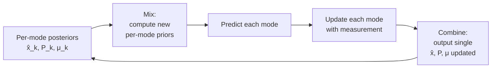
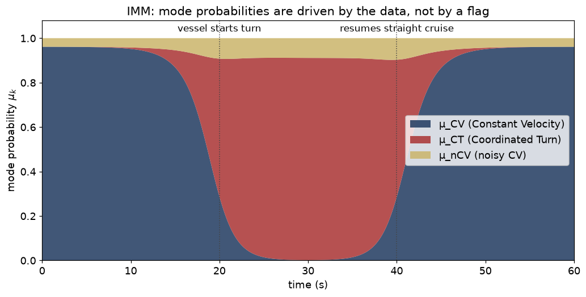

# 09 — Interacting Multiple Models (IMM)

> Prerequisites: [04 — Kalman filter](04-kalman-filter.md),
> [08 — Motion models](08-motion-models.md).
> Next: [10 — Measurements, frames, time](10-measurements-frames-time.md).

A real vessel does not obey a single motion model all the time.
It cruises in a straight line. Then it turns. Then it cruises
again. Sometimes it drifts because the helmsman lost
concentration. Sometimes it accelerates because of a sudden
manoeuvre.

A single-model filter — even with inflated process noise — is
stuck with a single compromise: stiff enough to be smooth in
straight-line cruise, loose enough to follow turns. You can't
have both.

The **Interacting Multiple Models** (IMM) filter is a Bayesian
solution: **run several filters in parallel, one per motion
hypothesis, and let the data decide which to trust at each
moment.** It then collapses them to a single output for
downstream consumers.

## 1. The setup

Pick a small set of motion models (we use three):

| Mode | Model                              | Captures                  |
|------|------------------------------------|---------------------------|
| `CV` | Constant Velocity                  | Cruising in a straight line. |
| `CT` | Coordinated Turn                   | Turning at a steady rate.    |
| `nCV`| "Noisy" CV (high `q`)              | Erratic / unmodelled motion. |

Each mode has its own filter (typically EKF) with its own
state and covariance. We also carry **mode probabilities**
`μ_k = P(mode = k | measurements)`, which sum to 1.

We also need a **mode transition matrix** `π`:

```
π[i][j] = P(mode_{t} = j | mode_{t-1} = i)
```

Typically `π` is near-identity (modes are sticky) with small
off-diagonal probabilities (mode switches are rare).

For example:

```
        CV     CT    nCV
   CV ⎡ 0.95  0.03  0.02 ⎤
   CT ⎢ 0.05  0.93  0.02 ⎥
   nCV⎣ 0.05  0.05  0.90 ⎦
```

## 2. The IMM cycle in four steps



### Step 1: Mix

The previous posteriors `(x̂_k, P_k)` and probabilities `μ_k` are
**mixed** to form *mode-conditional starting points* for each
mode. The math (Bar-Shalom):

```
c_j = Σ_i π[i][j] μ_i                        (predicted mode prob)
μ_{i|j} = π[i][j] μ_i / c_j                  (mixing weights)

x̂_0_j = Σ_i μ_{i|j} x̂_i                      (mixed mean)
P_0_j  = Σ_i μ_{i|j} (P_i + (x̂_i − x̂_0_j)(x̂_i − x̂_0_j)ᵀ)
                                             (mixed covariance,
                                              moment matching!)
```

This is **exactly the moment-matched mixture collapse from
chapter 02**. Each mode gets a starting point that is a weighted
blend of *all* previous modes — that is the "interacting" part.

Why mix at all? Because mode CT in this step might have
*started* the previous step as a near-straight track. We do not
want to throw that knowledge away just because we are now in CT.
The mixing brings CT's posterior closer to where the data was
already pointing.

### Step 2: Predict

Each mode's filter does its own predict on the mixed prior:

```
For each mode j:
   (x̂⁻_j, P⁻_j) = predict_j(x̂_0_j, P_0_j, dt)
```

This is just per-mode KF/EKF/UKF predict, as in earlier chapters.

### Step 3: Update

Each mode updates with the measurement:

```
For each mode j:
   (x̂_j, P_j) = update_j(x̂⁻_j, P⁻_j, z)
   ℓ_j        = N(z; ẑ_j, S_j)                ← likelihood of z under mode j
```

The mode likelihoods `ℓ_j` are computed from the per-mode
innovation `ŷ_j` and innovation covariance `S_j`. Modes that
explain the measurement well get high likelihood; modes that do
not get crushed.

### Step 4: Combine

Update the mode probabilities by Bayes, and produce a single
output:

```
μ_j ← c_j · ℓ_j / Σ_k c_k · ℓ_k              (Bayes on the mode)

x̂ = Σ_j μ_j · x̂_j                            (combined mean)
P = Σ_j μ_j · (P_j + (x̂_j − x̂)(x̂_j − x̂)ᵀ)   (combined covariance)
```

The combined `(x̂, P, μ)` is what we publish to downstream
consumers (TrackOutput, CPA evaluator). The per-mode posteriors
are kept internally and used as input to the next cycle.

## 3. Picture: mode probabilities over time



Reading this graph:

- **Left segment** — vessel is cruising in a straight line. `μ_CV`
  is high, the filter behaves like a stiff CV-KF.
- **Middle segment** — vessel turns. CT explains the measurements
  better, so `μ_CT` rises smoothly. The blended output now
  follows the curved trajectory.
- **Right segment** — vessel resumes straight cruise. CV wins
  again.

No flag was ever set. The data *itself* shifted the mode
probabilities through Bayes.

The CV mode dominates during straight cruise. As the vessel turns,
CT's likelihood `ℓ_j` becomes much larger and `μ_CT` climbs. When
the vessel straightens out again, CV takes over.

This is **automatic mode discovery**. No flag is needed; the data
itself decides.

## 4. Why it works — three intuitions

### 4.1 IMM is mixture-Bayes with structure

If you believed the posterior was a mixture of `K` Gaussians with
known mixture weights, you would not collapse it after every
update. You would propagate each Gaussian separately and update
each separately. IMM is exactly that, plus a Markov-chain prior on
the mixture weights via `π`.

### 4.2 The mixing keeps modes well-conditioned

If we did not mix between cycles, each mode would drift on its
own. When the vessel finally needed CT, the CT filter would have
diverged from the data over the long straight-cruise interval. By
re-initialising each mode from the mixed posterior every cycle, we
keep all modes near the current best guess.

### 4.3 The Markov chain is a prior on switching

`π` encodes our prior belief: *"mode switches are rare"*. If we
set `π = identity`, modes never switch (and the IMM degenerates to
a static mixture). If we set `π = uniform`, modes switch freely
(and the IMM becomes overreactive). The realistic value is
near-identity with small off-diagonals, which is what we use.

## 5. Time scaling of `π`

Subtle point that has burned us before: the transition matrix
must be **dt-scaled**. A `π` calibrated for a 1-second step is
wrong if you run the IMM at 0.1-second steps. The codebase
applies a dt-scaled transition matrix (see backlog item on this).

Why? Because `π` represents "probability of switching mode in one
step". Over a shorter step, the switching probability per step
must shrink, or you would otherwise switch ten times in one
second.

## 6. Assumptions

| Assumption                                  | When it pinches                                              |
|---------------------------------------------|--------------------------------------------------------------|
| Mode set covers the true motion             | Truly weird motion (rapid double-back) needs more modes      |
| Markov chain on modes (no memory beyond t)  | Real helmsmen plan ahead — slight violation we accept        |
| Per-mode Gaussian posteriors                | Same as the underlying filters; sharp turns are mildly bad   |
| `π` properly dt-scaled                      | If not, mode probabilities oscillate                         |
| Modes share state dimension                 | True by vIMM construction                                    |

## 7. Why we can use IMM here

The maritime use case fits the IMM textbook example almost
perfectly: most of the time vessels cruise; sometimes they turn.
The two regimes have very different process-noise needs. Without
IMM we are forever choosing between a stiff filter that loses
tracks during turns, and a loose filter that wobbles during
cruise. The IMM blends them automatically.

The third mode (noisy CV) handles the *long tail* of motion that
doesn't fit either CV or CT — driftage, anchor-watch wandering,
crew sleeping. Without it the filter occasionally explodes; with
it the filter degrades gracefully.

## 8. Cost

Per IMM step we run `K` per-mode predicts and updates. With
`K = 3` and EKF underneath, this is 3× a single EKF. Memory is
3× per track. For typical track counts this is fine.

## 9. Where this lives in code

- `core/estimation/ImmEstimator.{hpp,cpp}` — the IMM orchestrator.
- `core/estimation/ConstantVelocity5State.{hpp,cpp}` — CV mode.
- `core/estimation/CoordinatedTurn.{hpp,cpp}` — CT mode.
- (Noisy-CV mode is CV5 with inflated `q`, configured in the
  composition root.)
- `docs/algorithms/estimation.md` — equations.
- `docs/algorithms/algorithm-review-2026-06-07.md` — design log.

## 10. What we did not pick, and why

- **Variable Structure IMM (VS-IMM).** Activates/deactivates modes
  based on observed motion. More powerful, much harder to tune.
  Out of scope.
- **GPB1 / GPB2** — older multiple-model algorithms; IMM dominates
  them on cost/accuracy.
- **Mode-conditioned different state vectors.** Lets you have a
  3-D mode and a 2-D mode with different dimensions. Bookkeeping
  hell. We use vIMM (shared state) for simplicity.

---

Previous: [08 — Motion models](08-motion-models.md)
Next: [10 — Measurements, frames, time](10-measurements-frames-time.md) →
