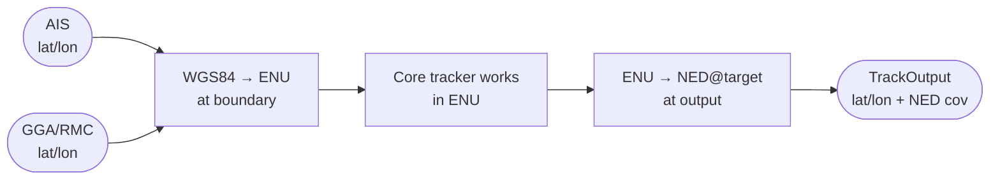
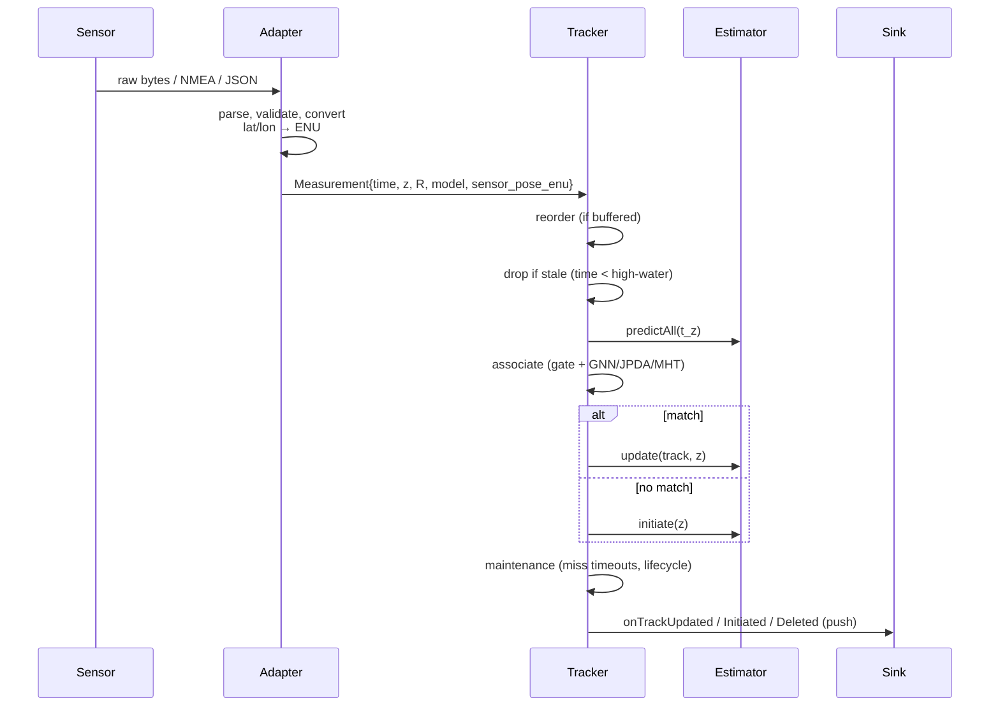

# 10 — Measurement models, coordinate frames, and time

> Prerequisites: [04 — Kalman filter](04-kalman-filter.md).
> Next: [11 — Gating + GNN + Hungarian](11-gating-gnn-hungarian.md).

So far we have spoken about `h(x)` and `H` abstractly. This
chapter pins them down: for *every* sensor type in this
codebase, what does the measurement model actually look like?
And before we even get there, *in which frame* are positions
expressed, and *how* do we keep timestamps honest?

If you skip this chapter, your bug is going to be a sign error in
a frame transform six months from now.

## 1. The three coordinate frames you must know

### 1.1 WGS84 geodetic (lat / lon)

This is the global geodetic frame the world thinks in. Latitude
and longitude in degrees. Height above the ellipsoid (we ignore
height — surface tracking).

We *only* use lat/lon at **system boundaries**: parsing AIS
position reports, parsing GGA/RMC, writing the final
`TrackOutput`. Internally the tracker never thinks in geodetic.

### 1.2 ENU local tangent plane (East–North–Up)

The internal working frame of the tracker. We project the curved
earth's surface onto a flat plane that is tangent at a chosen
**datum** point (usually own-ship at session start). Coordinates
are metres `(px_E, py_N)`.

Why ENU?

- It is **right-handed** and intuitive (east is `+x`, north is
  `+y`, up is `+z`). Velocity vectors are easy.
- It is **locally Euclidean** so all our covariance math
  (`P`, `S`, `K`) makes sense. The KF assumes Euclidean geometry.
- Over a few tens of kilometres around the datum, the projection
  error is millimetres. Negligible.

When own-ship sails far from the datum (default threshold: 30 km),
the projection error grows. The `OwnShipProvider` then **recenters
the datum** to own-ship's new position and broadcasts a
**datum-change event**. All track states must be shifted to the
new datum frame. The codebase wires this up via
`IDatumChangeSink` → `shiftTracksOnDatumChange`. See
`CLAUDE.md` and `core/tracking/DatumShift.{hpp,cpp}`.

### 1.3 Per-target local NED (North–East–Down)

For *output* we can report covariance north-first (NED), a maritime
convention that makes "north" and "east" uncertainty easy to inspect
on a chart. The output offers both orderings: `toTrackOutputNED`
gives north-first, `toTrackOutputENU` gives east-first (the same
ordering the core uses internally). The caller picks one — see
`docs/output-contract.md`.

You should not see NED inside the core tracking code. Only at the
output boundary.



## 2. Time

**Always use `Measurement.time`.** Never wall-clock time. The
tracker is **time-driven**, not clock-driven. Replay of a log
must produce identical output even if it runs 100× faster than
the original sensors. The CLAUDE.md invariant D2/D4 is
non-negotiable.

A few related ideas you will see in code:

- **Reorder buffer** (`ReorderBuffer`) — sensors arrive
  out-of-order. We buffer for a small window and release in
  timestamp order.
- **Stale-input guard** — if a measurement arrives with
  `time < high_water_mark`, the tracker drops it (counts it).
  Otherwise the predict step would no-op (`dt ≤ 0`) and the
  update would rewind `last_update`, blowing up the *next*
  predict's `dt`. See `Tracker::process` in
  `core/pipeline/Tracker.cpp`.
- **OOSM** — out-of-sequence measurement retrodiction is on the
  roadmap; currently we drop them rather than incorporate them.
- **Per-track `last_update` and `last_observation`** — track
  lifecycle and CPA both need these. Lifecycle uses
  `last_observation` to time out misses (chapter 15).

## 3. The Measurement type

```
struct Measurement {
  Time          time;
  SensorKind    sensor;          // AIS / ARPA / EOIR / OWNSHIP
  MeasurementModel model;        // which h(x) to use
  std::optional<Vec2> sensor_position_enu;
  Vector       z;                // raw observation
  Matrix       R;                // measurement noise covariance
  // ... source id, attributes ...
};
```

Notice three things:

1. The measurement carries **its own `R`**. Different sensors,
   even of the same type, can have different noise levels — and
   often *time-varying* noise.
2. The measurement carries **its own `model` enum**. The Tracker
   uses it to pick the right `h(x)`/`H` to apply. AIS uses
   `PositionVelocity2D`. ARPA uses `RangeBearing2D`. EO/IR uses
   `Bearing2D` (until range converges, then it can use
   `RangeBearing2D`).
3. The measurement carries the **sensor's ENU position** at the
   moment of observation. This is what makes moving-sensor
   bearing-only fusion tractable: parallax lives in `h(x)`
   directly. See chapter 05 §4.

## 4. The measurement models, one by one

### 4.1 `Position2D`

Used by anything that reports absolute ENU position.

```
h(x) = [ px ]
       [ py ]

H    = [ 1  0  0  0 ]
       [ 0  1  0  0 ]
```

`R` is the position covariance. AIS in this codebase falls into
this category if velocity is unavailable.

### 4.2 `PositionVelocity2D`

AIS reports both position and over-ground velocity.

```
h(x) = [ px, py, vx, vy ]ᵀ
H    = I_4
```

Linear and convenient. The full Kalman update applies directly.

### 4.3 `RangeBearing2D`

Radar: range from sensor + bearing from sensor.

```
dx = px − sx
dy = py − sy
r  = √(dx² + dy²)
β  = atan2(dy, dx)
h(x) = [ r, β ]ᵀ

H = ⎡ dx/r     dy/r     0    0 ⎤
    ⎣ −dy/r²   dx/r²    0    0 ⎦
```

For details, see chapter 05 §4.

Important detail: the bearing residual is wrapped to `(−π, π]`
*everywhere* the `RangeBearing2D` model is used: EKF/UKF update,
gating, JPDA, MHT. A failure to wrap shows up as a track that
"swings around" near `±π`.

### 4.4 `Bearing2D`

Camera (EO/IR) when range is unavailable.

```
h(x) = [ atan2(py − sy, px − sx) ]
H    = [ −dy/r²   dx/r²   0   0 ]
```

Same wrapping caveat. Same sensor-pose support.

**Bearing-only by itself is degenerate**: you cannot recover
range from one bearing. Either the geometry must change (sensor
moves), or the bearing must be fused with another sensor that
gives range (radar, AIS).

Until range converges, the EKF's `P` along the line of sight is
huge and the linearisation is bad. The codebase has two
strategies:

- `BearingRangeGuard` defers fusing bearing into a track until
  the *current* range estimate is bounded enough.
- The particle filter (chapter 07) can handle bearing-only
  initialisation properly.

## 5. Noise covariance `R` — where does it come from?

`R` is *not* a free parameter you tune to taste. It is the
intrinsic noise of the sensor, measured or specified:

- **AIS:** GPS-grade position covariance from the broadcast
  source. We typically use a fixed default per device class.
- **ARPA radar:** range and bearing noise per scan, often
  specified by the radar manufacturer. Range error of a few
  metres, bearing of a few mrad.
- **EO/IR:** pixel-level noise converted to angular noise. The
  per-pixel angular IFOV gives `σ_β`.

When the sensor does not report covariance, we fall back to
`pessimisticSensorDefaults()` — large but not crazy. Better to
under-trust a sensor than to over-trust it.

A wrong `R` corrupts everything downstream: gating
(false rejects / false accepts), filter consistency (NEES/NIS),
mode probability (IMM), data association. Chapter 16 walks
through how to detect and recalibrate `R` from data.

## 6. The `applyDefaultsIfEmpty` helper

If your custom measurement does not specify `R`, use:

```cpp
applyDefaultsIfEmpty(m, pessimisticSensorDefaults());
```

This is documented in `CLAUDE.md`'s library-use section. Saves
you from forgetting an `R` and having a NaN propagate.

## 7. Putting it together — the canonical end-to-end flow



Each block has its own chapter:
- adapter & frames: this one
- reorder / stale: chapter 03 + the pipeline docs
- predict / update: chapters 04–07
- associate: chapters 11–14
- lifecycle: chapter 15
- output: chapter 18

## 8. Why we can use ENU everywhere internally

Two reasons:

- The operational area of one tracking session is at most a few
  tens of km across. At that scale, the WGS84 → ENU projection
  error is millimetres. Below any sensor noise.
- The Kalman math is Euclidean. Working in geodetic
  coordinates would require curved-earth covariance propagation
  every step. Much harder. ENU lets us use straight-line algebra.

The cost is the datum-shift complexity. We pay it deliberately.

## 9. Where this lives in code

- `core/types/Measurement.hpp` — `Measurement` struct.
- `core/estimation/MeasurementModels.{hpp,cpp}` — all `h(x)/H`.
- `core/geo/` — ENU ⇄ lat/lon conversions.
- `core/tracking/DatumShift.{hpp,cpp}` — `shiftTracksOnDatumChange`.
- `adapters/own_ship/OwnShipProvider.hpp` — auto-datum + sink.
- `core/output/TrackOutput.hpp` — boundary back to lat/lon and
  per-target NED.

## 10. What we did not pick, and why

- **Mercator or UTM** for the internal frame. Both introduce
  distortion at high latitudes and near zone boundaries; ENU is
  cleaner.
- **ECEF** for the internal frame. Right-handed but the velocity
  components are not intuitive ("east" relative to where?). ENU
  is friendlier for engineers.
- **No frame transform at all (work in lat/lon)**. Tempting but
  wrong: the KF math would need a curved-earth metric and a
  reformulated covariance. Massive added complexity for no
  benefit at our scale.

---

Previous: [09 — IMM](09-imm.md)
Next: [11 — Gating + GNN + Hungarian](11-gating-gnn-hungarian.md) →
