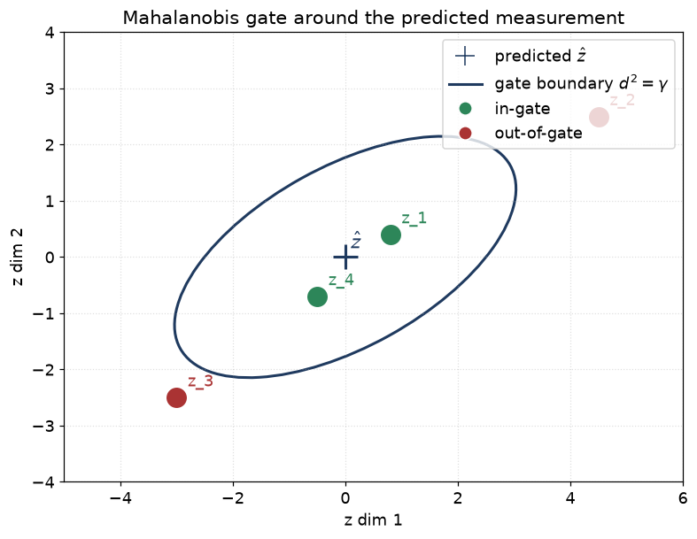
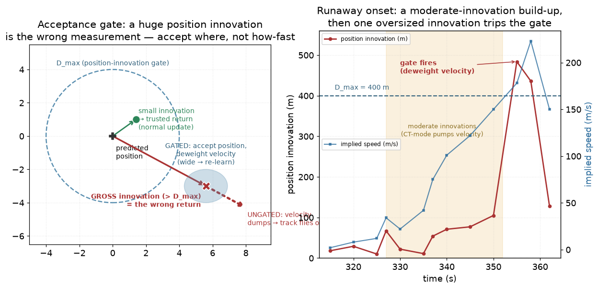
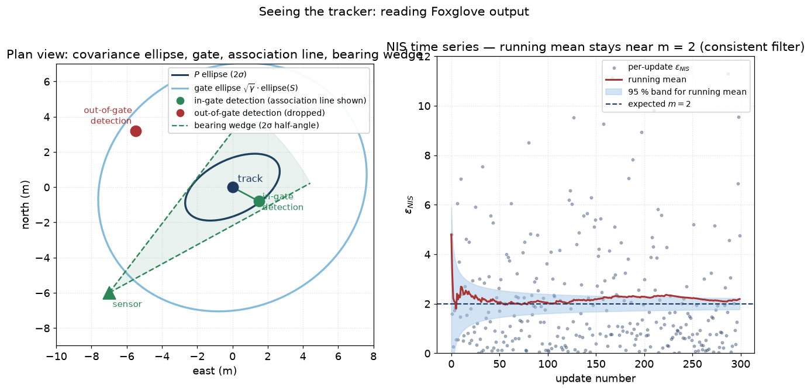

# 11 — Gating, GNN, Hungarian

> Prerequisites: [04 — Kalman filter](04-kalman-filter.md),
> [10 — Measurement models](10-measurements-frames-time.md).
> Next: [12 — JPDA](12-jpda.md).

A single Bayes filter assumes the measurement clearly belongs to
*its* track. In a multi-target world that is not given. At every
time step we may have:

- 5 tracks alive,
- 7 measurements just arrived,
- some pairs of (track, measurement) are obvious matches,
- some measurements are clutter (false alarms),
- some tracks miss out (no measurement this scan).

We need to decide *which measurement updates which track*. This is
**data association**. This chapter covers three pieces:

- **Gating** — the cheap filter that throws away (track, z) pairs
  that are obviously not from each other.
- **GNN** — Global Nearest Neighbour. The simplest greedy
  association.
- **Hungarian** — the optimal-pairing algorithm we use when greedy
  is not good enough.

## 1. Gating — Mahalanobis distance

For a candidate (track, measurement) pair, compute the
**innovation** `ŷ = z − h(x̂⁻)` (bearing-wrapped). The innovation
covariance is `S = H P⁻ Hᵀ + R`. The **Mahalanobis distance
squared** is:

```
d² = ŷᵀ S⁻¹ ŷ
```

If `d²` is larger than a chosen **gate** `γ`, this measurement
is too surprising to plausibly belong to this track. Throw the
pair away.

Why is this the right quantity?

Under the Gaussian hypothesis, `d²` is **chi-squared distributed**
with degrees of freedom equal to the measurement dimension `m`.
A `0.99` quantile gives:

| m   | χ²_m (p=0.99) |
|-----|---------------|
| 1   | 6.63          |
| 2   | 9.21          |
| 4   | 13.28         |

So with `m = 2` (range/bearing) and gate `γ = 9.21`, you expect to
keep 99 % of the *real* (track, z) pairs and reject most clutter.

### Picture: the gate as an ellipse, with in-gate and out-of-gate measurements



The "+" is the predicted measurement `ẑ = H·x̂⁻`. The ellipse
shape comes from `S = H P Hᵀ + R`. Green measurements fall
inside the gate (kept as candidates); red ones outside are
dropped. Notice `z_2` and `z_1` both look "close" on the chart,
but `z_1` is in-gate because the ellipse is elongated in that
direction. **The Mahalanobis distance `d² = ŷᵀ S⁻¹ ŷ` is the
*scaled* distance, where the scaling is `S`.** Two equal raw
distances on the chart can give very different `d²` if `S` is
elongated.

A measurement that falls inside the ellipse is "in-gate". Outside,
"out-of-gate".

### Cost-conscious gating

We do not actually invert `S`. We Cholesky-factor `S = L Lᵀ` and
solve `L u = ŷ` by forward substitution. Then `d² = uᵀ u`. This is
both faster and more numerically stable.

We also use a **score-style cost** `c = d² + log |S|` in the MHT
chapter so that the cost is a true log-likelihood. Pure `d²` is
fine for greedy GNN where the `log |S|` term cancels across pairs
of the same dimension.

### Code pointer

`core/association/Gating.{hpp,cpp}` — `mahalanobisDistance`.
`docs/algorithms/association.md` §1.

### A second gate: the velocity-runaway guard (backlog #25)

The Mahalanobis gate above decides *which* measurement a track may pair with.
There is a second, different gate that decides *whether to trust* a pairing the
tracker has already chosen — an **update-acceptance** gate. It exists because of
a specific failure: at a sustained close pass, our PMBM tracker sometimes let a
track's **speed estimate run away** (hundreds of m/s for a vessel doing ~4 m/s),
the estimate flew off the target, and the real vessel vanished from the picture
right at the closest point of approach — the worst moment to lose it.

**The plain-English idea.** When the tracker updates a track with a measurement,
it compares where it *predicted* the target to be with where the measurement
*says* it is. That gap is the **position innovation** ("innovation" = "surprise":
how surprised the filter is by the measurement). A small surprise is normal. A
**huge** surprise — the measurement is hundreds of metres from the prediction —
almost always means the tracker grabbed the **wrong return** (a different vessel,
or clutter). If it swallows that wrong return whole, it concludes the target
suddenly moved hundreds of metres in one step, i.e. it is going very fast, and it
flies off chasing that phantom speed.

The guard: if the position innovation exceeds a threshold `D_max` (we use
**400 m**), **accept where the measurement is** (the estimate stays somewhere
real) but **stop trusting how fast** the track thinks it is going — widen the
velocity uncertainty so the next few honest measurements pull the speed back
down. It is "accept *where*, not *how-fast*."



The left panel shows the geometry: a small-innovation return (green) is trusted
normally; a gross-innovation return (red, outside `D_max`) is the wrong return —
ungated, the velocity dumps and the track flies off; gated, we keep its position
but blur the velocity (the wide blue blob) so it re-learns. The right panel is the
real onset from a dying track: the speed is first pumped up by a *run of moderate
innovations* while the turning (CT) motion mode dominates, then **one oversized
innovation** trips the gate.

**Why "accept the position" and not "reject the measurement"?** We measured both.
Zeroing the velocity outright (a "reset") makes the track *stall* while the real
target keeps moving, so it stays lost through the close pass. Keeping the position
but widening the velocity uncertainty (a "deweight") lets the track keep moving in
roughly the right direction and re-lock onto the target — it cut the time the
target was missing during the CPA from 163 s to 6 s across the six worst cases.

**Why it is safe.** The guard only touches the *kinematics* (position/velocity).
It never deletes the track or lowers its existence probability — presence is the
requirement (see ADR 0002; a real object must stay in the picture). And it never
fires on the real-data workloads (AutoFerry, the harbour replays): their honest
returns never land 400 m from the prediction, so those runs are bit-for-bit
unchanged. It only bites on the pathological close-pass mis-associations it was
built for.

### Code pointer

`PmbmTracker::applyInnovationGate` + `Config::innov_gate_max_m` /
`innov_gate_action` (`core/pmbm/PmbmTracker.{hpp,cpp}`), default OFF.
`docs/algorithms/velocity-runaway-innovation-gate.md` (the four-section reference).

## 2. Greedy GNN — the baseline associator

Once gating has thrown away the obviously-wrong pairs, we have a
small list of candidate (track, z) pairs each with a cost `d²`.

Greedy GNN says: **take the smallest-cost pair, lock it in,
remove both track and z from consideration, repeat**.

```
1. Compute cost[t][z] for all in-gate pairs.
2. Find (t*, z*) = argmin cost.
3. Assign z* to t*. Remove t* and z*.
4. Goto 2 until no in-gate pair remains.
5. Remaining tracks → unmatched. Remaining z's → potential new tracks.
```

This is `O(T · M · log(T·M))` for `T` tracks and `M`
measurements. Fast, deterministic, simple.

When does GNN fail?

```
           z_1   z_2
   t_1     2     1
   t_2     3     ∞ (out of gate)
```

Greedy picks `(t_1, z_2)` with cost 1, leaving `t_2` to pair with
`z_1` at cost 3. Total cost: 4.

But the optimal assignment is `(t_1, z_1) cost 2`, `(t_2, z_2)
∞ — invalid`, so actually no, in this case greedy *is* optimal.
Let's try another:

```
           z_1   z_2
   t_1     1     2
   t_2     1     3
```

Greedy picks `(t_1, z_1) cost 1`. Then `(t_2, z_2) cost 3`. Total: 4.
Optimal is `(t_1, z_2) cost 2, (t_2, z_1) cost 1`, total 3.

So greedy can pick suboptimal globally. That's when we use
Hungarian.

### Code pointer

`core/association/GnnAssociator.{hpp,cpp}`.
`docs/algorithms/association.md` §2.

## 3. The Hungarian algorithm — globally optimal pairing

The Hungarian algorithm solves the **assignment problem** in
polynomial time: given a cost matrix `C[i][j]`, find the
permutation that minimises `Σ_i C[i, π(i)]`.

For our case, `i` ranges over tracks, `j` over measurements, and
`C[i][j]` is the Mahalanobis cost (or `+∞` if out of gate). The
algorithm produces the globally optimal one-to-one assignment.

In practice we use a rectangular variant: typically `|T| ≠ |M|`,
and unmatched is allowed by padding the matrix with dummy rows
or columns with cost `0` (or a configurable miss/birth penalty).

Hungarian is `O(n³)` where `n = max(|T|, |M|)`. At our typical
sizes (dozens of tracks and dozens of measurements per scan)
this is fast enough.

```
       z_1   z_2   z_3   ø
 t_1   2.1   ∞     8.0   M
 t_2   ∞     1.4   ∞     M
 t_3   3.0   9.0   2.5   M
 ø      B     B     B    0

   ø = dummy. B = "birth": cost of treating z as a new track.
   M = "miss": cost of leaving t unmatched.
```

The Hungarian solver returns assignments like `(t_1, z_1)`,
`(t_2, z_2)`, `(t_3, z_3)` or marks pairs as ø (unmatched).

### Why not always Hungarian?

Hungarian is more expensive per scan than greedy GNN. For very
small scans the difference is negligible. The reason we still
have both is that **greedy is the textbook starting point**, and
in many runs the two give identical assignments. Hungarian wins
when there is geometric ambiguity (parallel tracks, crossing
tracks). The codebase configures Hungarian by default for
production but keeps greedy as a fallback / for unit tests.

### Code pointer

`core/association/Hungarian.{hpp,cpp}`.
`core/association/JointEvents.{hpp,cpp}` (used in JPDA / MHT).

## 4. The bigger picture: associator hierarchy

In navtracker the associator is an **interface** (`IDataAssociator`).
The concrete implementations form a ladder:

```
GNN              ←  simplest. Hard 1:1. Greedy.
Hungarian        ←  hard 1:1 globally optimal.
JPDA             ←  soft 1:N: every (t,z) gets a probability β.
MHT              ←  deferred decision: keep multiple hypotheses,
                    prune later.
```

Each is the strict superset of the previous (in terms of
information retained) and the strict subset (in terms of
discarded ambiguity). MHT keeps the most ambiguity, so it is
the most powerful but also the most expensive.

The next two chapters (12, 14) cover JPDA and MHT. This chapter
ends here.

## 5. Assumptions of gating + GNN/Hungarian

| Assumption                                       | When it pinches                                   |
|--------------------------------------------------|---------------------------------------------------|
| Gaussian innovations                             | Sharp manoeuvres → real innovations bigger than `S` predicts → false rejects |
| `S` correct                                      | Bad `Q` or `R` → too-tight or too-loose gates    |
| 1:1 matching (one z per track per scan)          | Closely-spaced targets share blobs → MHT needed  |
| Costs additive across pairs                      | Holds for log-likelihoods under independence     |
| Same measurement dimension across pairs in batch | We keep dimensions consistent per associator call|

## 6. Why we can use this here

For the AIS path the (track, measurement) ambiguity is essentially
zero because the MMSI in the AIS message hints which track to
choose. For ARPA in moderate traffic the ambiguity is small. GNN
or Hungarian suffices.

When traffic is dense (e.g. a harbour with closely-spaced ferries)
the assignment becomes ambiguous and we step up to JPDA or MHT.
The library lets you pick the associator at composition time.

## 7. Where this lives in code

- `core/association/Gating.{hpp,cpp}` — Mahalanobis distance,
  gating helpers.
- `core/association/GnnAssociator.{hpp,cpp}` — greedy GNN.
- `core/association/Hungarian.{hpp,cpp}` — Kuhn-Munkres.
- `ports/IDataAssociator.hpp` — interface.

## 8. What we did not pick (yet)

- **Auction algorithm** — alternative to Hungarian, often faster in
  practice for sparse problems. Backlog.
- **2-D linear assignment with `k`-best solutions** (Murty) —
  needed for MHT (chapter 14), already implemented.
- **Feature-aided gating** — fold in target size / class into the
  cost. Future work.

## 9. Seeing the tracker in Foxglove

The `FoxgloveDebugRecorder` adapter (`adapters/foxglove/`) writes the
live pipeline to a `.mcap` file you can open in Lichtblick. What you
see on the 3D panel links directly to the math in this chapter and in
chapter 16 (NEES / NIS). Here is how to read the picture.

### Covariance ellipse vs gate ellipse

Every confirmed track shows two ellipses:

- **Small `P` ellipse** — comes from the filter's posterior covariance
  `P`. It says: "the filter thinks the target is somewhere inside
  here." The semi-axes are `k·√λᵢ(P₂)` where `P₂` is the top-left
  2×2 of `P` and `k = 2` by default (2-sigma).

- **Larger `S` gate ellipse** — comes from the innovation covariance
  `S = H P Hᵀ + R`. It says: "a new measurement must fall inside here
  to be a candidate for this track." The semi-axes are `√(γ·λᵢ(S))`
  where `γ` is the chi-squared gate threshold (e.g. 9.21 for 2-DOF
  99 %).

The gate is always larger than the `P` ellipse because `S` adds the
measurement noise `R` on top of `P`. When `R` is big (noisy sensor),
the gate grows. When `R` is small (accurate sensor), the gate stays
close to the `P` ellipse.

A measurement whose marker falls **inside the gate ellipse** is
in-gate. A measurement whose marker falls outside is dropped — you
will see it on `/detections` but not connected by an association line.

### Association lines

After each scan, the `/associations` channel carries a line from each
contributing detection to the track it updated. An association line
says: "this measurement was the one that moved the track this step."
When many measurements arrive and only one line per track appears, you
know the associator chose a single winner (GNN / Hungarian). When you
see no association line on a track, the track coasted — it predicted
forward without a measurement.

### Bearing wedge

EO/IR and other bearing-only sensors draw a **wedge** instead of an
ellipse. The apex is at `sensor_position_enu`. The two edges are at
angles `α ± k·σ_α` where `α` is the reported bearing and `σ_α²` is
the bearing variance from `R`. The wedge visualizes the angular
uncertainty: wide = noisy bearing, narrow = good bearing. When the
bias provider is active, a second semi-transparent wedge shows the
bias-corrected bearing side-by-side with the raw one.

An association line from a bearing touch anchors at the **sensor
position** (not a point target position), and runs to the track.

### What NIS plots reveal

The `/diag/innovation` channel emits `ε_NIS = νᵀ S⁻¹ ν` per update.
Plot it over time with a horizontal reference line at `m` (measurement
dimension):

- **Mean near `m`** — filter is consistent. `R` and `Q` are honest.
- **Mean well above `m`** — filter is overconfident. The covariance
  ellipse is too small for the actual scatter. Causes: `R` too small,
  `Q` too small, or a motion-model mismatch. The gate also becomes
  too tight and real measurements get rejected (see chapter 16 §7).
- **Mean well below `m`** — filter is underconfident. The ellipse is
  too wide. Cause: `R` too big or `Q` too big.

A healthy NIS series has noisy individual values (that is normal — see
the time-series figure in chapter 16) but a running mean that stays
near `m` throughout the run.



The figure shows (left) a plan view: a track's small `P` ellipse
(dark), the larger `S` gate ellipse (blue), two detections (one
in-gate in green with an association line, one out-of-gate in red),
and a bearing wedge from a sensor. (Right) A synthetic NIS time series
with a chi-squared band — the running mean stays near `m = 2`,
indicating a well-tuned filter.

### Beyond tracks: the environment and PMBM layers

The recorder now also draws everything the fusion core learned about the
world, not just the confirmed tracks:

- **Static world** — coastline land polygons (`/land`), charted
  obstacles with footprint + keep-clear rings (`/static_obstacles`), and
  keep-clear crossing alerts (`/static_hazard`). This is the
  "presence over classification" picture of ADR 0002: what is out there
  that a track can hit.
- **Live occupancy** — the persistence heatmap (`/occupancy/persistence`,
  blue→red by how sticky a cell is), the learned structure hazards
  coloured by whether a chart / camera / AIS confirmed or refuted them
  (`/occupancy/structures`, `/occupancy/camera_empty`, `/occupancy/veto`).
  This is how you *see* why a region does or does not suppress new births.
- **PMBM posterior** — the Poisson birth/undetected intensity as faint
  ellipses (`/pmbm/ppp`), each possible target (Bernoulli) sized/coloured
  by its existence probability `r` (`/pmbm/bernoulli`), and per-target
  trajectories (`/pmbm/trajectories`). Watch `r` grow as evidence
  accumulates and the ellipse migrate from PPP into a confirmed track.
- **Estimator internals** — per-IMM-mode ellipses fanned by mode
  probability (`/tracks/imm_modes`, `/diag/mode_prob`), particle clouds
  (`/tracks/particles`), and existence/visibility scalars
  (`/diag/existence`).
- **Sensor coverage** — each sensor's declared sector or disc
  (`/coverage/<source_id>`), so a "missed" target near a coverage edge is
  obvious.

The canonical end-to-end recording of all of this is
`navtracker_foxglove_pmbm_scenario`.

### Reference

Full channel table, wiring instructions, and panel layout:
`docs/debug-visualization.md`.

---

Previous: [10 — Measurements, frames, time](10-measurements-frames-time.md)
Next: [12 — JPDA](12-jpda.md) →
