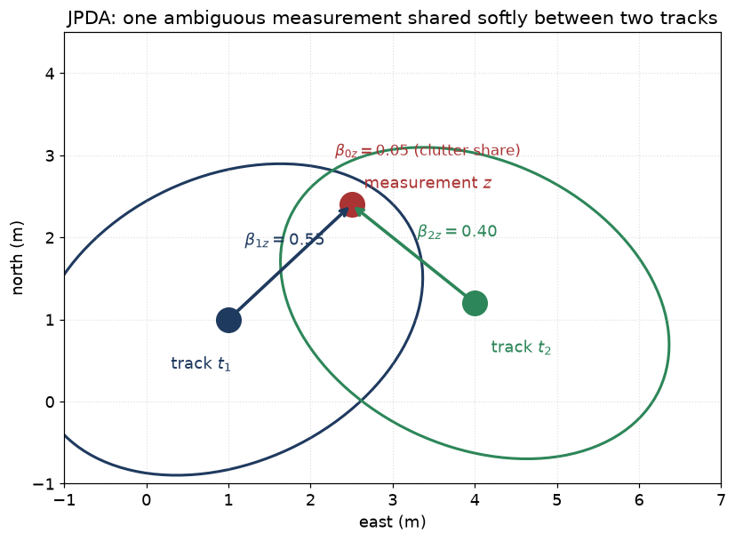

# 12 — Joint Probabilistic Data Association (JPDA)

> Prerequisites: [11 — Gating + GNN + Hungarian](11-gating-gnn-hungarian.md),
> [13 — Clutter and detection](13-clutter-and-detection.md) helps.
> Next: [13 — Clutter and detection](13-clutter-and-detection.md).

GNN and Hungarian commit to a **hard** assignment: one
measurement, one track, done. If the assignment is wrong, the
filter is permanently corrupted.

In dense traffic the right choice is often ambiguous — measurement
`z_j` *might* belong to track `t_a` (probability 0.7) or to
track `t_b` (probability 0.25) or be clutter (probability 0.05).
Committing 100 % to `t_a` throws away the information that `t_b`
also wanted that measurement.

**JPDA** is the principled solution: **enumerate every plausible
joint assignment, weight each by its posterior probability, and
update each track by the *weighted average* of all measurements
that could belong to it**. No commit. Soft update.

## 1. The joint event

A **joint association event** `θ` is a function

```
θ: {1..M} → {0, 1..T}
```

with `θ(j) = 0` meaning "measurement `j` is clutter" and `θ(j) = t`
meaning "measurement `j` belongs to track `t`". The constraint:
**no two measurements can share the same non-zero target**
(at most one detection per target per scan).

The set of all feasible `θ` is enumerated from a **validation
matrix** `V[j][t]` (1 if `(j, t)` is in-gate, 0 otherwise).

Example with 3 measurements and 2 tracks, validation matrix:

```
       t_1   t_2
 z_1    1     0     ← z_1 only in-gate for t_1
 z_2    1     1     ← z_2 ambiguous between t_1 and t_2
 z_3    0     1     ← z_3 only in-gate for t_2
```

Feasible joint events (writing `θ(j) = k` as `j→k`):

```
θ_a:  1→1, 2→0, 3→2
θ_b:  1→1, 2→2, 3→0   (can't be 3→2 and 2→2; would share t_2)
θ_c:  1→0, 2→1, 3→2
θ_d:  1→0, 2→2, 3→0
θ_e:  1→0, 2→0, 3→2
θ_f:  1→1, 2→0, 3→0
θ_g:  1→0, 2→0, 3→0    (all clutter)
... (every clutter-or-target combination respecting the validation)
```

For each `θ`, we compute its posterior probability.

## 2. The weight of a joint event

Two pieces:

1. **Likelihood** of the measurements under `θ`.
2. **Prior** for `θ` — how likely is this particular pattern of
   detection vs missed-detection vs clutter?

Per Bar-Shalom (PDA chapter), un-normalised:

```
w(θ) ∝ λ_C^{N_FA} · P_D^{N_D} · (1−P_D)^{T−N_D} ·
        Π_{j: θ(j)≥1} N(z_j; ẑ_{θ(j)}, S_{θ(j)})
```

where:

- `N_D = |{j : θ(j) ≥ 1}|` is the number of *detections*
  (measurements assigned to real tracks).
- `N_FA = M − N_D` is the number of false alarms.
- `λ_C` is the clutter density (false alarms per unit volume).
- `P_D` is the detection probability per (sensor, target).
- The Gaussian factors are the per-pair likelihoods.

Normalise across all feasible θ (log-sum-exp for numerical
safety):

```
w̃(θ) = w(θ) / Σ_{θ'} w(θ')
```

## 3. Marginal probabilities `β`

We do not actually care about each `θ` individually. We care
about the marginal: *"what is the probability that measurement
`j` belongs to track `t`?"*. Summing over all `θ` consistent
with `j → t`:

```
β_{jt}  = Σ_{θ: θ(j)=t} w̃(θ)        (j paired with t)
β_{0t}  = Σ_{θ: t unpaired} w̃(θ)    (t missed by every z)
```

These `β` are the **soft association probabilities**. They sum
to 1 over `j` for each `t` (including the "missed" event).

In our 3×2 example, after computing all `w̃(θ)`, we end up with
something like:

```
        z_1     z_2    z_3    missed
 t_1   0.85   0.10    0.0    0.05
 t_2   0.0    0.20   0.75    0.05
```

Track `t_1` "mostly belongs to `z_1`, with a small share of `z_2`".

## 4. The PDAF / JPDAF update

For each track `t`, compute the **combined innovation**:

```
ŷ_t = Σ_j β_{jt} · ŷ_{jt}
```

— each candidate's innovation, weighted by its β. Then apply the
Kalman gain as usual:

```
x̂_t ← x̂_t + K_t · ŷ_t
```

But the **covariance update has an extra term** — the "spread"
that accounts for the fact that we did not commit:

```
spread = K_t · [ Σ_j β_{jt} · ŷ_{jt} ŷ_{jt}ᵀ − ŷ_t ŷ_tᵀ ] · K_tᵀ
P_t   ← β_{0t} · P_t + (1−β_{0t}) · (I − K_t H_t) P_t + spread
```

Two effects:

- `β_{0t} · P_t` represents the chance that the track was *missed*
  this scan, so the covariance is left un-shrunk in that fraction.
- `spread` represents the uncertainty due to ambiguity between
  candidate measurements — the bigger the disagreement among
  candidates, the bigger the spread.

This is the **soft, hedged Kalman update**.

## 5. Picture: two ambiguous tracks, one shared measurement

Two confirmed tracks `t_1` and `t_2` running side-by-side. One
new measurement `z` lands almost between them.



The ellipses are the two tracks' gates. Both tracks include `z`
in their gates, so the joint event "z belongs to t_1" and the
joint event "z belongs to t_2" are both feasible. JPDA computes
`β_{1z}, β_{2z}, β_{0z}` (and similar for any other measurements)
and updates each track by the weighted measurement.

| Strategy        | What happens to z                                            |
|-----------------|--------------------------------------------------------------|
| GNN / Hungarian | Commits to `t_1` (closest). `t_2` gets *no* update. If wrong, `t_1` is corrupted. |
| JPDA            | Both tracks pull toward `z`, weighted by their β. Both covariances inflated by the "spread" term that captures the remaining ambiguity. |

JPDA never commits. If the next scan's measurement clearly belongs
to `t_2`, the β values snap and the tracks separate cleanly. No
permanent damage.

## 6. Strengths and weaknesses

### Strengths

- **Single-scan recovery from ambiguity.** No mistake is
  committed. If clearer evidence arrives next scan, β shifts
  smoothly.
- **Each track stays a single Gaussian** — cheap downstream
  (CPA, output, etc.).
- **Honest about residual ambiguity** through the spread term.

### Weaknesses

- Still cannot maintain **multiple competing track hypotheses
  over many scans**. After the soft update, the track is one
  state. If next scan a *very* different assignment becomes
  better, you have lost the alternative path.
- **Track coalescence**: closely-spaced tracks pull towards each
  other due to mutual β contributions. Over time the two
  tracks merge in state. A real maritime problem in parallel
  formations.

For deferred decision across many scans → MHT (chapter 14).

## 7. Cost

Enumerating *all* feasible joint events is `O(K^M)` in the worst
case where `K` is the max-in-gate per measurement. In practice we
prune with a low-probability threshold and use cluster
decomposition to keep this tractable.

The codebase pre-clusters tracks and measurements so that
disjoint clusters do not need joint enumeration with each other.
Two tracks 10 km apart with no shared measurements: enumerate
each cluster separately, then concatenate.

## 8. Assumptions

| Assumption                                          | When it pinches                                 |
|-----------------------------------------------------|-------------------------------------------------|
| Gaussian likelihood per (track, z) pair             | Heavy-tailed sensors mis-rate odds              |
| Independent clutter (Poisson rate λ_C)              | Clutter maps help (chapter 13)                  |
| Known `P_D`                                         | Adaptive `P_D` is on the roadmap                |
| One detection per target per scan                   | Closely-spaced merge in one blob; needs MHT     |
| Cluster decomposition correct                       | Enforced by gating: out-of-gate ≡ disjoint      |

## 9. Why we can use JPDA here

For mid-density traffic — say, a port approach with crossings —
JPDA is the cheapest associator that does not commit. It handles
crossing-vessel scenarios that ruin GNN/Hungarian, without paying
the MHT bill.

For high-density traffic (heavy AIS plus heavy clutter) we layer
MHT on top.

## 10. Where this lives in code

- `core/association/JpdaAssociator.{hpp,cpp}` — joint event
  enumeration, `β` computation.
- `core/association/JointEvents.{hpp,cpp}` — feasible-event
  enumeration helpers (shared with MHT).
- `core/estimation/EkfEstimator::softUpdate` — the PDAF soft
  update with the `spread` covariance term.
- `docs/algorithms/association.md` §4.

## 11. What we did not pick, and why

- **Plain PDA** (single track): we always have many tracks, so
  PDA on its own is not enough.
- **IPDA** (Integrated PDA with track existence): an upgrade we
  are taking via MHT's existence-per-leaf machinery (see backlog
  item).
- **MS-JPDA** (Multiscan JPDA): combines JPDA across scans —
  some of the benefits of MHT at lower cost. Possible future
  work, but the MHT path is more general.

## 12. PDA comes back: the PMBM soft detected-branch update

Section 11 said plain single-track PDA "is not enough" because we
have many tracks. That is true as a *whole* data-association method.
But a small, scoped piece of PDA turns out to be exactly the right
tool for one specific bug in the PMBM tracker.

**The bug.** PMBM (in its fast K=1 mode) picks, for each track, the
*one* nearest measurement and updates the track with only that one —
this is the hard "winner-take-all" pick from chapter 11. On the open
sea a piece of clutter sometimes lands **closer to the guess** than
the real ship's return. The track then jumps fully onto the clutter.
Next scan the real ship is outside the gate, and the track dies.

```
        guess ●                  hard pick: jump 100% to clutter ✗
       /       \                 x_new = clutter
  clutter ○     ○ real ship      → real ship leaves the gate next scan
   (closer)     (a bit farther)
```

**The fix (this is PDA).** Instead of jumping fully to the nearest
return, blend the returns by how likely each one is — exactly the
`β` weights of this chapter. The real ship still gets some weight, so
the track only moves **part way** toward the clutter and keeps the
real ship inside the gate next scan.

```
  x_new = β_clutter · (update toward clutter)
        + β_real    · (update toward real ship)
  → track stays near the real ship, survives ✓
```

**Why it does not cause the usual over-count.** We only blend in a
measurement if **no other established track already claimed it**
(the "unclaimed-only pool"). In a crowded scene every return is
already owned by some track, so the pool shrinks to just the winner
and the update is the plain hard update again — no change, no extra
ghost tracks. In the open sea the clutter is unowned, so it joins the
pool and does its softening job. This is why the change helps thin
scenes and leaves dense scenes (philos) untouched.

It is off by default (`use_pda_soft_detected_branch`) and reduces to
today's behaviour whenever only one measurement gates. Full math:
[pmbm-design.md §11](../algorithms/pmbm-design.md).

**A twist from real data: don't soften toward the shore.** When we
tried this on a real harbour dataset (AutoFerry), the open sea got
better but the **urban channel got a little worse**. The reason: near a
city waterfront the "unowned" returns are not sea clutter — they are
**docks, walls, moored barges**. Blending toward them pulls the track
*into* the shore. The fix is to ask the map: if a return sits on land
(the same coastline map we use to stop births on shore, chapter 13),
keep it **out of the blend**. So PDA softens against *water* clutter
only. This is the `pda_pool_excludes_land` option. It is safe — with no
map loaded it does nothing — but note it can only help where the data
*has* a coastline; AutoFerry ships none, so we still need a charted
harbour test to prove it end-to-end.

---

Previous: [11 — Gating + GNN + Hungarian](11-gating-gnn-hungarian.md)
Next: [13 — Clutter and detection](13-clutter-and-detection.md) →
