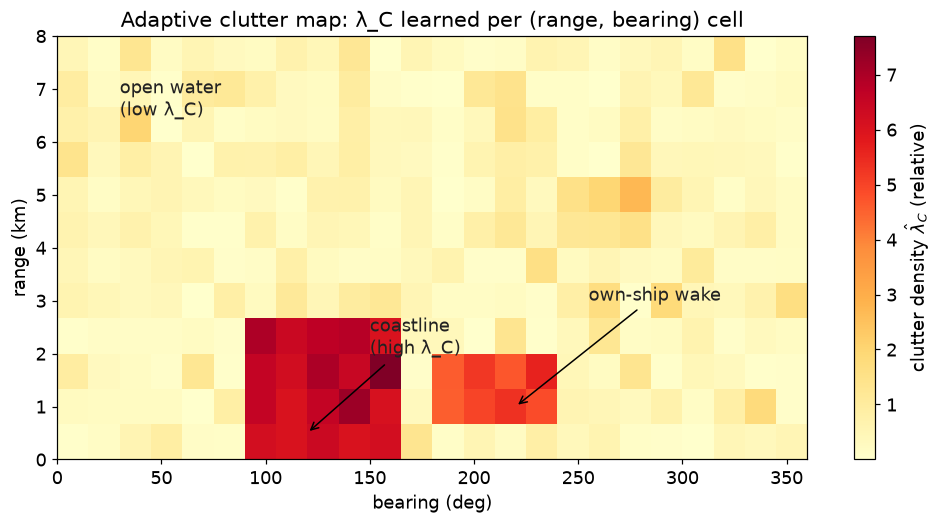
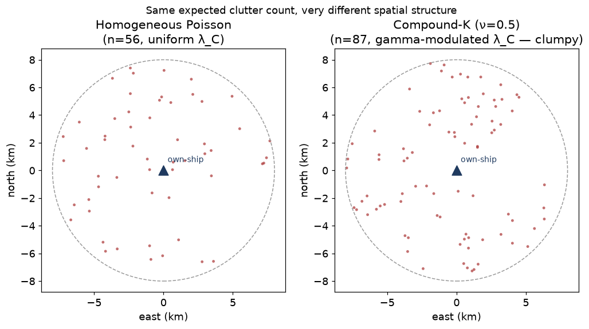

# 13 — Clutter and detection models

> Prerequisites: [12 — JPDA](12-jpda.md).
> Next: [14 — MHT](14-mht.md).

Sensors do not just give you target measurements. They also
give you:

- **Clutter** — false detections that look like targets but are
  not (a wave crest, a seagull, a radar reflection, a star
  glinting at the EO/IR camera).
- **Missed detections** — the target was there, the sensor did
  not see it.

These two affect the JPDA weight (chapter 12), the MHT score
(chapter 14), and the track lifecycle (chapter 15). Modelling
them correctly is what lets the tracker stay calm when sea
state goes from glass-flat to whitecaps.

## 1. Two parameters that summarise everything

For each (sensor, region), we need two numbers:

- **`P_D`** — probability of detection. *"Given that a real
  target is here, what is the chance the sensor sees it on this
  scan?"*. Always in `(0, 1]`. Modern radar might have `P_D ≈
  0.95`; an EO/IR camera in fog might be `0.4`.
- **`λ_C`** — clutter density. *"Per unit measurement volume,
  how many false alarms do we expect per scan?"*. Units
  inverse-volume (e.g. `1 / m²` for position measurements,
  `1 / (m·rad)` for range/bearing).

These two parameters thread through every probabilistic data
association: the JPDA event weight, the MHT score, the lifecycle
score-based confirmation.

## 2. The standard "Poisson clutter, Bernoulli detection" model

This is the textbook model and what we use as the baseline:

- **Detection** is Bernoulli: each real target is independently
  detected with probability `P_D`, missed with `1 − P_D`.
- **Clutter** is a **homogeneous Poisson point process** with
  intensity `λ_C`: false alarms appear uniformly at random in
  the measurement volume, with the *number* of false alarms in
  any subvolume being Poisson with mean `λ_C · |volume|`.

Implication: the probability that `n` false alarms appear in a
gate volume `V` is

```
P(n false alarms in V) = (λ_C V)^n · e^{−λ_C V} / n!
```

And the *density* of clutter at any point in the gate is just
`λ_C` (constant).

So when JPDA assigns measurement `z_j` to "clutter", the
likelihood factor is `λ_C` (a constant). When it assigns to
a target, the factor is `P_D · N(z_j; ẑ_t, S_t)`. When a target
is missed, the factor is `1 − P_D`. This explains the JPDA
event weight from chapter 12:

```
w(θ) ∝ λ_C^{N_FA} · P_D^{N_D} · (1−P_D)^{T−N_D} · Π … N(…)
```

You can read it now: *"each false alarm contributes `λ_C`, each
detection contributes `P_D` times its Gaussian likelihood, each
miss contributes `1 − P_D`"*.

## 3. Where do `P_D` and `λ_C` come from?

Three options, in order of sophistication:

### 3.1 Hard-coded per sensor

Simplest. Each sensor adapter publishes a typical `P_D` and
`λ_C` that the tracker uses everywhere. Good first cut.

### 3.2 Per-sensor, per-scenario tuned

Different `(P_D, λ_C)` for different operating conditions: open
sea vs port, calm vs heavy weather, day vs night. Switched at
the composition root.

### 3.3 Per-sensor + adaptive *clutter map*

A **clutter map** divides the measurement space (e.g. range/
bearing for a radar) into spatial cells and learns a *local*
`λ_C(cell)` from observed clutter rates over time. This is what
`ClutterMapDetectionModel` does in this codebase.

Why bother? Because clutter is **not uniform** in real life:

- Radar: more clutter near coastlines (wave + land reflections).
- EO/IR: more clutter near the sun glint angle.
- ARPA: more clutter in the wake of own-ship and other vessels.

A homogeneous `λ_C` over-counts clutter in empty areas (so the
filter is too cautious there) and under-counts clutter in noisy
areas (so the filter mis-confirms ghost tracks). A clutter map
fixes both ends.

### Clutter map mechanics

We discretise the measurement space into cells. For each cell
`c` and each *un-associated* measurement that falls in `c`, we
update a running estimate of clutter rate:

```
λ̂_C(c) ← α · (n_unassoc_in_c / V_c) + (1−α) · λ̂_C(c)
```

(EWMA-style update; details in the code.)

Two important refinements:

- **Where do "unassociated" come from?** A measurement is
  evidence of clutter only if it ended up explained by the
  clutter hypothesis. In the MHT path we label measurements from
  the **global hypothesis** (the best joint assignment) rather
  than from per-track birth gates — that is the "clutter map:
  label evidence from the global hypothesis" fix from a recent
  commit. Otherwise birth-gate babies pollute the clutter map.
- **Decay**: `α` controls the time-scale. Too fast → noisy `λ_C`
  estimates. Too slow → cannot track real environmental changes
  (e.g. weather front rolling in).



Cells with high `λ_C` (deep red — coastline, own-ship wake) make a
candidate measurement *less surprising* → less likely to birth a
new track or attract an existing one. Cells with low `λ_C`
(yellow — open water) make the same measurement *more surprising*
→ much more likely to be a real target.

## 4. Detection probability `P_D`

The Bernoulli `P_D` also is not constant in real life:

- Far targets are harder to detect than close ones (atmospheric
  loss, smaller cross-section).
- Targets behind another vessel (occlusion) drop in `P_D`.
- Targets in own-ship's blind sector (e.g. behind a mast) have
  `P_D ≈ 0`.

Adaptive `P_D` per (sensor, target) is on the backlog. Today we
use a single per-sensor `P_D` configured at composition time.

Even with a fixed `P_D`, getting the *value* roughly right
matters more than getting it perfectly. Sensitivity rule of
thumb:

- `P_D` too low → tracker over-explains misses, won't delete
  stale tracks ("zombie" tracks coasting forever).
- `P_D` too high → tracker under-explains misses, kills good
  tracks during legitimate sensor outages.

## 5. The relation to track lifecycle

Three places `(P_D, λ_C)` matter for lifecycle (chapter 15):

1. **Track score (LLR).** Each hit contributes
   `log(P_D · N(z|ẑ,S) / λ_C)`. Each miss contributes
   `log(1 − P_D)`. Confirmation and deletion thresholds are
   set on this score.
2. **Track birth.** A new measurement is more likely to be a
   real target the *lower* `λ_C` is. So the same measurement
   leads to a stronger birth in calm seas than in heavy clutter.
3. **Track death.** Several consecutive misses are damning if
   `P_D` is high, forgivable if `P_D` is low.

A good clutter / `P_D` model is therefore not "nice-to-have" —
it is the **calibration** that makes everything downstream
honest.

## 6. Assumptions

| Assumption                                       | When it pinches                                  |
|--------------------------------------------------|--------------------------------------------------|
| Clutter is Poisson (no clumping)                 | Real clutter clumps (gusts); we accept the bias  |
| Clutter is spatially uniform                     | Fixed by clutter map                             |
| `P_D` constant per sensor                        | Fixed by adaptive-`P_D` (future work)            |
| Detections independent across sensors            | True for our sensor stack                        |
| Sensor volume known (to convert λ to count)      | Set per sensor at composition time               |

## 7. Why we can use this model here

The Poisson-clutter model is the standard maritime model. AIS is
essentially clutter-free (`λ_C ≈ 0`); ARPA and EO/IR have
non-negligible clutter, well-modelled by Poisson over short time
scales. With a clutter map we adapt to spatial variation. With
per-sensor `P_D` we get most of the detection-probability
benefits without per-target adaptation.

## 8. Where this lives in code

- `core/tracking/ClutterMapDetectionModel.{hpp,cpp}` — the
  adaptive clutter map.
- `core/tracking/SensorDetectionModels.hpp` — abstract sensor
  detection-model interface.
- `core/association/JpdaAssociator.cpp` — uses `P_D, λ_C` in the
  event-weight formula.
- `core/pipeline/MhtTracker.cpp` — uses `P_D, λ_C` in the MHT
  score (chapter 14).
- `docs/baselines/2026-06-12_clutter_map*.md` — empirical impact
  of the clutter map.

## 9. Compound-K clutter: when "flat Poisson" is a lie

Everything above assumes clutter is **homogeneous Poisson**: false
alarms scattered with the same intensity `λ_C` everywhere, each
cell independent. Real **sea clutter is not like that.** Waves
come in groups; a swell, a rain cell, or a patch of choppy water
throws back many returns from one small area for a few seconds,
then that patch calms and another lights up. The returns are
**clumpy in space and bursty in time** — the opposite of "spread
out evenly."

The standard model for this is **compound-K** clutter. Think of it
as clutter with *two* layers of randomness:

- a slow **texture**: the local clutter power drifts up and down
  across the picture, patch by patch. We draw it from a **gamma**
  distribution (a positive, skewed distribution — mostly small
  with an occasional big spike). A shape parameter `ν` (nu) sets
  the spikiness: small `ν` = very spiky, large `ν` → back to flat.
- a fast **speckle**: given a patch's current power, the actual
  number of returns is a Poisson draw around it.

Multiply the two — gamma texture × Poisson speckle — and the count
you observe per patch is no longer Poisson but **negative-binomial**:
same *average* as Poisson, but a much **heavier tail**. Some patches
are empty; a few are packed.



Both panels above have the *same expected number* of false plots.
The left (Poisson) is evenly spread. The right (compound-K) has the
same average but forms **clumps** — and a few clumps are dense
enough to look like a cluster of detections from a real target.

**Why this matters — why it is not just a detail.** A tracker whose
`λ_C` term assumes flat Poisson sees a compound-K clump and cannot
explain it as "background": too many points, too close together, for
the uniform rate it believes in. So it does what it was told to do
with a surprising pile of detections — it **births tracks**. The
result is **over-counting**: phantom tracks that flicker in and out
where the clutter happened to bunch. The uniform-`λ_C` assumption
does not fail loudly; it fails as a steady stream of false tracks.

**Assumptions of the compound-K model.** (1) The texture varies
*slowly* relative to the scan rate (it is "frozen" within a patch
for the dwell). (2) Patches are drawn independently — a real sea
has spatial correlation the simple per-patch draw omits (a "ways to
improve" below). (3) The gamma shape `ν` is a property of the sea
state and radar, not a tuning knob you turn to make a scenario pass.

**Why it is here (the sim-gate rationale).** The multi-sensor
simulation battery (chapter 17 / `docs/baselines/2026-07-06_sim_multisensor_battery.md`)
uses compound-K on purpose in its `sim_ms_clutter_burst` scenario.
A simulation gate that fed the tracker *flat Poisson* clutter would
be **model-matched**: it would flatter exactly the assumption the
tracker already makes, and report falsely reassuring accuracy. The
gate exists to stress the assumption, so it must generate the
clutter the assumption gets *wrong*. And it does: on that scenario
both the MHT and PMBM trackers over-count (positive cardinality
error) precisely because their `λ_C` is uniform — the measured
signal that a **spatially-varying-λ_C** model (the adaptive clutter
map, §3.3) is the next thing to test there.

**Ways to improve / test next.** (1) Correlated texture (a smoothed
random field instead of independent patches) — closer to real sea
clutter's spatial correlation. (2) Score a spatially-varying-λ_C
tracker against `sim_ms_clutter_burst` and confirm it beats
uniform-λ_C on cardinality error (the designed A/B). (3) Tie the
gamma `ν` to a named sea state so scenarios are labelled by
condition, not by an opaque number.

## 10. What we did not pick, and why

- **Non-homogeneous Poisson cluster process** — better statistical
  model for clumpy clutter, but estimation is fragile and the
  cost rarely pays back. The clutter map captures most of the
  benefit. (Compound-K, §9, is how we *generate* clumpy clutter
  for the sim gate; estimating it online is the harder problem
  this bullet is about.)
- **Per-target adaptive `P_D`** — backlog item; needs careful
  identifiability analysis to avoid feedback loops with the
  tracker's own state.

---

Previous: [12 — JPDA](12-jpda.md)
Next: [14 — MHT](14-mht.md) →
