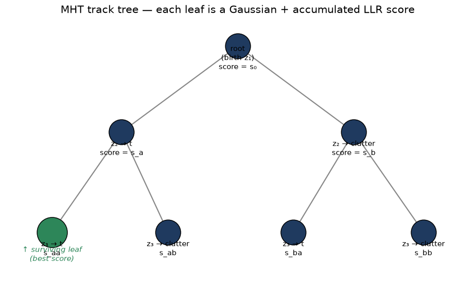
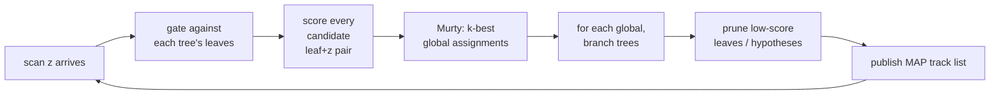

# 14 — Multiple Hypothesis Tracking (MHT)

> Prerequisites: [11 — Gating + GNN + Hungarian](11-gating-gnn-hungarian.md),
> [12 — JPDA](12-jpda.md), [13 — Clutter and detection](13-clutter-and-detection.md).
> Next: [15 — Track lifecycle](15-track-lifecycle.md).

JPDA hedges across a *single scan*. MHT hedges across *many
scans*. The idea: when you cannot decide whether `z_j` belongs to
`t_a` or `t_b`, **do not decide**. Keep both possibilities as
separate hypotheses. Update both. Wait. Future measurements will
make one of them dominant and the other negligible — then prune.

This is the most powerful associator in classical tracking, and
it is what navtracker actually runs in production
(`MhtTracker`).

## 1. The core idea: a hypothesis tree per target

For every target we maintain a **track tree**: a tree of
state hypotheses rooted at the first measurement that birthed
the track. Each node is a Gaussian `(x̂, P)` plus a score, and
each branch corresponds to a particular history of
*which measurements were assigned to this track*.



Each leaf carries `(x̂, P, score)`. The score is the
log-likelihood-ratio of the history it represents. The green leaf
is the current best-score leaf and would be the one selected
under N-scan pruning. After collapse, the tree restarts from that
leaf, and the cycle repeats.

Each leaf is a "complete history": *"this track was born from
`z_1`, then assigned `z_2`, then missed at `z_3`, ..."*. Many
histories are very unlikely and get pruned. A few survive and
form the active hypothesis set.

The leaves of the track tree are the **current states** for
that target — the things you would associate, gate, score,
update. You can think of each leaf as a separate "track" with
its own (x̂, P, score).

## 2. The global hypothesis

For each scan, we want a **joint** assignment across all
targets: which leaf in each track tree got which measurement. The
combinatorial space is the product of leaf-sets across trees —
huge.

We pick the **k best global hypotheses** with **Murty's
algorithm** (chapter 11 mentioned it; covered below). The single
best is the **maximum a-posteriori (MAP) global hypothesis** —
the most likely joint assignment given all evidence. It is what
the tracker publishes as the current track list.



## 3. The score — log-likelihood ratio (LLR)

The MHT score is the **log-likelihood-ratio** of "the
measurements belong to a real track" vs "the measurements are
clutter". For a hypothesis with `N_hit` hits and `N_miss`
misses:

```
score = Σ_hits  log( P_D · N(z; ẑ, S) / λ_C )
      + Σ_miss  log( 1 − P_D )
```

Each in-gate measurement contributes a positive term that
combines:

- `log P_D`     — "we expected this hit",
- `log N(...)`  — Gaussian likelihood (Mahalanobis cost
  `−½ d² − ½ log |S|`),
- `−log λ_C`    — comparing against the clutter alternative.

Each miss contributes `log(1 − P_D)` — small if `P_D` is high,
forgiving if `P_D` is low.

LLR is **additive across time**, so the score is just the sum.
Numerically safe: stays bounded as long as you wrap and
clip-by-pruning.

This is the same `λ_C` and `P_D` you read about in chapter 13.

## 4. Murty's k-best

The joint assignment is solved by the Hungarian algorithm
(chapter 11) — that gives you the *best* one. **Murty's
algorithm** extends Hungarian to give you the *k* best in
deterministic time. We use `k = 3` to `k = 10` typically.

Why `k > 1`? Because the second-best global assignment might
become the best as new data arrives. Keeping the top-k seeds
gives us the diversity needed to defer decisions.

The algorithm iteratively partitions the assignment space,
running Hungarian on each partition. Cost is roughly `k · n³`.

See `core/association/Murty.cpp`. Production today uses
`murty-k3` (top-3) as the default; bench results in
`docs/baselines/2026-06-08_murty-k3.md`.

## 5. Branching, pruning, and the N-scan window

After we have the k best globals, we **branch** each track tree:

- For each (tree, global) we extend the relevant leaf with a
  new child node corresponding to the assignment in that global.
- Different globals may extend the same leaf in different ways
  → multiple children, each with its own score.

This is where the **combinatorial growth** comes from. Without
pruning, the tree size doubles every scan. We use four pruning
mechanisms:

1. **Score pruning.** Drop any leaf whose score is more than
   `Δ_score` below the best leaf in its tree. Far-behind leaves
   are dead.
2. **Global hypothesis pruning.** Drop globals whose total
   score is more than `Δ_global` below the best.
3. **N-scan pruning.** After N scans (typically 3–5), commit
   to the leaf with the best score; collapse the tree back to
   that single branch. This is the most powerful pruner — it
   bounds the tree depth.
4. **Sibling merging.** Two leaves with nearly identical state
   are moment-matched-merged.

Without these, MHT is unimplementable. With them, MHT runs at
real-time on dozens of tracks.

## 6. Track existence: birth, confirm, delete

MHT separates **track existence** from **track state**. The
score doubles as a confirm/delete signal:

- New birth: leaf with the seed measurement and `score_init`.
- After several scans, if the leaf's score crosses a confirm
  threshold → confirmed. (Equivalent to the M-of-N rule.)
- If the leaf's score drops below a delete threshold → leaf
  killed. If a whole tree's best leaf is killed → track
  deleted.

Each leaf can carry an **existence probability** (IPDA-style) —
the probability the leaf corresponds to a real target rather
than to a long clutter run. This is a backlog item (see
`project_imm_tomht_upgrade_path.md` in memory).

## 7. Per-sensor `(P_D, λ_C)` in the score

The codebase computes the score with **per-sensor** `(P_D, λ_C)`
rather than a single global pair. That matters because:

- AIS has near-zero clutter and high reliability.
- ARPA has noticeable clutter and moderate reliability.
- EO/IR has different reliability again.

A single `P_D, λ_C` across all sensors would make AIS-only
tracks score the same as ARPA-only tracks of equal quality,
which is wrong. The per-sensor split is the right thing.
See backlog item 12 in `docs/algorithms/improvement-backlog.md`.

## 8. The duplicate-birth conveyor

A subtle MHT failure mode the codebase has fought:

> A measurement is gated for an *existing* track tree and *also*
> for a new birth tree. If both get accepted, we end up with two
> trees that gradually converge to the same state. After
> N-scan pruning, the duplicate stays.

Fixes (deployed):

- Birth-gate **suppression**: if a measurement is well-explained
  by any existing track, it is not allowed to birth a new tree.
- N-scan pruning across **siblings**: trees with nearly
  identical leaves get merged.
- See `core/pipeline/MhtTracker.cpp` and commits like
  `3c85ec9 MHT: sc5 churn re-diagnosed as duplicate-birth
  conveyor`.

The lesson: MHT is sensitive to bookkeeping bugs that have no
analogue in GNN/JPDA. Most production failures are bookkeeping
failures, not theory failures.

## 9. Assumptions

| Assumption                                            | When it pinches                                |
|-------------------------------------------------------|------------------------------------------------|
| Per-leaf Gaussian posteriors                          | Same as KF-family; usually fine                |
| Track existence factorises across leaves              | True approximately; failures show up as zombies|
| Clutter Poisson with `λ_C` correct                    | Clutter map (chapter 13) handles spatial var. |
| `k` (top-k globals) covers the relevant alternatives  | `k = 3` works empirically                      |
| Score thresholds well-calibrated                      | Requires offline tuning per deployment         |

## 10. Why we can use MHT here

MHT is the right tool for tracking in dense traffic and dense
clutter — the maritime regime when you approach a port or a
busy waterway. The cost is real but bounded by aggressive
pruning. The bookkeeping is finicky but contained inside
`MhtTracker.cpp`. The score-based lifecycle gives us
honest confirm/delete behaviour without ad-hoc heuristics.

For very low-density traffic where every measurement is
unambiguous, MHT is overkill. The architecture lets a consumer
swap to GNN or JPDA if they need to.

## 11. Where this lives in code

- `core/pipeline/MhtTracker.{hpp,cpp}` — main MHT orchestration.
- `core/tracking/TrackTree.{hpp,cpp}` — the per-target tree.
- `core/association/Murty.{hpp,cpp}` — k-best assignment.
- `core/association/JointEvents.{hpp,cpp}` — event enumeration.
- `core/tracking/ClutterMapDetectionModel.{hpp,cpp}` — clutter
  map (chapter 13).
- `docs/algorithms/algorithm-review-2026-06-07.md` — full
  classical-MHT design log.
- `docs/baselines/2026-06-*` — empirical evaluation across
  scenarios.

## 12. What we did not pick, and why

- **Reid's classical MHT with explicit hypothesis matrix.** Same
  math, more memory. The tree representation we use is more
  efficient.
- **PMBM / labelled multi-Bernoulli filters.** Modern
  alternatives with cleaner Bayesian foundations. We have not
  invested in them — current MHT is already strong, and the
  switching cost is large. Possibly future work.
- **Sequential MHT** (process one measurement at a time
  instead of per-scan). Theoretically equivalent; per-scan is
  what the literature and the code converged on for performance.
- **Random Finite Set (RFS) filters** — entire alternative
  paradigm. Not adopted; tracking literature and our team's
  expertise both lean classical-MHT.

---

Previous: [13 — Clutter and detection](13-clutter-and-detection.md)
Next: [15 — Track lifecycle](15-track-lifecycle.md) →
