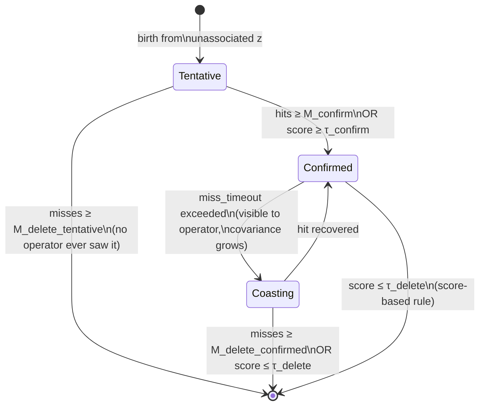

# 15 — Track lifecycle and scoring

> Prerequisites: [13 — Clutter and detection](13-clutter-and-detection.md),
> [14 — MHT](14-mht.md).
> Next: [16 — NEES / NIS](16-nees-nis.md).

A track is not just a state plus covariance. It is also a
**lifecycle entity**: born from a measurement that may or may
not be real, growing in confidence as more measurements arrive,
dying when evidence runs out. This chapter is about the
*non-Bayesian bookkeeping* that surrounds the Bayes filter:
when does the tracker emit a new track, when does it confirm,
when does it delete?

If you get this wrong, the math underneath does not matter.
False tracks will pollute the display; real tracks will
disappear too quickly.

## 1. The four lifecycle states



- **Tentative** — fresh track. Not visible to operators yet.
  Waiting for enough hits to confirm.
- **Confirmed** — operator-visible track. The tracker is willing
  to put a label on this.
- **Coasting** — recently confirmed but missing measurements.
  Operator still sees it (uncertainty grows visibly), but it is
  on its way out.
- **Deleted** — gone. The track ID is **never re-used**, even
  long after deletion (CLAUDE.md invariant D1).

## 2. The simplest rule: M-of-N

A new measurement that does not associate to anything becomes a
*tentative* track. Then:

- Count consecutive hits. After `confirm_hits` hits (default
  e.g. 3 of last 4 scans), promote to **Confirmed**.
- Count consecutive misses. After `delete_misses` misses (a
  smaller number for tentative tracks, larger for confirmed
  tracks), delete.

`TrackManager` in this codebase uses the **strict consecutive**
M-of-N variant: `recordHit` zeros the miss counter,
`recordMiss` zeros the hit counter. Simple and deterministic.
See `core/tracking/TrackManager.{hpp,cpp}`.

Two refinements layered on top:

- **Miss timeout** instead of "miss per scan". A track is missed
  if `last_observation` is more than `miss_timeout` seconds in
  the past at the moment of a new measurement (any measurement,
  not necessarily for *this* track). This avoids the classic
  bug of recording a miss on every unrelated measurement that
  arrives. See `core/pipeline/Tracker.cpp` step 5.
- **Lifecycle is per-tree, not per-leaf** in MHT. The tree-level
  status is the max status across leaves.

## 3. The smarter rule: score-based (LLR) confirmation

M-of-N is robust but loses information. A track with three
measurements very far from the predicted location should *not*
confirm — even though it has 3-of-3 hits — because the
likelihoods were tiny.

The **score-based** rule uses the LLR from chapter 14:

```
score = Σ_hits  log( P_D · N(z|ẑ,S) / λ_C )
      + Σ_miss  log( 1 − P_D )
```

Confirm when `score ≥ τ_confirm`. Delete when
`score ≤ τ_delete`. Thresholds are calibrated to give a target
false-track rate vs. confirmation delay.

This is what `MhtTracker` uses (score *is* the tree leaf score).
`TrackManager` in non-MHT pipelines uses M-of-N as the simpler
fallback.

## 4. The miss counter and the gate

A miss is not a free signal. It costs:

- LLR-wise: `log(1 − P_D)`. Roughly `−log 10` per miss if
  `P_D = 0.9`.
- Operationally: covariance keeps growing during predict,
  so gates keep widening, so the next miss is increasingly
  unlikely to be a *real* miss (almost everything in-gate).

Tracks that genuinely no longer have a real target eventually
hit the delete threshold. Tracks that are simply sensor-shy
recover when the next real hit comes in.

## 5. Track IDs — never re-used

`TrackManager` issues monotonic `uint64` IDs starting at 1.
When a track is deleted, the ID is **gone forever**. Even if a
new track is initiated *immediately* at the same position with
similar dynamics, it gets a new ID.

Why? Two reasons:

1. **External consumers** keyed off the ID (e.g. operator
   workstations, recordings, alarms) need a stable definition.
   Re-using IDs would break replay determinism.
2. **Identity recovery** belongs to a separate layer (track
   stitching, AIS MMSI hinting). The tracker's job is
   per-second consistency, not cross-session re-identification.

This is CLAUDE.md invariant D1, non-negotiable.

## 6. Birth — when can a measurement start a new track?

A measurement that did *not* associate to any existing track is
a candidate for birth. But not every unassociated measurement
deserves a track: in clutter we would create dozens of false
tracks per scan.

Rules in the codebase:

- **Single measurement birth.** A new tentative track is
  initiated with `estimator.initiate(z)`. The state mean
  inherits the position from `z` (and velocity from `z` if the
  measurement model includes velocity, else zero). The
  covariance is the measurement covariance plus a generous
  velocity covariance.
- **Birth gating.** In MHT, we suppress births for
  measurements that are well-explained by an existing tree
  (the "duplicate-birth conveyor" fix from chapter 14).
- **Score-init.** A new tree leaf gets `score_init` that
  encodes the prior probability of a real target birth.

## 7. Coasting — keep predicting when you cannot update

While a track is missing measurements, the predict step keeps
running. The covariance keeps growing. The operator can still
see the predicted position with widening uncertainty — useful
for collision-risk evaluation even when the sensor blinks.

We do *not* freeze tracks in place during coasting. A frozen
track gives a false sense of certainty. The growing covariance
ellipse is the honest depiction.

## 8. Promotion and demotion in IMM / MHT

For IMM tracks, lifecycle is *not* per-mode. We sum hits/misses
across the IMM as a whole. The lifecycle state machine sits
above the IMM.

For MHT, leaves have scores but lifecycle is **per-tree**. The
tree's effective state is the maximum status of any leaf, which
in practice equals the status of the best-score leaf because
all confirmed leaves carry similar scores.

## 9. The deletion event

When a track is deleted we fire `onTrackDeleted` via
`ITrackSink`. This is a hard transition; the track is removed
from the manager. Downstream consumers must store enough state
to identify the track or to display its last known position.

Why a push event rather than poll? Because deletion is rare and
the consumer typically needs to react (clear an alarm, close a
file). Polling for "any track gone since last call" is
error-prone; the push semantic is robust.

The same goes for `onTrackInitiated` (lifecycle entry) and
`onTrackConfirmed` (operator-visible promotion).

## 10. Assumptions

| Assumption                                  | When it pinches                                 |
|---------------------------------------------|-------------------------------------------------|
| Hit/miss counts well-calibrated             | Wrong `P_D` → wrong confirm/delete behaviour    |
| Miss timeout well-calibrated                | Too short: real tracks die in noisy gaps        |
| Score thresholds tuned per deployment       | Default thresholds OK for moderate clutter      |
| ID issuance is sequential and unique        | Enforced by `TrackManager`                      |
| IDs never re-used                           | Enforced                                        |

## 11. Why we can use this here

The lifecycle policy is independent of sensor type and works on
any associator. Same policy for AIS-only, ARPA-only, mixed —
because the inputs are abstract `hit`/`miss` events plus an
optional score. The interface boundary is clean.

For MHT, score-based confirmation is a strict improvement over
M-of-N and is what we ship. For non-MHT pipelines, M-of-N is the
simpler baseline that any team can audit by eye.

## 12. Where this lives in code

- `core/tracking/TrackManager.{hpp,cpp}` — lifecycle state
  machine, ID issuance.
- `core/pipeline/Tracker.cpp` — orchestration: hit/miss
  counting on each measurement.
- `core/pipeline/MhtTracker.cpp` — MHT-side lifecycle from
  tree-leaf scores.
- `ports/ITrackSink.hpp` — push events.
- `docs/algorithms/association.md` §3.

## 13. What we did not pick, and why

- **Sliding-window M-of-N** (e.g. 3-of-5 over a window) — more
  forgiving than strict consecutive M-of-N. We may switch when
  the next NEES/NIS-driven calibration is done. Backlog item.
- **Re-promote Coasting → Confirmed on re-acquisition.** Today
  the track stays Confirmed throughout (Coasting is just the
  "we are missing data" sub-state). The codebase exposes this
  via the lifecycle state machine; future versions may add a
  full re-promotion event.
- **Track stitching across deletes.** A separate layer above the
  tracker. Possible future work; needs careful AIS-MMSI hint
  design.
- **An in-lifecycle "hand off to static hazard" transition.** The
  lifecycle here is vessel-track-only; there is no state that
  converts a stopped track into a static-hazard representation (or
  back). That vessel-vs-environment handling lives entirely in the
  birth channel — [chapter 26](26-static-obstacles.md) (charted)
  and [chapter 27](27-live-static-occupancy.md) (learned) — not in
  this state machine.

---

Previous: [14 — MHT](14-mht.md)
Next: [16 — NEES / NIS](16-nees-nis.md) →
