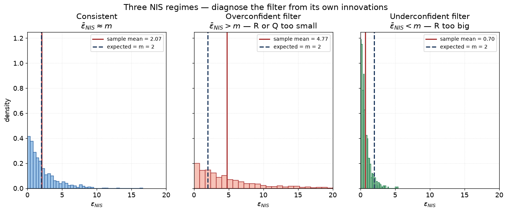
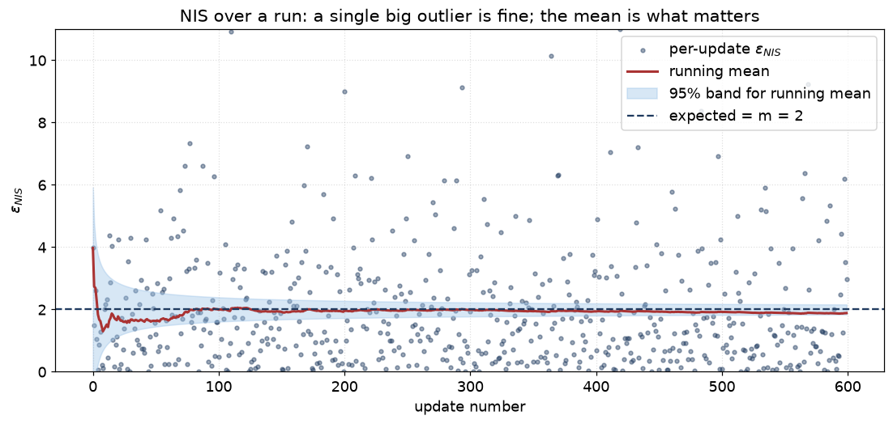

# 16 — Filter consistency: NEES and NIS

> Prerequisites: [04 — Kalman filter](04-kalman-filter.md),
> [11 — Gating](11-gating-gnn-hungarian.md),
> [13 — Clutter and detection](13-clutter-and-detection.md).
> Next: [17 — Multi-sensor + bias](17-multi-sensor-and-bias.md).

Every filter we have discussed makes a self-statement at each
step: *"this is the mean, this is the covariance, this is how
confident I am"*. We have no way to know if those statements are
honest until we **compare them against ground truth**.

Two simple, classical metrics do this. They are the **NEES**
(Normalised Estimation Error Squared) and the **NIS**
(Normalised Innovation Squared). Both are dimensionless
chi-squared statistics. Both are essential for tuning `Q` and
`R`. Both are the first thing to check when a tracker
"behaves weirdly".

## 1. NIS — am I lying about my innovation covariance?

NIS lives on the *measurement side*. It does not need ground
truth. After every update:

```
ν  = z − h(x̂⁻)              (innovation, bearing-wrapped)
S  = H P⁻ Hᵀ + R              (predicted innovation covariance)
ε_NIS = νᵀ S⁻¹ ν              (NIS, dimensionless)
```

Under the Gaussian-noise hypothesis, `ε_NIS` is **chi-squared
distributed** with degrees of freedom equal to the measurement
dimension `m`. Its expected value is `m`.

### What NIS tells you

Average NIS over many updates:

- `ε̄_NIS ≈ m`: filter is consistent. Predicted `S` matches the
  actual surprise.
- `ε̄_NIS > m`: filter is **overconfident**. Real innovations are
  bigger than `S` says — either `R` is too small, `Q` is too
  small, or the motion model is wrong.
- `ε̄_NIS < m`: filter is **underconfident**. Real innovations
  are smaller than `S` expects — your `R` is too big.

### Picture



Left: the sample mean of `ε_NIS` sits near `m = 2` — the filter
is consistent. Centre: the mean is well above `m`, the filter is
overconfident (`R` and/or `Q` too small). Right: the mean is well
below `m`, the filter is underconfident (`R` too big).

Now the same picture as a time series with the 95 % confidence
band for the running mean:



Individual `ε_NIS` values bounce around — a single big sample is
fine (one outlier visible mid-run). The running mean is what
matters, and it stays inside the band around `m = 2`. A drift
upward over minutes would tell you `R` is creeping wrong.

### NIS is per (sensor, measurement-model, source) bucket

The codebase aggregates NIS per source key
`k = (SensorKind, MeasurementModel, source_id)`. Different
sensors have different `R`s and the consistency story is
per-sensor.

### The R-calibration loop

If NIS for ARPA at source X is `2× m`, you have evidence that
ARPA's published `R` is too small. The corrective `R` scaling
is roughly `R' = (NIS / m) · R`. Iterate until NIS settles near
`m`.

This is what `docs/algorithms/consistency.md` and
`docs/superpowers/specs/2026-06-13-nees-r-calibration-design.md`
describe in detail. The `IInnovationSink` port carries
innovations to the bench-side aggregator.

## 2. NEES — am I lying about my state covariance?

NEES lives on the *state side*. It needs ground truth `x_true`:

```
e = x_true − x̂
ε_NEES = eᵀ P⁻¹ e
```

Under the Gaussian hypothesis, `ε_NEES` is **chi-squared
distributed** with degrees of freedom equal to the state
dimension `n`. Expected value is `n`.

Average NEES over many updates:

- `ε̄_NEES ≈ n`: filter is consistent.
- `ε̄_NEES > n`: filter is **state-overconfident**. Real error
  is bigger than `P` says. Could be biased state, badly-tuned
  `Q`, or model mismatch.
- `ε̄_NEES < n`: filter is **state-underconfident**.

In production we cannot compute NEES directly — there is no
ground truth. We use NEES on **scenario tests** where synthetic
truth is known.

### Picture

The same shape as NIS but with `n` (state dim) instead of `m`.

## 3. The combined view

Both must look right. Two common failure modes:

```
  NIS high + NEES high   → Q too small. Filter is too stiff;
                           predict step does not allow
                           enough motion uncertainty.
  NIS high + NEES low    → R too small. Filter trusts the
                           sensor too much; updates are too
                           snappy.
  NIS low  + NEES high   → R too big. Filter ignores good
                           sensors; state drifts.
  NIS low  + NEES low    → Filter is too cautious overall.
                           Inflate confidence (rarely the bug).
```

A good filter tune lands both near their expected values, with
narrow spread. Drift across the run (e.g. NEES rises over
minutes) suggests a structural model problem rather than a
covariance tune.

## 4. The chi-squared confidence bounds

For a sample size `N` and DOF `m`, the 95 %-confidence interval
for the *average* NIS is roughly

```
[ m · (1 − 2·√(2m)/√N) , m · (1 + 2·√(2m)/√N) ]
```

(narrows as `N` grows). For `N ≈ 200` and `m = 2`, the
acceptable mean-NIS band is `[1.6, 2.4]`. Anything outside is
statistically meaningful.

The codebase computes per-bucket confidence intervals and flags
"out of band" buckets in the consistency report.

## 5. Where NEES/NIS go wrong (and don't conclude too fast)

A *single* high NIS does not prove anything. Bigger-than-expected
innovations happen for legitimate reasons:

- The vessel turned right between predict and update.
- A clutter measurement squeezed past the gate.
- An IMM mode mismatch (predict was on CV, target was in CT).

Always look at:

- The **average over many samples** (Welford-style running
  mean).
- The **spread** (variance of NIS samples).
- The **time series** (does it drift?).

The aggregator in `core/benchmark/Consistency.{hpp,cpp}` does
all three.

## 6. When the model is the problem

NEES/NIS are diagnostics for **covariance** mistuning. If the
motion model is *fundamentally* wrong (e.g. CV used for a
constantly-turning vessel), the covariance tune alone cannot
fix it: even with the right `Q`, the predicted mean is off, so
the predicted innovation is biased, so NIS is biased even with
perfectly-tuned `R`.

In that case the fix is **structural** — add a CT mode,
adopt IMM, widen the motion family. NEES/NIS told you *that*
the model is wrong; you have to diagnose *what* is wrong by
inspecting failure trajectories.

## 7. Assumptions

| Assumption                                       | When it pinches                                  |
|--------------------------------------------------|--------------------------------------------------|
| Gaussian innovations                             | Heavy-tailed sensors bias NIS                    |
| `R` known per sensor                             | Wrong `R` is *what* NIS is detecting             |
| Ground truth available for NEES                  | Scenario tests only                              |
| Adequate sample size                             | Use confidence bands; don't over-interpret few   |
| Source-keyed buckets are stable                  | Re-keyed buckets reset the running average       |

## 8. Why we can use this here

NEES/NIS are universal Bayesian-filter diagnostics. They apply
to *any* of the filters in chapters 04–09. The codebase's
`IInnovationSink` design means the same port emits innovations
from EKF/UKF/IMM/MHT, and the same bench-side aggregator scores
all of them.

For us specifically:

- NIS catches per-sensor mis-calibration (ARPA `R` wrong, EO/IR
  `R` wrong, etc.).
- NEES on synthetic-truth scenarios catches structural model
  problems (CV used when CT is needed, etc.).
- The two together give us a tight feedback loop on tuning.

## 9. Where this lives in code

- `core/benchmark/Consistency.{hpp,cpp}` — running aggregator.
- `ports/IInnovationSink.hpp` — port for per-update innovations.
- `core/pipeline/Tracker.cpp` / `MhtTracker.cpp` — emit to the
  sink after each successful update.
- `docs/algorithms/consistency.md` — math, source keys, exact
  formulae.
- `docs/superpowers/specs/2026-06-13-nees-r-calibration-design.md`
  — the R-calibration plan.

## 10. What we did not pick, and why

- **Normalised Estimation Error Squared in NED** instead of in
  the filter's frame — different normalisation, no theoretical
  advantage. We use the filter's own `P` so the math closes.
- **Adaptive `R` tuning at runtime** — tempting, but dangerous
  feedback loop. Offline NEES/NIS + manual tune is safer.
- **Use NEES with the *posterior* `P` instead of the prior `P⁻`**
  — both have variants; the posterior version is more common
  in textbook coverage. We use the predicted moment-matched
  state at measurement time so the diagnostic catches the
  predict-side mis-tune separately from the update-side.

---

Previous: [15 — Track lifecycle](15-track-lifecycle.md)
Next: [17 — Multi-sensor + bias](17-multi-sensor-and-bias.md) →
