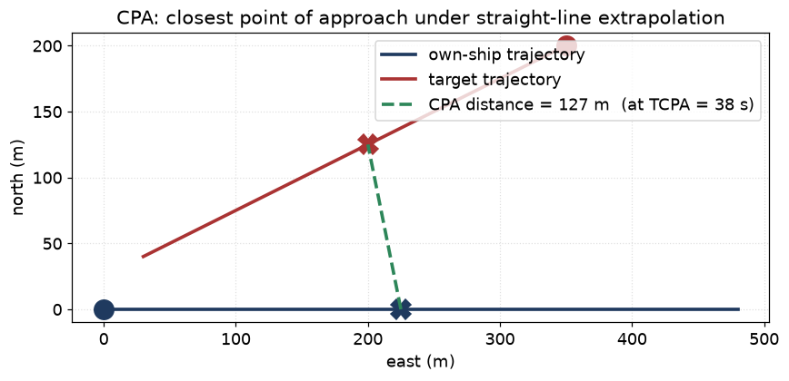
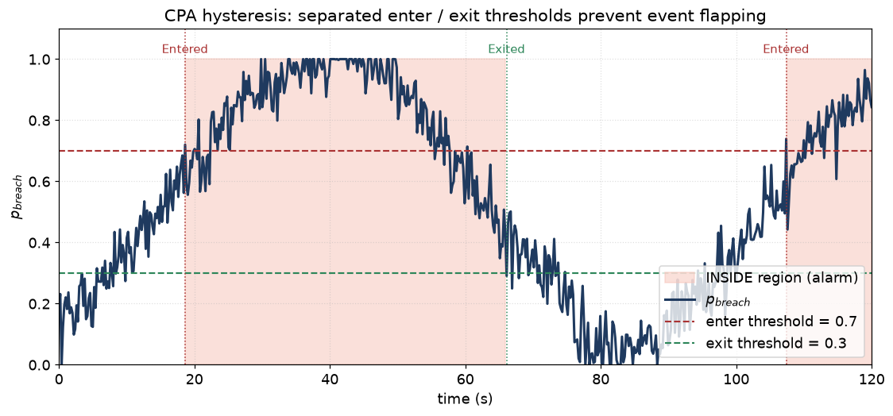

# 18 — CPA and collision-risk evaluation

> Prerequisites: [04 — Kalman filter](04-kalman-filter.md),
> [17 — Multi-sensor fusion](17-multi-sensor-and-bias.md).
> Next: [19 — Glossary](19-glossary.md).

A clean track list is not the goal in itself. The user-facing
question is operator-grade: *"is this vessel going to come too
close to us?"*. The answer is computed by the **CPA evaluator**
(`core/collision/CpaEvaluator.hpp`) and pushed via
`ICollisionRiskSink`.

CPA stands for **Closest Point of Approach** — the minimum
distance between own-ship and the target if both keep their
current course and speed, plus the **TCPA** (Time to CPA).

This chapter explains how CPA is computed, how the uncertainty
is propagated, and how the hysteresis logic emits Entered /
Exited events without flapping.

## 1. The deterministic CPA, no uncertainty

In ENU, let own-ship be at `p_o = [px_o, py_o]` with velocity
`v_o = [vx_o, vy_o]`, and target at `p_t, v_t`. Relative
position `Δp = p_t − p_o`, relative velocity `Δv = v_t − v_o`.

If both keep CV motion, time to closest approach:

```
TCPA = − (Δp · Δv) / |Δv|²     (if Δv ≠ 0)
```

Distance at that time:

```
CPA = | Δp + TCPA · Δv |
```

If `Δv = 0` (vessels with the same velocity), CPA is the
*current* relative distance and TCPA is undefined (or 0,
depending on convention).

These two numbers, plus the **bearing at CPA**, are the
deterministic ingredients.



Both ships extrapolate at constant velocity. The two "X" markers
are where they each sit *at the moment of closest approach*; the
green dashed line is the CPA distance.

## 2. Why deterministic CPA is not enough

Every component above is a *random variable*:

- own-ship velocity is uncertain by GPS noise + bias estimator
  state,
- target velocity is uncertain by the tracker's `P`,
- target position too,
- the model itself is constant-velocity (target may turn).

A deterministic CPA of "350 m, in 47 s" with no uncertainty is
misleading. The operator needs to know if there is a 90 %
chance of CPA below safety threshold, vs a 5 % chance.

So we compute a **probability of CPA breach**:

```
p_breach = P( CPA < d_threshold )
```

And we emit Entered / Exited events when this probability
crosses configurable thresholds.

## 3. How we propagate uncertainty into CPA

Two viable approaches:

### 3.1 Linearise (analytical)

Compute CPA and TCPA, then propagate the joint covariance of
`(p_o, v_o, p_t, v_t)` through the Jacobian of the CPA
formula. Fast but only accurate near the operating point;
breaks down when `|Δv|` is small (TCPA singular).

### 3.2 Sample (Monte Carlo)

Draw `N` samples from the joint Gaussian
`N(μ_joint, Σ_joint)`, compute CPA and TCPA per sample, count
the fraction of samples with `CPA < d_threshold`. Robust to
nonlinearity. The codebase samples to compute the breach
probability.

```
For i = 1..N:
   sample own_state_i ~ N(own_mean, own_cov)
   sample tgt_state_i ~ N(tgt_mean, tgt_cov)
   compute CPA_i, TCPA_i from CV propagation
   record breach_i = (CPA_i < d_threshold and TCPA_i > 0)

p_breach    ≈ (Σ breach_i) / N
CPA_med     = median of CPA_i (for display)
TCPA_med    = median of TCPA_i
```

This is the **sampling** the user asked about in the doc spec.
It is the same Monte-Carlo idea as the particle filter
(chapter 07) but applied to a downstream calculation, not to
the filter itself.

## 4. The CpaPrediction payload

The evaluator emits a `CpaPrediction` per (own_ship, target)
pair. Fields (cross-reference `core/collision/`):

```
- cpa_distance       (median or expected value, metres)
- tcpa               (median or expected value, seconds)
- cpa_bearing        (bearing at CPA, radians)
- p_breach           (probability of CPA below threshold)
- valid              (is the prediction usable, e.g. TCPA > 0)
- timestamp          (evaluation time)
```

Plus full uncertainty fields per the contract.

## 5. Hysteresis: avoiding event flapping

Naïvely you would emit `Entered` when `p_breach > 0.5` and
`Exited` when `p_breach < 0.5`. But the probability bobs across
0.5 dozens of times as noisy measurements arrive — flapping.
Operators would lose their minds.

Two separated thresholds make hysteresis:

```
enter_probability = 0.7
exit_probability  = 0.3
```

Logic:

- Start in `OUTSIDE`.
- If `p_breach > 0.7` → emit `Entered`, switch to `INSIDE`.
- Stay `INSIDE` until `p_breach < 0.3` → emit `Exited`,
  switch back to `OUTSIDE`.

Between 0.3 and 0.7 nothing changes. The track stays in
whichever state it was. Updates while inside fire
`CollisionRiskEvent::Updated` so the consumer can see the
risk evolve, without re-firing Entered.



`Entered` fires only on the first up-crossing of 0.7; `Exited`
fires only on the first down-crossing of 0.3. The pink-shaded
region is the "INSIDE / alarm" state. Between the two thresholds,
nothing changes — no flapping.

## 6. CV is enough for CPA (mostly)

We do *not* propagate IMM or MHT alternatives through the CPA
sampling. We sample from the **combined** posterior — the moment-
matched single Gaussian. Reason: CPA is a smooth function over
nearby trajectories, and the moment-matched Gaussian captures
the dominant uncertainty. A formal mixture sampling is a
backlog item but rarely needed in practice.

For *very* manoeuvring targets — e.g. a tug that turns sharply
mid-approach — the CV-extrapolation assumption is wrong on the
*motion*, not on the filter. The fix is a manoeuvre model in
the CPA propagation; in current production we accept the bias
during sharp turns and let the IMM keep the *filter* honest.

## 7. Per-pair vs per-target

The CPA evaluator walks **all (own_ship × target) pairs** each
`evaluate(t)` call. The complexity is `O(N_targets · N_samples)`.
For 30 tracks and 1000 samples, that is 30 000 cheap
calculations per evaluation — under 1 ms on commodity
hardware.

We do *not* evaluate target-vs-target CPA. The user-facing
question is own-ship safety, not full traffic forecasting.
Add later if needed.

## 8. The sink contract

`ICollisionRiskSink` (`ports/ICollisionRiskSink.hpp`) emits:

```
struct CollisionRiskEvent {
  enum Kind { Entered, Exited, Updated };
  TrackId track_id;
  CpaPrediction prediction;
  Time timestamp;
};
```

The consumer's job is to react: raise alarms, render on a
display, log to disk, send a Slack message, whatever. The
tracker does *not* care. This is a clean push-based interface.

## 9. Assumptions

| Assumption                                       | When it pinches                                  |
|--------------------------------------------------|--------------------------------------------------|
| CV propagation valid for the TCPA horizon         | Sharp manoeuvres bias the prediction             |
| Moment-matched Gaussian captures uncertainty      | Multimodal posteriors lose information           |
| Threshold `d_threshold` fits the operational rule | Set per deployment                               |
| Hysteresis thresholds well-chosen                 | Too tight → flapping; too loose → missed events  |
| Independence of own / target uncertainty          | True; we sample independently                    |

## 10. Why we can use this here

The Monte-Carlo CPA approach is robust under any of the filter
families in chapters 04–09. It does not need a special hook
into the estimator — just a posterior `(x̂, P)`. The hysteresis
mechanism is industry-standard for marine alarms. The
push-based sink fits the asynchronous nature of risk events.

## 11. Where this lives in code

- `core/collision/CpaEvaluator.{hpp,cpp}` — sampling, CPA
  calculation, hysteresis.
- `ports/ICollisionRiskSink.hpp` — event sink.
- `core/types/CpaPrediction.hpp` — payload.
- `tests/integration/test_full_stack_pipeline.cpp` — end-to-end
  example asserting Entered/Exited transitions.

## 12. What we did not pick, and why

- **Multi-target CPA** (target-vs-target). Out of scope; the
  user-facing question is own-ship safety. Could be added as
  a separate evaluator.
- **Long-horizon prediction beyond TCPA** (route prediction).
  Belongs in a separate layer (traffic forecasting), not in
  the tracker.
- **Linearised CPA covariance** as the default. The sampling
  approach is robust and fast enough; we keep it.
- **COLREGS rule encoding**. The CPA evaluator is sensor
  fusion's output; COLREGS reasoning is a higher-level
  decision layer.

---

Previous: [17 — Multi-sensor + bias](17-multi-sensor-and-bias.md)
Next: [19 — Glossary](19-glossary.md) →
