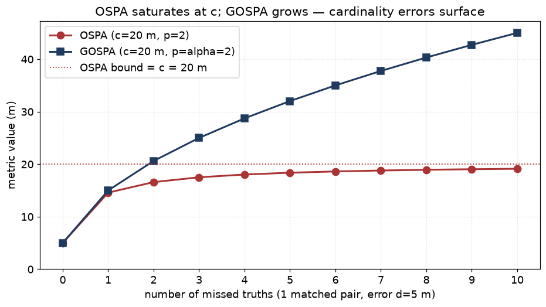
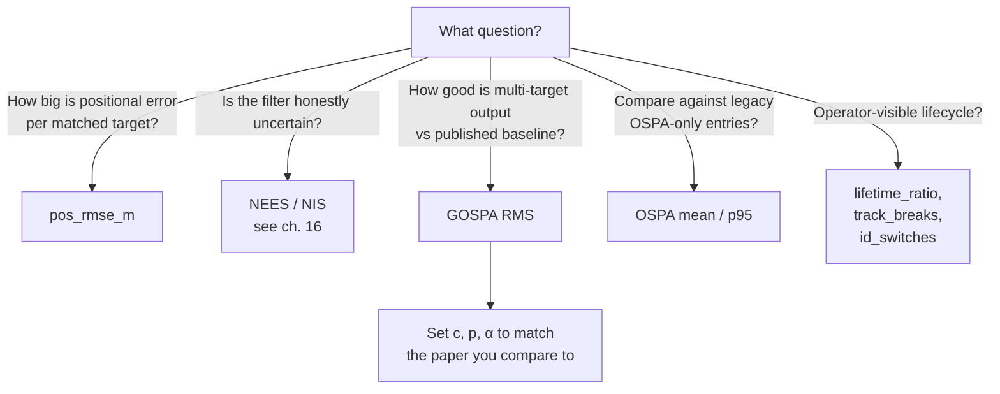

# 20 — Tracker performance metrics: RMSE, OSPA, GOSPA

> Prerequisites: [11 — Gating + GNN](11-gating-gnn-hungarian.md),
> [15 — Track lifecycle](15-track-lifecycle.md),
> [16 — NEES / NIS](16-nees-nis.md).

Chapter 16 asked: *is the filter honest about its uncertainty?*
This chapter asks the next question: *how good is the tracker
itself, all parts considered, against ground truth?*

We use three metric families:

1. **Position RMSE** — per-target positional error.
2. **OSPA** — multi-target distance, bounded.
3. **GOSPA** — multi-target distance, unbounded; the modern default.

Plus track-management bookkeeping: **lifetime**, **track-break
count**, **ID switches**, and **establishment length**. We define
each below.

## 1. The problem in two pictures

We compare two sets per time step:

- The **truth set** `Yₖ = {y₁, …, yₙ}` — true target positions.
- The **estimate set** `Xₖ = {x₁, …, xₘ}` — confirmed tracks' position estimates.

A good metric must score:

1. **Localisation error** — how far each estimate is from the truth
   it represents.
2. **Cardinality error** — were any truths missed (n > m)? Were any
   false tracks created (m > n)?

The metric must also pair "this estimate" with "this truth" before
it can compute either — which usually means solving a small
assignment problem.

## 2. Position RMSE — per-target only

If you have an assignment already (e.g. via the bench's gated
nearest-neighbour `assignPerStep`), RMSE is the simplest score:

```
RMSE_i = √( (1/T_i) · Σ_k ‖x_assigned(k) − y_i(k)‖² )
```

Average across truths if you want a single number. Implementation:
`core/benchmark/Metrics.cpp::computeRmse`.

**What it tells you.** Mean square positional error of estimates
that were successfully associated to a truth — measured *only on the
steps where there is an assignment*. So RMSE says nothing about
missed targets or false tracks. A tracker that finds nothing has
RMSE = 0 by convention.

**What it does not tell you.** Cardinality errors. That is what OSPA
and GOSPA exist to add.

## 3. OSPA — Optimal Sub-Pattern Assignment

OSPA (Schuhmacher, Vo, Vo 2008) is the classical multi-target metric.
It is **bounded** — a property that helps cross-scenario
comparability but, as we will see, also hides cardinality errors at
large `c`.

### 3.1 Definition (p = 2)

Let `n = max(|X|, |Y|)` and let `π` be the assignment that minimises

```
            ( 1/n · [ Σ_(i,j)∈π min(‖x_i − y_j‖, c)²
                       + (n − |π|) · c² ] )^(1/2)
```

The `c` parameter is a cut-off (metres). Beyond `c` a pair is no
longer "matched" — it contributes a full `c²` penalty.

The factor `1/n` divides by the larger cardinality, which gives OSPA
its bound: **OSPA ≤ c**. That is its main appeal — and its main
limitation.

### 3.2 What it means

- All matched pairs are within `c` of each other → OSPA ≈ pos error
  averaged over the assignment.
- Missed and false targets → contribute `c² / n` each to the sum
  inside the root. With `n` large, every extra error becomes cheap.
- Worst case: every estimate is `≥ c` from every truth → OSPA = `c`.

### 3.3 Why it can hide cardinality errors

`navtracker` historically used **`c = 500 m`** (OSPA cutoff in the
bench). On a harbour-scale scene where typical positional error is
20 m, you would expect OSPA to grow when a track is lost. Because
the cutoff is so large compared to a hit, *one missed target* can
swing OSPA by up to 500 m — but divided by `n`, so if there are
two targets the cardinality penalty is around `c / √2 ≈ 350 m` per
miss. OSPA absorbs an enormous slice of the metric budget for
cardinality, and the positional term gets drowned.

In practice this means: two trackers with very different positional
error but the same cardinality error look almost identical in OSPA.
We saw this on AutoFerry — `c = 500 m` compressed scenario
differences and we logged it as backlog item 10 ("OSPA cutoff 500 m
compresses differences on harbour-scale scenes").

The fix is either a smaller cutoff (loses bound) or a different
metric. The PMBM/JIPDA literature picked the second route.

Implementation: `core/scenario/Ospa.{hpp,cpp}`, optimal (min-cost)
assignment via the Hungarian algorithm.

## 4. GOSPA — Generalised OSPA

GOSPA (Rahmathullah, García-Fernández, Svensson 2017) is the modern
default. It keeps the OSPA assignment idea but changes how
unmatched targets are charged — and drops the `1/n` divisor.

### 4.1 Definition (p, α parameters)

```
GOSPA = ( min_π [ Σ_(i,j)∈π d^(c)(x_i, y_j)^p ]   ← localisation
                + (cᵖ / α) · (|X| + |Y| − 2|π|)   ← cardinality
       )^(1/p)
```

where `d^(c)(x, y) = min(‖x − y‖, c)` clips the localisation error
at `c`.

Standard choice: `p = 2`, `α = 2`. In words: each **missed truth**
contributes `c² / 2` to the cost², each **false track** also
contributes `c² / 2`. There is no `1/n` — so the metric grows with
cardinality error instead of saturating.

### 4.2 Reading the numbers

With `c = 20 m`, `α = 2`:

| Situation | GOSPA contribution to cost² | GOSPA value |
|---|---:|---:|
| 1 matched pair, error = 5 m | 25 | 5 |
| 1 matched pair at cutoff | 400 | 20 |
| 1 missed truth, no track | 200 | √200 ≈ 14 |
| 1 false track, no truth | 200 | √200 ≈ 14 |
| 1 missed truth + 1 false track | 400 | 20 |

Each miss costs `√(c² / 2) ≈ 14 m`. Each false track the same. This
is per time step — over a long scenario where you miss a target for
20 s, you eat 20 × 14 = 280 m of GOSPA-cost. **Cardinality errors
hurt.** That is the whole point.

### 4.3 Per-step versus aggregate

A scenario produces a per-step GOSPA `GOSPA(k)`. The literature
reports the **RMS across steps**:

```
GOSPA_rms = √( (1/K) · Σ_k GOSPA(k)² )
```

Squaring before averaging weights big-spike steps more than small
ones — exactly what you want for a "worst sustained error"
description. Helgesen 2022 explicitly says "GOSPA is reported as
RMS" — when comparing to the paper, use `gospa_rms`, not
`gospa_mean`.

`navtracker` reports three:

| Field | Definition |
|---|---|
| `gospa_mean` | arithmetic mean of per-step GOSPA |
| `gospa_p95` | 95th percentile of per-step GOSPA |
| `gospa_rms` | RMS of per-step GOSPA (paper convention) |

Implementation: `core/scenario/Gospa.{hpp,cpp}`,
`core/benchmark/Metrics.cpp::computeGospaPerStep`.

### 4.4 OSPA saturates, GOSPA grows — picture



Same scenario: 1 matched pair (error 5 m) plus a growing number of
missed truths. OSPA hits its ceiling at `c` and never moves again
— a tracker that misses 1 of 2 targets and one that misses 10 of 11
score the same. GOSPA charges `c² / α` per miss with no division by
the total, so every miss visibly costs more.

### 4.5 Why GOSPA over OSPA

| Aspect | OSPA | GOSPA |
|---|---|---|
| Cardinality penalty per miss | `cᵖ / n` (divided by total) | `cᵖ / α` (independent) |
| Bound | `≤ c` always | unbounded — grows with `|X| − |Y|` |
| Surfaces missed targets? | only weakly | yes |
| Decomposable? | no | yes (localisation + missed + false) |
| Used by PMBM literature | rarely | always |

GOSPA is the right metric when track breaks and false tracks
matter — which is *always* for an operator-facing tracker. We
default to GOSPA for comparisons against the literature; OSPA is
kept for historical continuity with earlier evaluation log entries.

## 5. Lifecycle bookkeeping

Beyond per-step distance metrics, every operator cares about:

- **Lifetime ratio** — fraction of steps a truth is present where it
  has any assigned track. Range `[0, 1]`. 1.0 means "always
  tracked".
- **Track breaks** — count of contiguous "gap" intervals per truth
  (the truth is present, no track is assigned for ≥1 step, then a
  track returns).
- **ID switches** — count of times the truth's assigned track-id
  *changes*. A break is not a switch (no track at all); a switch
  is a handoff between two tracks.
- **Establishment length** — time from scenario start until the
  first confirmed track for a truth. Helgesen 2022 reports this as
  `Est.L`. We measure it implicitly via `lifetime_ratio`.

Implementation: `core/benchmark/Metrics.cpp::computeContinuity`,
`assignPerStep`.

## 6. When to use which metric



For Helgesen 2022: `c = 20 m`, `p = α = 2`, report `gospa_rms` — and
remember the paper aggregates per-environment, not per-scenario.

## 7. Where this lives in the repo

- `core/scenario/Ospa.{hpp,cpp}` — OSPA, optimal (Hungarian) assignment.
- `core/scenario/Gospa.{hpp,cpp}` — GOSPA, optimal (Hungarian) assignment.
- `core/benchmark/Metrics.{hpp,cpp}` — per-step computation,
  RMS / mean / p95 aggregation, lifecycle counts.
- `core/benchmark/Sweep.cpp` — emits one row per metric per
  `(config × scenario × seed)`.
- `docs/baselines/helgesen2022_reference.md` — comparison table
  against the published paper baseline.

## 8. What we did not pick, and why

- **OSPA(2)** (window-based, penalises ID switches inside the
  metric). Useful, but the literature has converged on GOSPA + a
  separate `id_switches` count. We follow that convention.
- **T-GOSPA** (trajectory-level, time-weighted) — penalises track
  fragmentation. Strict improvement over scan-by-scan GOSPA;
  queued as PMBM-plan phase 4 follow-up (`docs/superpowers/plans/
  2026-06-07-pmbm-integration-plan.md`). Needs trajectory-aware
  step bundling that the current `BenchSink` does not yet emit.
- **Greedy assignment.** *(Superseded 2026-06-18, review #17.)* We
  originally used greedy nearest-neighbour, reasoning that on
  AutoFerry's 2 truths × ≤ 5 tracks it agreed with Hungarian to
  within noise. That held on average but **not in close-crossing
  geometry**: greedy can lock a locally-cheap pairing that forces a
  globally-worse remainder, manufacturing spurious `id_switches` /
  OSPA spikes *and* masking real ID swaps by keeping a stale pairing.
  Both directions confound A/B estimator comparisons, so OSPA, GOSPA,
  and `assignPerStep` now all use the optimal (min-cost) **Hungarian**
  assignment (`core/association/Hungarian.hpp`). On the synthetic
  sweep this changed ~0.8 % of metric rows, all in head-on crossings.
