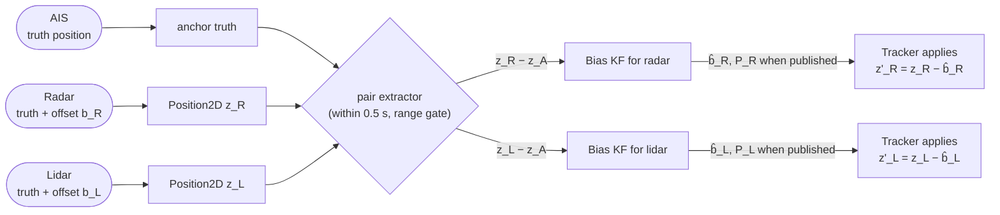
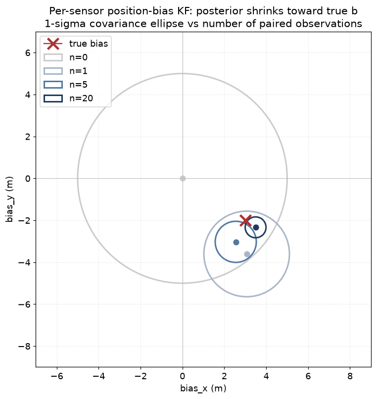

# 21 — Inter-sensor registration bias

> Prerequisites: [04 — Kalman filter](04-kalman-filter.md),
> [10 — Measurement models](10-measurements-frames-time.md),
> [17 — Multi-sensor fusion and bias](17-multi-sensor-and-bias.md).

Chapter 17 explained how we estimate the **heading bias** of the
own-ship's gyro because that one number is shared across every
sensor mounted on the ship. This chapter explains the next
layer: each individual sensor (the radar, the lidar, each EO
camera, each IR camera) has its **own** mounting offset relative
to the heading-bias-corrected ENU frame. That residual,
per-sensor offset is the **registration bias**.

It is what is left after the heading bias is removed, and it is
sensor-specific, not platform-specific.

## 1. What problem are we solving?

After heading bias is taken out, we still observe a stubborn
disagreement between sensors looking at the same target. Two
radars report the same vessel a metre apart. The lidar says the
ferry is 1.5 m north of where AIS reports it. The EO camera's
bearing is off by 0.5 degrees from where the lidar reports.

The disagreement is **systematic** — it does not average out over
many measurements. Each sensor has its own:

- **Mounting offset** — where the sensor's optical / radio centre
  sits relative to the platform's GNSS antenna.
- **Calibration drift** — thermal expansion, mechanical
  settling, mast knocks change the offset slowly over time.
- **Frame misalignment** — what the sensor *thinks* is forward
  may differ from what the own-ship `OwnShipPose` reports.

These look like noise to the fused tracker, but they are not
random. Treating them as random *inflates* the measurement
covariance R and hides real information.

If we can estimate the offset, we can **subtract it** from each
measurement before it enters the tracker. The tracker then sees
a calibrated stream and posRMSE drops.



## 2. How it works — the recipe

The math is identical to a 2-D Kalman filter on a constant
(slowly-drifting) state.

### 2.1 State

For each non-anchor sensor (each radar, each lidar) we maintain
a 2-vector `b ∈ ℝ²` — the mounting offset in ENU metres — and
its `2×2` covariance `P_b`. Initialised broad (default
σ = 5 m per axis), since we *do not know* the mounting offset.

For each bearing-only camera (EO / IR) we maintain a scalar
bearing offset `β` and its variance `P_β`.

### 2.2 Predict

Bias drifts slowly:

```
b(t + dt) = b(t) + w,    w ~ N(0, σ²_drift · dt · I)
```

Default `σ²_drift = (0.1 m)² / 3600 s` — the offset changes
~0.1 m over an hour. Slow, but not zero — thermal expansion and
mast settling are real.

The bearing version uses `(0.05 rad)² / 3600 s`.

### 2.3 Anchor: AIS

A bias measurement requires an **independent** reference. AIS is
ideal: the target's lat/lon comes from the target's *own* GNSS,
not from any of the own-ship's sensors. So an AIS report and a
radar return on the same target give two estimates of the same
truth, and their difference is exactly the radar's bias plus
zero-mean noise:

```
z_radar − z_AIS = (truth + b_R + n_R) − (truth + n_A)
                = b_R + (n_R − n_A)
```

This is the textbook scalar/2-D Kalman update with `H = I`,
`R_obs = R_radar + R_AIS`.

### 2.4 The pair extractor

After each scan, we walk every track's `recent_contributions`
(see `core/types/Track.hpp::SourceTouch`). Any track that has
an AIS contribution *and* a non-AIS Position2D contribution
inside the cycle window (default 0.5 s) yields one pair
observation per (AIS, non-AIS) pair.

This is the same pattern as `AisArpaPairExtractor` does for the
heading bias estimator — it just generalises to *all* non-AIS
positional sensors.

### 2.5 Bearing variant

For cameras the math reads:

```
α_observed = atan2(target_y − sensor_y, target_x − sensor_x) + β
r          = wrap(α_observed − α_predicted)
H_β        = 1
R_obs      = σ²_α_sensor + σ²_anchor_pos / range²
```

The anchor position uncertainty projects onto the bearing
through the geometric Jacobian. At short range this projection
blows up — hence the range gate.

### 2.6 Three observability gates

Each candidate pair must pass three checks before it updates the
bias state — identical in spirit to the heading-bias estimator's
G1-G2-G3:

1. **Time-window gate.** `|t_anchor − t_sensor| ≤ Δt_max`
   (default 1.0 s). Beyond that the target may have moved
   between reports and the difference is no longer a pure bias
   measurement.
2. **Range gate.** `range(target) ≥ r_min` (default 50 m). At
   very short range the geometric Jacobian for bearing-bias is
   ill-conditioned (small position errors cause large bearing
   errors).
3. **Innovation gate.** `||r|| ≤ N · √(diag(R_obs + P_b))`
   (default `N = 5`). Rejects pair-mismatches — when the
   extractor accidentally pairs an AIS report with a *different*
   target's lidar return.

### 2.7 Application — the deterministic shift

Once the bias estimator's posterior variance falls below a
publish threshold (default 1 m² per axis ≈ 1 m 1-σ), the
estimator publishes `b̂` as the canonical bias for that sensor.
The Tracker then subtracts `b̂` from every incoming
measurement of that sensor *before* predict / associate:

```
z_corrected = z_sensor − b̂_{(sensor, source_id)}
```

The bias *covariance* `P_b` is NOT inflated into the per-track
measurement covariance in this revision. That belongs to the
Schmidt-KF treatment (deferred to `sota-roadmap §5`). Once the
bias is converged its residual variance is small compared to the
per-measurement R it would inflate.

### 2.8 Convergence in pictures



Starting from a broad prior centred at the origin (`n = 0`), each
paired observation moves `b̂` toward the true bias and shrinks
the posterior covariance ellipse. After ~20 observations the
ellipse is well below the publish threshold and the deterministic
shift kicks in.

## 3. Why it works — intuition

The crucial insight is that the **systematic** part of the
disagreement averages to the true bias, while the **random**
parts (anchor noise + sensor noise) average to zero. So with
enough pair observations the KF concentrates around `b_true`.

```
E[z_sensor − z_anchor] = b_true + E[n_sensor − n_anchor]
                       = b_true + 0
                       = b_true
```

How many observations is "enough"? The posterior variance after
n independent observations is approximately:

```
P_b ≈ P_prior · R_obs / (n · P_prior + R_obs)
```

With `P_prior = (5 m)²`, `R_obs ≈ (3 m)²` total (1 m AIS + 2 m
radar isotropic), 10 observations give `P_b ≈ 0.6 m²` — already
under the 1 m² publish threshold.

A typical 60-second scenario on AutoFerry with two AIS-broadcasting
vessels and a 1-Hz radar yields ~120 pair observations — far more
than enough.

## 4. Why per-(sensor, source_id) and not one shared bias?

Two cameras of the same kind have **independent** mountings on
the mast. Their drifts are uncorrelated. A single shared bearing
bias would be the average of both cameras' true offsets — which
fits neither.

The lidar and radar share the same mast but their digital
pipelines are independent. Different latencies, different
filters, different calibration history. Each physical sensor
gets its own estimator.

In navtracker we key on `(SensorKind, source_id)` — same as
every other per-sensor structure in the codebase (per-sensor
P_D / λ_C tables, per-source NIS aggregation).

## 5. Why a separate filter, not in the per-track state?

The same argument from chapter 17 §4. A bias filter:

- isolates slow bias dynamics (random walk with tiny Q) from
  fast track dynamics (process noise, manoeuvres);
- decouples bias convergence speed from individual track update
  rate;
- lets one estimator pool information across **all** tracks
  that observe the same sensor.

A radar that sees 5 tracks and contributes 200 pair observations
to its bias estimator builds an extremely sharp `b̂_R` — and
*every* future track of that radar benefits, even a track that
saw only 2 measurements.

If the bias lived inside each track's state vector, this
cross-track pooling would be lost.

## 6. Schmidt-KF: "considered" bias treatment

When the bias estimator publishes a new `(b̂, P_b)`, every subsequent
measurement of that sensor is corrected by subtracting `b̂`. But
`b̂` is itself uncertain — its covariance is `P_b`. If we ignore
that uncertainty, the filter thinks it received a perfectly
calibrated measurement and shrinks its track posterior more than
it should. Right after the estimator first publishes — when `P_b`
is still relatively wide — the result is overconfident tracks and
NIS values that drift below 1.

The cleanest cure is the **Schmidt-KF** trick (Schmidt 1966). It
says: keep the bias outside the track filter (as we do), but
when consuming a corrected measurement, inflate its noise
covariance by however much the bias still wobbles:

```
R_eff = R + H_b · P_b · H_bᵀ
```

`H_b` is the Jacobian of the measurement with respect to the bias.
For our additive bias model:

- **Position2D** — `z = pos_true + b`. So `H_b = I_2` and
  `R_eff = R + P_b`. We just add the two 2×2 covariances.
- **Bearing2D** — `β = β_true + b_β`. So `H_b = 1` and
  `R_eff[0,0] = R[0,0] + σ_b²`.
- **RangeBearing2D** — only the bearing column is biased, so
  `R_eff[1,1] += σ_b²`. Range is left alone (no range bias modelled).

This is implemented in `core/pipeline/BiasCorrection.hpp`'s
`applyBiasCorrection(z, provider)`, called by both `Tracker` and
`MhtTracker` on every incoming measurement.

### Why this is "considered" and not full Schmidt

Full Schmidt-KF also carries a state-bias **cross-covariance**
`P_{xb}` between every track and every bias state. That cross-cov
captures the information that "this track's posterior and this
sensor's bias estimate were jointly refined by the same
observation". We deliberately skip it because:

1. The bias estimator (item 9) only ingests **AIS-anchored**
   pairs — observations the per-track filters do not see. So the
   bias mean is updated by a *disjoint* data stream from the
   track posteriors, and the cross-covariance is genuinely close
   to zero. The Schmidt approximation is exact in the limit of
   disjoint information streams.
2. Carrying `P_{xb}` would require book-keeping proportional to
   `target_count × sensor_count`, which is non-trivial inside an
   MHT pipeline that already swims in covariances.

The standard literature term for "Schmidt-KF without the cross
covariance" is the **considered Kalman filter**.

### Why we did not do this earlier

Without an external bias estimator, there was no `P_b` to fold
in — the bias didn't exist as a separate state at all. Item 9
gave us `(b̂, P_b)`, item 9 §5 (Schmidt-KF acceptance criterion)
wires its covariance into R. The two halves are designed to ship
together.

## 7. Assumptions

| Assumption                                              | When it pinches                              |
|---------------------------------------------------------|-----------------------------------------------|
| AIS is unbiased relative to truth                       | Class-B AIS can have a non-zero offset.       |
| Mounting bias drifts slowly                             | A mast knock causes a step change; the filter catches up but with lag. |
| Targets are point objects at the AIS-reported position  | A 30-m ship's AIS antenna is metres away from the radar return centre. The bias absorbs this offset. |
| Cross-sensor pair counts are sufficient                 | Sparse-AIS scenarios may never reach the publish threshold; the estimator stays at the broad prior. |
| Heading bias is already corrected upstream              | The estimator sees the disagreement *after* the heading bias is removed by `OwnShipProvider`. Otherwise the heading bias would leak into the position bias. |

## 8. Why this fits our problem

AutoFerry env 1 (open water) has 2 AIS-broadcasting vessels and
runs for ~60 s — well over the threshold for convergence. The
GOSPA-RMS gap to the Helgesen 2022 paper on env 1 is
**+23 m (43 vs 20)**, much of which we hypothesise comes from
unmodelled per-sensor offsets. The paper carefully calibrates
each sensor's mounting offset against RTK-GNSS truth; we did not,
until now.

The estimator's behaviour on no-AIS scenarios is the honest one:
the bias stays at the prior, `is_published == false`, the
deterministic shift is zero. No regression on synthetics.

## 9. Where this lives in the repo

- `ports/ISensorBiasProvider.hpp` — the port and the
  `SensorBiasKey` primary key.
- `core/bias/SensorBiasEstimator.{hpp,cpp}` — the KF (one entry
  per key, position + bearing variants).
- `core/bias/SensorBiasPairExtractor.{hpp,cpp}` — pulls (AIS,
  non-AIS) pairs from track `recent_contributions`.
- `core/pipeline/Tracker.{hpp,cpp}` — `setSensorBiasProvider`
  hook; `applyBiasCorrection(z, provider)` runs at the top of
  `process` / `processBatch`.
- `core/pipeline/MhtTracker.{hpp,cpp}` — same hook on the MHT
  pipeline.
- `core/benchmark/Sweep.cpp` — wires the bench's post-scan
  feeder when the `build_sensor_bias_estimator` factory is set.
- `docs/superpowers/specs/2026-06-13-inter-sensor-registration-bias-design.md`
  — the full design spec (math, alternatives, acceptance).

## 10. What we did not pick, and why

- **Augmented per-track state.** Carrying the bias inside each
  track's state vector. One copy per track, no cross-track
  sharing, slow dynamics polluting the fast filter. Rejected.
- **Full Schmidt-KF with state-bias cross-covariance.** We use the
  *considered* simplification (R_eff = R + H_b·P_b·H_bᵀ, no
  `P_{xb}`). The full version is theoretically nicer when bias is
  observable through the same measurements that update the
  tracks; in our wiring the bias is observed only through
  AIS-anchored pairs, so the cross-covariance is genuinely
  near-zero and skipping it costs essentially nothing. See §6 for
  the implementation we did pick.
- **Range / scale biases on the radar.** Multiplicative
  (range_observed = (1+α) · range_true). Different
  parameterisation, different observation projection. Add when
  needed.
- **Track-anchored bias** when AIS is absent. Requires solving
  the cyclic-anchor problem (a track using the biased sensor
  cannot be its own bias anchor). Spec out later if AIS coverage
  drops below a measured threshold.
- **Online sensor R recalibration** (VB-AKF). That estimates
  *noise variance*, not *offset*. Different problem; can be done
  alongside in a future iteration.

---

Previous: [20 — Tracker performance metrics](20-tracker-metrics.md)
