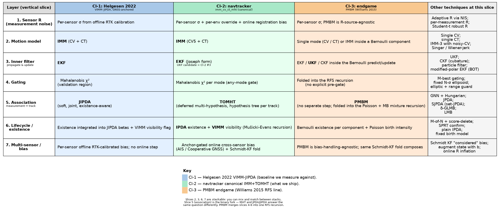

# 22 — Tracker stacks compared: what's a layer, what's a fork?

**Prerequisites:** §04–06 (KF / EKF / UKF), §09 (IMM), §11 (gating, GNN, Hungarian), §12 (JPDA), §14 (MHT), §15 (track lifecycle), §17 (multi-sensor and bias). This chapter is a *cross-cutting* view of how those pieces fit together — it does not introduce new math.

---

## 1. What problem are we solving?

A multi-target tracker is not one algorithm. It is a **stack** of layers — sensor noise, motion model, inner filter, gating, association, lifecycle, multi-sensor bias — and at each layer the literature offers two or three real choices.

If you only ever read one paper, the layers look soldered together. *"VIMM-JIPDA"* sounds like one thing; *"IMM+TOMHT"* sounds like a competing one thing. But most of the layers are **stackable** — you can take Helgesen's existence model and put it inside our MHT, or take our IMM and run it under PMBM.

A small number of layers are **forks** — competing answers to the same question, where you have to pick. That is where the design tension actually lives.

This chapter is the map. Use it to:

- understand what the three stacks we measure against (Cl-1 / Cl-2 / Cl-3 in [`docs/algorithms/comparison-baselines.md`](../algorithms/comparison-baselines.md)) actually share and where they really differ;
- decide whether a "next step" is a real fork (a research decision) or a drop-in swap (a tuning decision);
- read a new paper and quickly place it on the map.

---

## 2. The picture

Source: [`figures/22-tracker-stack-alternatives.dot`](figures/22-tracker-stack-alternatives.dot). Edit the `.dot`, do not hand-edit the PNG; render with `dot -Tpng <file>.dot -o <file>.png`.

Three named stacks in the coloured columns:

- **Cl-1 — Helgesen 2022 VIMM-JIPDA.** The paper we measure ourselves against. IMM (CV+CT) motion, EKF inner, JIPDA association with visibility-aware existence, GNSS-calibrated per-sensor bias.
- **Cl-2 — navtracker canonical `imm_cv_ct_mht`.** What we ship. IMM (CV5+CT) motion, EKF Joseph-form inner, **TOMHT** association, **IPDA + VIMM** existence/visibility, online anchor-gated cross-sensor bias (AIS / Cooperative GNSS) with a Schmidt-KF fold.
- **Cl-3 — PMBM endgame.** Williams 2015 lineage. State estimator inside (typically UKF/CKF) wrapped in a Poisson + Multi-Bernoulli random-finite-set recursion that handles association, existence and birth in one go.

The rightmost column lists *other* techniques that live at the same slice — drop-in alternatives, not necessarily good ideas in this codebase.

---

## 3. What is a layer, what is a fork?

The footer of the diagram says it in one line: **slices 2, 3, 6, 7 are stackable; slice 5 is the binary fork; PMBM rolls slices 4-6 into one RFS recursion**. Here is the longer reading.

### Stackable (you can mix and match)

#### Slice 2 — motion model

IMM vs single-mode is a design choice, but it is independent of every other choice further down. Helgesen's IMM (CV+CT) is the same shape as our IMM (CV5+CT) — we use the 5-state CV with explicit omega so that mixing into CT does not throw away rate-of-turn information. Either of those IMMs can live under JIPDA, under MHT or as the "filter" inside a PMBM Bernoulli component.

→ See §08–09 for the underlying math; §15 (`comparison-baselines.md`) for the bench evidence on `imm_cv_ct_jpda` vs `imm_cv_ct_mht`.

#### Slice 3 — inner filter

EKF, UKF, CKF, particle filter. This is a tuning knob, not a fork. The literature is divided on whether UKF actually buys anything on maritime range/bearing — the nonlinearity is modest at typical ranges. **Cl-2 #3 in the open-work table is exactly this experiment**: build `ukf_cv_ct_mht`, bench against `imm_cv_ct_mht`, decide.

→ §04 (KF), §05 (EKF), §06 (UKF), §07 (PF).

#### Slice 6 — lifecycle / existence

This is where the labels get most confusing. *IPDA*, *JIPDA*, *VIMM*, *Multi-Bernoulli existence* are all answers to the *same* question (is this track real?) at different levels of joint reasoning. They are stackable with the association choice above them:

- **IPDA** = per-target existence recursion, ignores other targets. We ship this.
- **JIPDA** = IPDA + the joint constraint that one measurement = one source. Helgesen's "JI" — meaningfully better only when measurements are heavily shared between candidates.
- **VIMM** = adds a visibility flag for sensors that drop out (clouds, shore line, FOV). We ship this too.
- **Multi-Bernoulli existence** = the RFS-native form; algebraically a JIPDA variant with a different bookkeeping basis.

This is why "JIPDA is already inside our MHT" is half true: we run IPDA (the existence half) inside MHT. We do not run JIPDA (the *joint* existence half) — but neither does MHT *need* the joint half, because the hypothesis tree already enforces the one-measurement-one-source constraint at the association layer.

→ §15 for the lifecycle math, [`comparison-baselines.md`](../algorithms/comparison-baselines.md) §"Open work" for the SJPDA / JIPDA "do it on the JPDA branch" route.

#### Slice 7 — multi-sensor / bias

Calibrate offline (Helgesen) or estimate online (us). Both are valid. We do online because we cannot demand RTK calibration of every deployment; Helgesen could because the AutoFerry sea trial was RTK-instrumented.

→ §17 (multi-sensor fusion), §21 (per-sensor registration bias).

### The fork

#### Slice 5 — association

This is where the real design decision lives. **MHT and JPDA/JIPDA are two different answers to "what do I do when I cannot tell which measurement belongs to which track?"**:

- **MHT (TOMHT in our case)** — *defer the decision*. Keep multiple discrete hypotheses (each picks ONE assignment), prune later when evidence accumulates. The "joint constraint" (one measurement = one source) is enforced by *global* hypothesis pruning.
- **JPDA / JIPDA** — *do not decide*. Collapse to a single soft estimate weighted by the betas. The joint constraint is folded into the beta calculation itself.

You can in principle build "soft PDA inside each MHT branch" hybrids — some commercial systems do — but it doubles the hypothesis-tree dimensionality and is not standard. In practice you pick one branch of the slice-5 fork and live with it.

PMBM resolves the fork the third way: collapse the whole thing into an RFS recursion where slices 4-6 are one set of equations. That is what makes Cl-3 the endgame — the design tension at slice 5 disappears.

→ §12 (JPDA), §14 (MHT).

---

## 4. The three named stacks, on the map

A worked example of how to *use* the diagram:

**Helgesen 2022 → navtracker canonical**. From the right column to the middle column you change exactly three things:

1. Slice 5 (association): JIPDA → TOMHT — the fork.
2. Slice 7 (bias): offline RTK → online anchor-gated estimator with Schmidt-KF fold.
3. Slice 1 / 2: per-env R override + 5-state CV (small but measurable).

Slices 3, 4, 6 are bit-identical between the two stacks. Most "Helgesen vs us" discussions only need to argue about slice 5. The rest is shared lineage.

**navtracker canonical → PMBM endgame**. From the middle column to the left orange column:

1. Slices 4-6 collapse into one RFS recursion — this is *the* substantive change.
2. Slice 3 typically moves EKF → UKF (sigma points reconstruct the Bernoulli moments cleanly), but that is a tuning preference, not a requirement.
3. Slice 7 composes unchanged — our Schmidt-KF bias fold sits in front of the RFS update as a measurement-pre-processing step.

**What you do NOT get to do without thinking:** mix slice-5 choices halfway. "JIPDA inside MHT" is not a stack; it is a research project.

---

## 5. What we assume

The map is **a teaching aid**, not a strict ontology. Two caveats:

- Some techniques cross slices. Online R adaptation (slice 1) and visibility (slice 6) can interact through the NIS path. PMBM merges 4-6. The diagram shows the *dominant* slice for each.
- "Alternatives" in the right column are not equally good. M-best gating is a tuning knob; particle filters at the inner-filter slice are a different cost class. Read the alternatives as a roadmap, not a buffet.

---

## 6. Why we can use this view here

Two things make the slice view actually useful for our work, not just pretty:

1. **The bench harness already isolates slices.** `imm_cv_ct_mht_nobias` ablates slice 7. `imm_cv_ct_mht_novis` ablates slice 6 (visibility half). `ekf_cv_jpda` swaps slice 5. `imm_cv_ct_jpda` does slice 5 alone. The map tells you what an ablation is *measuring* — change one slice at a time, attribute the delta cleanly.
2. **It clarifies what "doing JIPDA next" means.** From the diagram: there are at least three different things you might mean (visibility flag at slice 6, soft betas at slice 5 on the JPDA branch, or true joint existence reasoning). Picking which one is the actual experiment is a five-minute conversation if you point at the picture.

---

## 7. Where this lives in the repo

| Layer | navtracker code |
|---|---|
| 1. Sensor R | `core/types/SensorDefaults.cpp`, `adapters/replay/AutoferryJsonReplay.{hpp,cpp}` per-env override, `ports/ISensorDetectionModel.hpp` for `DetectionParams` |
| 2. Motion model | `core/estimation/ConstantVelocity*.hpp`, `core/estimation/CoordinatedTurn.hpp`, `core/estimation/ImmEstimator.hpp` |
| 3. Inner filter | `core/estimation/EkfEstimator.cpp`, `core/estimation/UkfEstimator.cpp`, `core/estimation/ImmEstimator.cpp` (per-mode EKF) |
| 4. Gating | `core/association/Gating.hpp`, `core/estimation/ImmEstimator::gate` (any-mode) |
| 5. Association | `core/association/GnnAssociator.cpp`, `core/association/JpdaAssociator.cpp`, `core/tracking/MhtTracker.cpp`, `core/tracking/TrackTree.cpp` |
| 6. Lifecycle / existence | `core/tracking/TrackManager.cpp` (IPDA + VIMM), `core/tracking/MhtTracker.cpp` (hypothesis bookkeeping) |
| 7. Multi-sensor / bias | `core/bias/SensorBiasEstimator.{hpp,cpp}`, `core/bias/SensorBiasPairExtractor.{hpp,cpp}`, `core/bias/AisArpaPairExtractor.{hpp,cpp}` |

---

## 8. What we did not pick, and why

- **A flat side-by-side list of papers.** Tempting, but each paper smears multiple slices. The map is the only way to compare cleanly across stacks.
- **A flowchart of which technique to pick.** Decision-tree-style "pick MHT if X, JPDA if Y" guides exist in the literature; they tend to over-promise. Real choice depends on workload, deployment constraint and bench evidence — out of scope for a foundations doc.
- **Folding PMBM into "just another association choice".** It is, mathematically, but conceptually it collapses three slices into one and the conceptual jump matters more than the algebra at the pedagogical level we are aiming for.

---

## 9. Where to go next

- For the bench-evidence side of the same comparison, read [`docs/algorithms/comparison-baselines.md`](../algorithms/comparison-baselines.md) and the open-work table.
- For implementation deep-dives, jump back to §09 (IMM), §12 (JPDA), §14 (MHT), §15 (lifecycle).
- For PMBM specifically, the Williams 2015 paper (cited in `comparison-baselines.md`) is the canonical reference; we have not yet shipped an in-repo chapter on PMBM — that lands with Cl-3 work.
