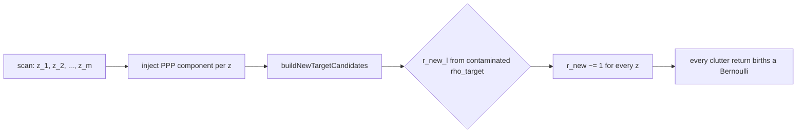

# 23 — Poisson Multi-Bernoulli Mixture (PMBM)

**Prerequisites:** §03 (Bayes), §04–06 (KF / EKF / UKF), §09 (IMM), §11 (gating, GNN), §12 (JPDA), §13 (clutter and detection), §14 (MHT), §15 (track lifecycle), §22 (tracker stacks compared).

> **Status.** PMBM is **implemented and shipped** in this repository (`core/pmbm/PmbmTracker.{hpp,cpp}`) — it is the Cl-3 endgame tracker. This chapter is the plain-English on-ramp; the equation-level reference is the design doc ([`docs/algorithms/pmbm-design.md`](../algorithms/pmbm-design.md)) and the staged history is the engineering plan ([`docs/superpowers/plans/2026-06-07-pmbm-integration-plan.md`](../superpowers/plans/2026-06-07-pmbm-integration-plan.md)). Sections §8a/§8b below sketch the shipped Phase 7–9 refinements (adaptive birth, source-aware identity, misdetection dedup) at the concept level and point to the design doc for measured results and config flags.

---

## 1. What problem are we solving?

In every tracker we have read about so far — GNN, JPDA, MHT — the mental model is the same:

> *I have a list of named tracks. I look at this scan's measurements. I decide which measurement updates which track, mark some tracks as "missed", maybe start a new track, maybe delete one. Repeat next scan.*

Each of those steps has its own subsystem with its own knobs:

- **Gating** picks which measurement–track pairs are plausible.
- **Association** decides who gets what (GNN: one winner per track; JPDA: soft weights; MHT: keep many hypotheses across scans).
- **Lifecycle** decides when a track is born (M-of-N initiator), confirmed, coasting, deleted (delete misses).

That works. But the subsystems do not *talk to each other in one shared probability calculation*. Lifecycle changes existence *separately* from how association changes the state. When a track is briefly missed and then re-acquired, the *kinematic* filter has happily kept coasting (covariance grew a bit), but the *existence* logic — which lives in a different file — may have already decided "track is healthy" or "track is dying" using its own thresholds. The two views can disagree, and the over-confidence on re-confirmed tracks that we measured in Cl-2 #2 is exactly that disagreement.

PMBM is the answer if you ask:

> *What if existence, gating, association, and birth were all the **same** Bayesian update?*

You give up the "list of named tracks" mental model. You replace it with a **probability distribution over the set of all targets currently alive in the surveillance area**. Every per-scan operation — gating, association, lifecycle, birth — is one update of that distribution.

This is called **Random Finite Set (RFS)** thinking. The state you carry forward in time is not a vector — it is a *set*, and uncertainty over a set is a *probability distribution over sets*.

---

## 2. The big idea, in one paragraph

PMBM splits the multi-target probability distribution into two pieces and tracks them together:

1. **Poisson Point Process (PPP)** — represents *targets that may exist but have not been detected yet*. It is a "fog" over the surveillance area saying "there is roughly *this much* probability of an undetected target per square metre, here". New tracks come out of this fog when something gets detected.
2. **Multi-Bernoulli Mixture (MBM)** — represents *targets that have been detected and we are tracking*. Each "Bernoulli component" is one potential target with (a) an *existence probability* `r` between 0 and 1, and (b) a *state* (position, velocity — exactly what your Kalman filter holds today). A "Multi-Bernoulli" is a *set* of such components. A "Mixture" is a weighted sum of *alternative* such sets — because data-association ambiguity creates multiple possible "who is real and who is who" interpretations, and PMBM keeps them all, like MHT does.

Both pieces evolve under one Bayesian recursion. The math forces them to stay consistent.

---

## 3. One scan, step by step (plain English)

Imagine the tracker is in some state at time `k−1`: a fog (PPP) of where new targets might appear, plus a weighted list of alternative scenarios (MBM), each scenario listing a few possible targets with their states and existence probabilities.

**Step A — Predict.** The fog drifts a bit (small targets move; we add a fresh layer of "newborn" fog at the radar edges). Each Bernoulli's state propagates through its motion model (IMM-UKF, in our case). Each Bernoulli's existence multiplies by survival probability `p_S` (typ. 0.99): if it was real, it's probably *still* real, but not certainly.

**Step B — Update with this scan's measurements.** For each measurement, three things can be true:

- It matches an existing Bernoulli (target re-detected). Update that Bernoulli's state the normal Kalman way; existence goes up to 1 (we just saw it).
- It came from the fog — a new target was born and detected for the first time. Take a chunk of the PPP intensity around that measurement and turn it into a brand-new Bernoulli with some `r < 1`.
- It is clutter — false alarm — keep all existing Bernoullis, no new track.

PMBM does **not pick** which of the three is true. It enumerates every consistent way to assign measurements to "Bernoulli updates / new births / clutter", and each enumeration becomes a *new branch* of the mixture, weighted by Bayes' rule. (Same combinatorics as MHT — we use Murty's K-best to keep only the K cheapest branches.)

For every Bernoulli that was *not* matched to a measurement this scan, the existence probability drops:

```
r_new = (1 − p_D) · r_old / (1 − r_old + (1 − p_D) · r_old)
```

Plain words: "I expected to see this target with probability `p_D`. I didn't. So either it doesn't really exist, or it does exist but I missed it. Bayes' rule tells me exactly how much to lower its existence probability."

**Step C — Prune.** Drop branches whose weight is too low. Drop Bernoullis whose `r` is too low (effectively a "track death" — except it falls out of the math, not a threshold). Merge similar Bernoullis across branches (same identity, similar state) to keep the mixture from exploding.

**Step D — Read off tracks.** For each unique Bernoulli identity, sum its weight × existence across all branches. Above some threshold (≈ 0.5), call it a confirmed track and report it. Below, call it tentative. That's it — no separate M-of-N machine, no separate IPDA recursion, no separate delete-misses counter. All of them are *one number*: aggregated `P(target exists)`.

### A subtlety: "cheapest" must mean "most probable" (and why picking only ONE branch can hurt)

Murty's K-best keeps the K *cheapest* branches. For "cheapest" to mean "most probable", the cost of assigning a measurement to a track must be the exact negative-log of the weight that branch will actually get. If the cost leaves a piece out, the cheapest branch is no longer the most probable one — and then the tracker prefers the wrong story. This is exactly the bug fixed in backlog #34 (M5): the cost was missing the "how likely was I to detect this at all" piece (`p_D`), so at `K=1` the tracker sometimes committed to the *second*-best explanation. See `docs/algorithms/pmbm-design.md` §3.4.1.

Now the deeper point. Our shipped config keeps only **one** branch per prior (`K = 1`) — it is fast and, when one explanation is clearly best, correct. But sometimes two explanations are almost *tied*: think of two boats passing very close, where a single radar blip could belong to either. With `K = 1` the tracker must pick one **right now**, by a hair, with no way to change its mind later. If it picks wrong, one real boat can be quietly absorbed into the other and vanish for a while (we call this *coalescence*), or one boat can be split into two ghosts. Keeping a *second* branch alive at a near-tie — so later scans can settle the argument with more evidence — sounds like the cure, and it does help when the tie is a rare, isolated close pass. But in a scene that is ambiguous *everywhere* (many blips, all a little uncertain), keeping extra branches every scan breeds ghost tracks faster than it saves real ones. A single fixed "how close counts as a tie?" number cannot tell those two situations apart. So for now `K = 1` is what ships, its close-pass weakness is a **named, documented cost**, and a smarter, scene-aware rule is a filed follow-up (improvement-backlog #39).

---

## 4. Why does this fix the Cl-2 #2 failure?

Cl-2 #2 was the "re-confirmation over-confidence" problem: after a track was briefly missed and then re-acquired, the filter's reported uncertainty was too small. The Cl-2 #2 (a)+(b) attempt tried to fix it by widening the lifecycle thresholds and the initial covariance — and broadly *regressed* (autoferry anchored GOSPA +17 %). The mechanism: looser lifecycle kept more false-track tentatives alive, the wider init pulled measurements into more competing branches, the hypothesis tree bloated.

In PMBM, this can't happen for two reasons:

1. **Existence and state are updated by the **same** equations.** A miss raises Bernoulli covariance (state) *and* lowers Bernoulli existence (`r`) at the same time. A re-detection raises `r` back up *and* shrinks covariance *and* the math couples those two. There is no separate IPDA layer to disagree with the kinematic filter.
2. **Birth is principled, not heuristic.** A new Bernoulli has `r` set by the PPP-intensity-weighted likelihood of the measurement. Cluttery scans don't blow up the mixture, because the math weighs the "this is clutter" branch against the "this is a new target" branch using `λ_C` and the PPP intensity directly.

That's the reason PMBM is the *principled* fix for the failure mode Cl-2 #2 hit a wall on.

---

## 5. What stays the same, what changes (vs Cl-2 IMM+TOMHT)

Bring up the §22 vertical-slice picture. PMBM **replaces slices 4, 5, 6** (gating, association, lifecycle) with one RFS update. It **does not change** slices 1, 2, 3, 7:

| Slice | Today (Cl-2) | Under PMBM (Cl-3) |
|---|---|---|
| 1. Sensor R + clutter density + P_D | unchanged — same per-sensor σ, same `λ_C`, same `p_D` |
| 2. Motion model | unchanged — IMM (CV5 + CT), one IMM per Bernoulli |
| 3. Inner filter | unchanged — UKF inside each IMM mode |
| **4. Gating** | Mahalanobis χ² | **folded into the RFS update** (likelihood ratio vs PPP) |
| **5. Association** | TOMHT hypothesis tree | **Multi-Bernoulli mixture**, K-best per prior branch |
| **6. Lifecycle** | IPDA + VIMM + M-of-N | **Bernoulli existence + PPP birth**, no thresholds |
| 7. Cross-sensor bias | Schmidt-KF correction in front | unchanged, composes in front of PMBM update |

So when you read the design doc and see "imm_cv_ct_pmbm", parse it as: "same as our canonical `imm_cv_ct_mht`, except the layer that handles gating + association + lifecycle has been replaced by PMBM." Sensor handling, motion model, inner filter, bias correction — **identical**.

---

## 6. The three RFS densities, written out

Just enough math so the design doc is readable. All of this is a more careful version of §2.

**Poisson Point Process (PPP)** — the fog of undetected targets:

```
λ^u_k(x) = Σ_i w^u_{k,i} · 𝒩(x; m^u_{k,i}, P^u_{k,i})
```

A weighted sum of Gaussians over the single-target state `x`. Read it as "the expected number of undetected targets per unit volume of state space around `x`". Unlike a probability density, `λ^u` *can integrate to more than 1* — it is an intensity, not a probability.

**Bernoulli component** — one possible detected target:

```
b = (r, f(x)),    r ∈ [0,1]
```

`r` is the existence probability. `f(x)` is the state density — Gaussian for a single-mode filter, a Gaussian mixture for IMM (the mode probabilities are the mixture weights).

**Multi-Bernoulli (one global hypothesis)** — a *set* of Bernoullis:

```
hypothesis j  =  { b^{j,1}, b^{j,2}, …, b^{j,n_j} }
```

Each global hypothesis is a complete "who is real and who is who" interpretation of the measurement history so far.

**Multi-Bernoulli Mixture (the full posterior)** — a weighted mixture of global hypotheses:

```
posterior MBM  =  Σ_j w^j · hypothesis j,    Σ_j w^j = 1
```

`w^j` is the Bayesian probability of interpretation `j`. **Different interpretations carry different numbers of Bernoullis** — that's the whole point of using a set framework. PMBM is comfortable with the "is there a target here at all?" question being itself uncertain.

The full posterior is the *convolution* of the PPP and the MBM. In code, you just keep them as two separate data structures and combine at output time.

---

## 7. Why is this called the *endgame*?

Because every problem the Cl-2 work has hit in the last four months reduces to "two separate subsystems with two separate calculations disagreeing":

- The cross-sensor anchor problem (item 13): bias estimation and tracking ran as separate KFs; we partially solved it by anchor-gated publish, then by Schmidt-KF cross-sensor bias. The principled solution is to fold bias into the joint state — and our Schmidt-KF *does* do that.
- The re-confirmation over-confidence (Cl-2 #2): IPDA existence ran separately from the kinematic update. We could not fix it from outside the recursion.
- The metric artefacts (Cl-2 #1): Hungarian truth-track matching is its own logic, disconnected from the filter — and produced tail blow-ups that took weeks to diagnose. PMBM doesn't fix the metric, but the *more* honest existence probabilities make the underlying tracks Hungarian sees more stable.

PMBM puts gating, association, birth, and lifecycle into one Bayesian recursion. It is the structural change that exhausts the "two systems disagreed" failure mode by removing the *two systems*.

---

## 8. What we did not pick, and why

- **δ-GLMB.** Also an RFS conjugate prior with native existence. Carries explicit labels in the filter algebra, which is a heavier representation than PMBM. The trajectory-PMBM variant gets us labels-as-output without the labelled-prior algebra, at lower implementation cost. Maritime evaluations (Sci. Rep. 2025) show PMBM competitive with δ-GLMB on the metrics we care about.
- **PHD / CPHD.** RFS filters, but they discard target identity. Non-starter under our stable-`track_id` invariant. (CLAUDE.md invariant 5: every track has a unique internal id, never reused.) Useful as an academic comparison, not as a deployment.
- **JIPDA (the Cl-1 baseline's association layer).** *Does* couple existence with association — which is part of what PMBM does. But JIPDA still commits per scan (it does not keep alternative interpretations across scans the way MHT or PMBM do), so it cannot recover from a wrong commit. PMBM gives you both the existence-association coupling and the deferred mixture.

---

## 8b. Birth, the contamination problem, and Adaptive Birth (Reuter 2014)

PMBM has two ways to put a "new target Bernoulli" on the table for each measurement:

1. **PPP-driven birth.** The undetected-target intensity λ^u(x) (the PPP) is updated by every measurement just like a target would be; if the resulting posterior mass at `z` is large enough relative to clutter, the *new-target row* fires and a Bernoulli is born. The math:

   ```
   r_new_l = ρ_target_l / (ρ_target_l + λ_C(z_l))
   ```

   where `ρ_target_l = Σ_i p_D · w_i^u · ℓ(z_l | c_i)` is the PPP-posterior mass at measurement `z_l`. Read it as: "the prior odds that this measurement comes from a real (undetected) target rather than from clutter."

2. **Adaptive Birth (Reuter 2014).** Plug a *measurement-independent* scalar `λ_birth` (expected new-target rate per unit measurement-space volume per scan) into the same formula:

   ```
   r_new_l = λ_birth / (λ_birth + λ_C(z_l))
   ```

   The spatial state for the new Bernoulli still comes from the measurement (mean at `z`, covariance from `estimator.initiate(z)`), but the *existence prior* is decoupled from any measurement.

**Why this matters in practice.** Our maritime deployments do not have a usable spatial prior over "where do new ships appear" — we use *measurement-driven birth*: every initiable measurement injects a fresh PPP component centred on itself. The next time `buildNewTargetCandidates` runs, that just-injected component dominates `ρ_target` *for every measurement*, including clutter returns. So formula (1) gives `r_new ≈ 1` for everything. The phantom-birth gate (a per-row threshold on `r_new`) never fires.

The mechanism is straightforward enough to draw:



Adaptive Birth cuts the contaminated loop:

```mermaid
flowchart LR
  Z2[scan: z_1, z_2, ..., z_m] --> B2[buildAdaptiveBirthCandidates]
  B2 --> R2[r_new = lambda_birth / (lambda_birth + lambda_C)]
  R2 --> S[small initial r; Bernoulli ramps via posterior updates]
```

In short: with adaptive birth, the tracker skips the measurement-driven PPP
injection and instead gives each new Bernoulli a small existence prior from
`λ_birth`. Its *position* still comes from the measurement; only its *existence*
is decoupled. A small initial `r` is the correct choice — a real target ramps up
to Confirmed over its next few detections, while a one-off clutter return never
gets a second detection and prunes away.

**The refinement: keep the birth existence constant across sensors.**

A single fixed `λ_birth` has a hidden flaw. The birth existence
`r_new = λ_birth / (λ_birth + λ_C)` depends on the clutter density `λ_C`, which
varies a lot between sensors (radar clutter is dense; AIS clutter is almost
zero). So the *same* `λ_birth` produces a small, safe `r_new` on one sensor and a
near-certain `r_new ≈ 1` on another — and a near-certain birth on an AIS or
low-clutter radar blip emits a Confirmed track immediately. That is an
over-counting engine.

The fix is to decide the birth existence you *want* — a small constant `r*` —
and derive `λ_birth` from the live `λ_C` each scan so that `r_new` comes out at
`r*` regardless of the sensor:

```
λ_birth = (r* / (1 − r*)) · λ_C
r_new   = λ_birth / (λ_birth + λ_C) = r*    ← independent of λ_C
```

Plain words: *pick "every new track starts at, say, 10 % existence" and let the
maths back out the rate that makes that true on whatever sensor you are looking
at.* Real targets still ramp to Confirmed over a few detections; clutter still
prunes.

**Assumption.** `λ_C` is roughly uniform across the surveillance volume (for
per-sensor clutter maps the same formula works per measurement, using the local
density). Where a *spatial* birth prior is actually known (radar coverage edges,
named ports), injecting structured PPP at predict-time would beat this — adaptive
birth is the *uniform-prior* default.

The config flags, tuning sweeps, and measured GOSPA numbers are in
[pmbm-design.md](../algorithms/pmbm-design.md) §3.2.

**Reference.** Reuter, Vo, Vo, Dietmayer, *The Labeled Multi-Bernoulli Filter*, IEEE Trans. Signal Processing 62(12), 2014. Adaptive Birth is in §IV-B; the formulation is general (LMB / PMBM / δ-GLMB all use the same trick).

---

## 8a. Getting the misdetection model right

Two related concepts fix how PMBM counts "I did not detect this target this
scan." Both are corrections toward the standard PMBM equations; both matter for
the same reason — a wrong miss count silently distorts every Bernoulli's
existence.

**One sweep = one detection opportunity.** The miss recursion (§3, Step B) needs
the effective `p_D`: the chance the target *would* have been seen this scan. A
naive implementation multiplies the miss probability once per *measurement* in
the scan — so a radar rotation that produced 50 blips charges the miss penalty 50
times, giving an effective `p_D ≈ 1 − (1 − 0.07)^50 ≈ 0.97` from a radar whose
real `P_D` is 0.07. That is far too harsh. The correct model charges **one miss
per sweep per sensor channel**, not one per blip — the same "one rotation = one
chance" principle as the coverage channel (chapter 24). In code, the fix is to
deduplicate the returns down to one opportunity per sensor channel before
applying the miss.

**Per-vessel identity, not per-channel.** All AIS vessels share the same channel
label ("ais"). A miss gate keyed on the *channel* would penalise vessel B just
because vessel A happened to broadcast in this scan — as if B had failed to show
up in a scan that was looking for it. But an AIS scan carrying only vessel A's
report says nothing about vessel B. The fix is to key the miss gate on the
**vessel identity** (the MMSI) carried alongside the channel: a vessel is only
charged a miss when *its own* identity was expected and absent, never when a
different vessel on the same channel reported.

Both refinements are equation-level detail — the exact recursion, the config
flags that gate them, and why they interact with the cardinality controls live
in [pmbm-design.md](../algorithms/pmbm-design.md) §3.1.

---

## 9. Where this lives in the repo

- `core/pmbm/PmbmTracker.{hpp,cpp}` — the PMBM tracker, sibling to `MhtTracker`.
- Reuses `core/association/Murty.{hpp,cpp}` (K-best assignment).
- Reuses `ImmEstimator` with UKF inside each Bernoulli.
- `core/scenario/Gospa.hpp` — GOSPA / T-GOSPA metrics for fair comparison with published PMBM benchmarks.

The phased engineering history is in [`docs/superpowers/plans/2026-06-07-pmbm-integration-plan.md`](../superpowers/plans/2026-06-07-pmbm-integration-plan.md). The equation-level reference is in [`docs/algorithms/pmbm-design.md`](../algorithms/pmbm-design.md). This chapter is the on-ramp before either.

---

## 10. Sources

- García-Fernández, Williams, Granström, Svensson, *Poisson Multi-Bernoulli Mixture Filter: Direct Derivation and Implementation*, IEEE TAES 54(4), 2018. **Primary derivation.**
- García-Fernández, Williams, Granström, Svensson, *Poisson Multi-Bernoulli Mixtures for Sets of Trajectories*, arXiv:1912.08718, 2020. **Trajectory variant.**
- Williams, *Marginal multi-Bernoulli filters: RFS derivation of MHT, JIPDA and association-based MeMBer*, IEEE TAES 51(3), 2015. **Bridge text: derives MHT, JIPDA, and PMBM all from the same RFS framework.**
- Mahler, *Statistical Multisource-Multitarget Information Fusion*, Artech House, 2007/2014. **RFS textbook.**
- Reuter, Vo, Vo, Dietmayer, *The Labeled Multi-Bernoulli Filter*, IEEE Trans. Signal Processing 62(12), 2014. **Adaptive Birth Distribution (§IV-B)**, the textbook fix for ρ_target contamination under measurement-driven birth.
- Reference MATLAB implementation: [Agarciafernandez/MTT](https://github.com/Agarciafernandez/MTT) (BSD-2). Local copy used for cross-check during the port: `third_party/reference/MTT-master/`.
