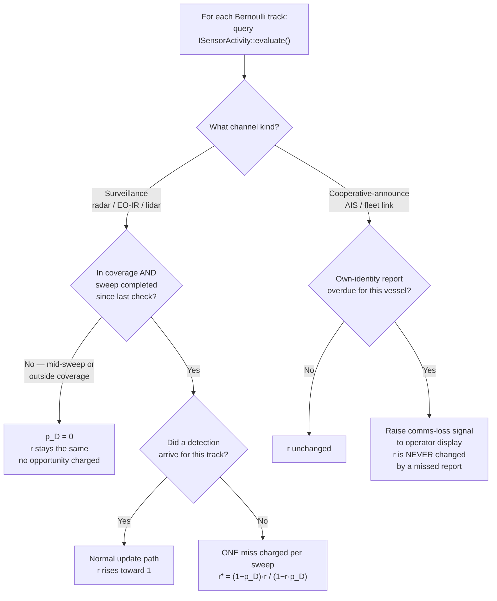

# 24 — Coverage / Visibility Channel

> Prerequisites: [§13 — Clutter and detection models](13-clutter-and-detection.md),
> [§15 — Track lifecycle](15-track-lifecycle.md),
> [§23 — PMBM](23-pmbm.md).
> Next: [Index](00-index.md).

The precise algorithm reference is
[`docs/algorithms/pmbm-design.md §9`](../algorithms/pmbm-design.md#9-coverage--visibility-channel-isensoractivity).

---

## 1. What problem are we solving?

In chapter 13 we introduced `P_D` — the probability that a sensor
detects a real target in one scan. In PMBM (chapter 23), a missed
detection lowers a Bernoulli's existence probability `r`:

```
r_new = (1 − p_D) · r / (1 − r · p_D)
```

The bigger `p_D` is, the faster `r` falls after a miss. That makes
sense: if the radar almost never misses, then *not* seeing a target
is strong evidence it is gone.

**But the formula only makes sense if the sensor actually had a
chance to see the target.**

Before Task 4, navtracker had no way to answer that question. A
"scan" in the code was just a bundle of measurements that happened
to share the same timestamp. If a measurement arrived, the sensor
counted as "active". If no measurement arrived from a particular
sensor on a particular timestamp, the sensor was not charged for a
miss — even if it had just finished sweeping the area.

That produced two problems:

- **Phantom tracks.** Shore returns and other clutter are detected
  again and again. Every detection prevents a miss from being
  charged. The track never fades.
- **Wrong model.** The miss-penalty was charged once per blip, not
  once per sweep. One radar rotation is one opportunity, regardless
  of how many blips it produces.

The **coverage / visibility channel** fixes this. It gives the
tracker an honest answer to the question:

> *Did the sensor actually have a real chance to see this track
> just now, and did that chance pass with nothing?*

---

## 2. Two kinds of sensors — very different answers

Not all sensors answer that question the same way. There are exactly
two archetypes, and they are opposite in nature.

### Kind A — Surveillance sensors (radar, EO/IR, lidar)

These sensors **search an area** on a rhythm you control. A radar
rotates once every 2.5 seconds. An EO/IR camera scans its sector
on a known cycle. That cycle is called the **duty cycle**.

Key properties:
- One rotation = one **opportunity** to see anything in the covered
  area.
- **Silence over covered ground is strong evidence.** If the radar
  swept the area and nothing came back, that tells you something.
  It works even for targets you have never seen before.
- Evidence is roughly **symmetric**: a detection and a covered-but-
  empty sweep are both informative.

### Kind B — Cooperative-announce sources (AIS, fleet link)

These sources work the opposite way. The **target announces
itself** — you do not search for it. The rhythm belongs to the
target, not to you.

Key properties:
- One "opportunity" = the target's own expected report time.
- **Silence is weak evidence.** A quiet AIS transponder might mean
  the vessel sank. Or it might mean the transponder is off, the
  channel is congested, the vessel is out of range, or the link
  dropped.
- Evidence is **asymmetric**: a report is very strong (the target
  exists, here, with an identity); silence is ambiguous.
- It is keyed on **identity**, not on a place. Vessel B's silence
  says nothing about vessel A.

**AIS and a dedicated fleet link are both Kind B** — they differ
only in how trustworthy the report is and how reliable the link is.
A fleet link with authentication is the gold-standard end of Kind B;
AIS is the open-access end. The model is the same.

---

## 3. The flowchart — how the tracker decides

For each Bernoulli (potential target) the tracker queries the
coverage channel once per update. Here is what happens:



Two things stand out:

1. **Between sweeps**, existence does not change. The track coasts.
   The old `idle_halflife_sec` knob was a wall-clock fade applied
   continuously; this replaces it with an honest "did the sensor
   look?" test.

2. **Cooperative silence does not lower existence.** An overdue AIS
   or fleet-link report raises a flag for the operator ("we lost
   contact"), but the filter keeps the track alive. A track that is
   only seen by a cooperative source is retired only by a long,
   explicitly configured timeout, or once a radar sweep that covers
   its position confirms absence.

---

## 4. Why cooperative silence should not lower existence

Imagine a fleet partner vessel goes quiet on the link. What does
that mean?

- *Maybe*: the vessel sank or disappeared.
- *More likely*: the radio link dropped, the transponder malfunctioned,
  congestion on the AIS channel, the vessel moved out of range, or
  the operator turned the transponder off in a sensitive area.

Communication losses are common and routine at sea. If we applied
the same "no report = target might be gone" reasoning we use for
radar misses, we would delete tracks whenever a radio link
hiccupped.

Instead, the model separates two concerns:

- **Existence** (`r`): how confident are we this vessel is still
  physically there? This is lowered only by a surveillance sensor
  that covered the area and found nothing.
- **Communications status**: are we in contact with the vessel?
  This is flagged by the stale / comms-loss signal, independently
  of existence.

A surveillance-held track that goes quiet on its cooperative link
remains alive on radar; the operator sees "comms lost" but the
fusion track continues.

---

## 5. How the math changes — one miss per sweep

The existence recursion is unchanged:

```
r_new = (1 − p_D) · r / (1 − r · p_D)
```

What changes is how many times it is applied and with what `p_D`.

**Before (wrong).** The miss penalty was charged once per blip,
using a `compute_miss_pD` function that was called in the
misdetection branch of the per-measurement loop. One radar rotation
might produce 50 blips for other targets — each one charged a miss
to every track that was not in that blip. That is 50 opportunities
per rotation instead of one.

**After (correct).** The per-duty-cycle activity check fires once
per Bernoulli per sweep. If a full rotation of the radar has passed
since the last check, and the track's predicted position is inside
the coverage range and sector, one miss is charged. Otherwise zero
are charged. A target that is outside radar coverage simply does not
accumulate misses until a sweep covers it.

Plain words: *one rotation = one chance. One missed chance = one
charge.*

---

## 6. Snapshot + deferred write (a subtle correctness detail)

PMBM keeps multiple alternative hypotheses simultaneously (chapter
23, the "mixture" part of PMBM). When the tracker loops over all
hypotheses, each hypothesis might process the same Bernoulli at a
different moment in the loop.

If we updated `last_activity_check_` for a Bernoulli the moment
hypothesis H1 processed it, hypothesis H2 — processed next in the
loop — would see a *later* `last_checked` and might charge zero
misses even though H2 is an independent hypothesis.

The fix: read all `last_activity_check_` values as a **frozen
snapshot** before the hypothesis loop starts. Write the updates to
a staging map. Apply the staged writes *once* after all hypotheses
finish. This way every hypothesis sees the same `last_checked` for
a given Bernoulli, regardless of loop order.

This is called **snapshot + deferred write** in the code. It is a
small implementation detail with a big correctness consequence:
without it, the miss count would depend on which hypothesis was
processed first — a subtle non-determinism.

---

## 7. What we assume

1. **Known duty cycle and coverage.** Each surveillance sensor has a
   declared rotation period (`duty_cycle_sec`) and a coverage area
   (`max_range_m`, azimuth sector, `p_D`). These are static
   configuration today. An adaptive model that *learns* cadence from
   observed gaps is planned as a future implementation behind the
   same interface.

2. **Known cooperative cadence.** Each cooperative source has a
   declared expected report interval. If a fleet partner normally
   reports every 10 seconds, the cadence model uses 10 seconds as
   the overdue threshold.

3. **Identity is stable enough to key cadence.** The cooperative
   overdue check uses `hints.mmsi` or `hints.platform_id` from the
   track's association history. These must be populated and not
   change mid-track.

4. **No re-feeding of stale data.** The consumer supplies coverage
   state through the activity port, not by sending old positions
   as fresh measurements. The port is a pure function: same inputs
   → same output, every time.

---

## 8. Why we use this here

navtracker fuses AIS (cooperative-announce) with radar (surveillance).
Those two sources have opposite evidence structures. Treating them
the same — "no measurement = possible miss" — was the root cause of
phantom tracks on the philos coastal dataset and the reason the old
wrong-math crutch existed in the first place.

The coverage channel gives each sensor kind its correct model.

**What this retires (three old crutches):**

| Old crutch | Why it existed | Replaced by |
|---|---|---|
| Wrong per-blip `compute_miss_pD` | No sweep concept; miss charged per blip | Per-duty-cycle miss via activity port |
| `idle_halflife_sec` | Needed a slow global decay to prevent phantom accumulation | Honest "did the sensor look?" test |
| `source_id="ais"` patch | Ad-hoc AIS identity gate in misdetection | Unified `mmsi`/`platform_id` identity gate + cooperative stale path |

---

## 9. Measurement results — where it works and where it does not

The coverage model was bench-measured on two datasets in
2026-06-29. The full numbers are in
[`docs/algorithms/evaluation-log.md`](../algorithms/evaluation-log.md)
under "Task 4".

**Autoferry (open water, high radar P_D ≈ 0.6–0.8):**
Coverage is the best result across all PMBM variants — lowest
GOSPA, near-zero cardinality error, fewest identity switches —
with fewer tuning knobs than any alternative (no `idle_halflife`,
no wrong-math dedup). This is the setting the model was designed
for: a surveillance-dominated scene where missed sweeps are rare
and each non-detection genuinely tells you something.

**Philos (coastal, low radar P_D = 0.07):**
Coverage is the worst variant, with GOSPA 153.6 vs 48.5 for the
best PMBM config. Two compounding causes:

1. *AIS retirement timer was inert.* The cooperative stale timeout
   keys on `SensorKind::Cooperative`; philos AIS is `SensorKind::Ais`,
   so the timer never fires and AIS tracks are never retired.

2. *Honest radar miss is too weak at p_D=0.07.* Each missed sweep
   only moves `r` from some value to `0.93 · r`. Shore returns are
   re-detected every rotation, so they never miss. The old
   wrong-math and idle_halflife were accidentally suppressing those
   phantoms; removing them revealed the underlying spatial clutter
   problem.

**Conclusion.** The philos over-count is a *spatial* clutter
problem, not a temporal one. The next candidate fix is a
coastline / land-mask prior at birth — suppress shore-echo
Bernoullis before they are born, so the temporal miss model
never has to compensate for them.

---

## 10. Where this lives in the repo

| What | Where |
|---|---|
| Port (the interface) | `ports/ISensorActivity.hpp` |
| Stale signal sink | `ports/IStaleSignalSink.hpp` |
| Declared-profile provider | `core/sensor_activity/DeclaredSensorActivity.{hpp,cpp}` |
| PMBM integration (miss + stale) | `core/pmbm/PmbmTracker.cpp` |
| Activity profiles in bench | `adapters/benchmark/ReplayScenarioRun.cpp` (duty-cycle / p_D per scenario) |
| Unit tests | `tests/pmbm/` |
| Algorithm reference | [`docs/algorithms/pmbm-design.md §9`](../algorithms/pmbm-design.md#9-coverage--visibility-channel-isensoractivity) |

---

## 11. What we did not pick — and why

**"Just use per-scan timestamps as sweep boundaries."**
That is what the old code did. A "scan" was whatever measurements
shared one timestamp. A sensor only counted as active if another
measurement happened to arrive at the same instant. This is
accidental and depends on message batching, not on the physical
sensor cycle. Rejected: not a model of coverage.

**"Apply existence decay continuously (idle_halflife_sec)."**
A single global decay rate for every track, regardless of whether
any sensor was looking. Too blunt: a vessel behind a headland
should not lose existence just because wall-clock time passes.
Replaced by: existence drops only when a surveillance sensor that
*covers* the predicted position completes a sweep with no return.

**"Make cooperative silence lower existence, with a small weight."**
Rejected: comms losses are too common and too unrelated to actual
vessel fate. A model that degrades `r` on radio silence will
wrongly delete fleet-partner tracks on every link outage. The
architecture keeps existence and communications status as separate
concerns.

---

Previous: [23 — PMBM](23-pmbm.md)
Back to: [Index](00-index.md)
