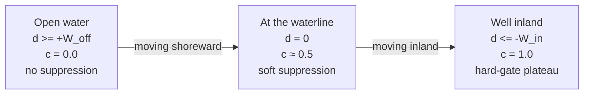
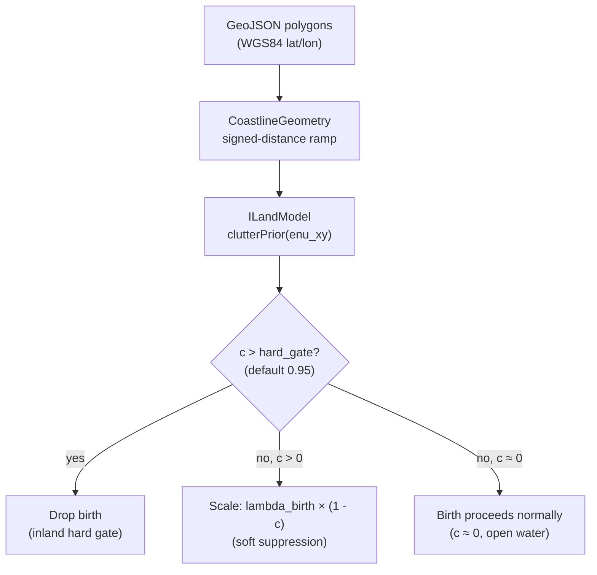

# 25 — Suppressing tracks on land: the coastline clutter prior

**Prerequisites:** [13 — Clutter and detection models](13-clutter-and-detection.md),
[23 — PMBM](23-pmbm.md). A quick read of [24 — Coverage / Visibility Channel](24-coverage-visibility-channel.md)
helps, but is not required.

---

## 1. What problem are we solving?

Imagine a radar in a busy harbour. It spins once per second. Every spin it sees
a small boat in the middle of the water — and also a bright return from the pier,
the crane, and the concrete wall on shore.

The tracker does not know what is a real vessel and what is a fixed structure.
It treats every strong return the same: "something might be here." After a few
seconds, the pier return has been seen so many times that the tracker creates a
track for it — a phantom track. If there are 185 such shore-clutter returns, the
tracker creates 185 phantom tracks. The cardinality error blows up.

The problem is **spatial**. The shore returns are always at the same lat/lon.
They are not vessels — they are buildings, piers, and walls. The time-based
methods (like the coverage channel in chapter 24) cannot help: they rely on the
return going *missing* for a few scans to lower the track's existence probability.
But shore returns never go missing — they are there every single scan.

The solution is to tell the tracker where the land is. Then, when a new birth
candidate appears on land, the tracker suppresses or rejects it before it can
become a phantom track.

---

## 2. How it works

### 2.1 The coastline clutter prior

We give the tracker a **clutter prior** — a number `c` between 0 and 1 for any
position. It means:

- **c = 0.0** — open water. No suppression. Birth candidates proceed normally.
- **c ≈ 0.5** — right at the waterline. Moderate suppression. The birth is allowed
  but starts weaker.
- **c = 1.0** — well inside land. Maximum suppression. The birth is blocked.

We compute `c` from a **shoreline ramp**: a smooth function of how far the
position is from the nearest shore edge.

### 2.2 The shoreline ramp

Let `d` = the signed distance from the query position to the nearest shore edge.

- `d > 0` means **offshore** (positive = towards open water).
- `d < 0` means **inland** (negative = inside land).
- `d = 0` is exactly **on the shoreline**.

The ramp formula is:

```
c(d) = clamp( (W_off − d) / (W_off + W_in),  0,  1 )
```

`W_in` is the inland half-width (how far inland before `c` reaches 1.0).
`W_off` is the offshore half-width (how far offshore before `c` drops to 0.0).
Both default to 50 metres.

**In plain words:**

- If you are more than 50 m offshore: `c = 0`. No effect on births.
- If you are right on the waterline: `c ≈ 0.5`. Births are allowed but
  start at half-weight.
- If you are more than 50 m inland: `c = 1`. The hard gate blocks the birth.

The diagram below shows the three zones:



### 2.3 Applying the prior at birth

When the PMBM tracker creates a new birth candidate at position `p`, it asks:

```
c = clutterPrior(p)
```

Then it applies the rule:

- If `c > 0.95` (inland plateau) → **drop the birth entirely**. No Bernoulli
  is created. This is the *hard gate*.
- Otherwise → **scale the birth intensity** by `(1 − c)`. A birth on open water
  (c = 0) is unchanged. A birth at the waterline (c = 0.5) starts at half the
  normal intensity. This is the *soft suppression*.

The flow from coastline data to the birth gate is:



The GeoJSON lives in an **adapter** (`GeoJsonCoastline`). The core tracker only
calls the `ILandModel` interface — it never touches files or GeoJSON directly.
This keeps the hexagonal architecture clean (see CLAUDE.md invariant 1).

---

## 3. Why it works

### 3.1 Shore clutter is spatial

Shore returns come from fixed structures. They appear at the same position every
scan. No amount of waiting will make them disappear. Time-based methods fail here.

A spatial mask works because it attacks the problem at its origin: the tracker
never creates a Bernoulli at a shore position in the first place. There is no
phantom to prune later.

### 3.2 Why not raise the clutter intensity λ_C near shore?

The obvious idea: "tell the tracker there is more clutter near shore by raising
λ_C." This sounds correct but does not work when **adaptive birth** is enabled
(Task 1 / Chapter 23 §7).

With adaptive birth, the code sets:

```
λ_birth = (r* / (1 − r*)) · λ_C
```

where `r*` is a configured target existence probability. Then the new Bernoulli
existence is:

```
r_new = λ_birth / (λ_birth + λ_C)
      = r*            [λ_C cancels out]
```

`λ_C` cancels in the numerator and denominator. Raising λ_C just raises `λ_birth`
by the same factor — `r_new` stays pinned at `r*`. Raising clutter intensity has
no effect on birth existence under adaptive birth. So we must scale `λ_birth`
directly, which is what the clutter prior does.

### 3.3 Why the soft band at the waterline?

Two reasons.

**Imprecision in the GeoJSON.** Coastline data from a city boundary file is not a
tide-corrected nautical survey. It might be 30–100 m off. A sharp land/water edge
would suppress births right up to the true shoreline. The soft band (±50 m
default) absorbs this error gracefully.

**Anchored vessels.** A real vessel moored at a dock sits exactly at the waterline.
We do not want to hard-block it. At c ≈ 0.5 the birth intensity is halved — the
vessel can still build up evidence across repeated detections and confirm a track.
Only deep-inland returns (c > 0.95) are hard-rejected.

---

## 4. What we assume

1. **You supply the coastline.** The tracker cannot fetch GeoJSON by itself. You
   load a GeoJSON file that covers the area around own-ship and pass it to the
   `GeoJsonCoastline` adapter.

2. **The GeoJSON is approximately correct.** It does not need to be perfect. The
   soft band absorbs waterline errors of up to `W_off` metres offshore.

3. **Datum recenters are wired.** The `CoastlineModel` registers itself as an
   `IDatumChangeSink` and updates its internal datum reference whenever own-ship
   moves more than 30 km. You must call `OwnShipProvider::registerDatumSink(&land_model)`.
   If the new area is not yet in the loaded GeoJSON, the model returns c = 0
   everywhere (no suppression — "I do not know" = "do not invent land").

4. **Coastline updates happen at deterministic points.** If you load fresh GeoJSON
   mid-mission, apply the swap at a scan boundary (a timestamped point in the
   measurement stream). Never call `setCoastline` from a timer callback or a
   network thread. This keeps replay deterministic.

---

## 5. Why we can use this here

The philos dataset is Boston inner harbor. A pre-check (2026-06-29) showed:

- 69% of philos radar plots are physically **on land** (inside a building or a
  pier). A vessel cannot be there.
- Another 17% are within 50 m of the shoreline.
- Only 14% are in open water — the positions where real vessels could exist.

The land mask catches exactly the 86% that are clutter, and leaves the 14% that
matter untouched. The `boston.geojson` fixture (City of Boston boundary) was
validated by testing known land points (Charlestown Navy Yard, downtown) and
known water points (own-ship position, mid-harbor). The soft band covers the
administrative-boundary imprecision.

---

## 6. Where this lives in the repo

| File | What it does |
|---|---|
| `ports/ILandModel.hpp` | The pure interface: `clutterPrior(enu_xy) → double` |
| `core/land/CoastlineGeometry.hpp/.cpp` | Signed-distance ramp from geodetic polygons |
| `core/land/CoastlineModel.hpp` | `ILandModel` + `IDatumChangeSink`: swaps query datum on recenter |
| `adapters/land/GeoJsonCoastline.hpp/.cpp` | Parses GeoJSON Polygon/MultiPolygon; calls `setCoastline` |
| `core/pmbm/PmbmTracker.hpp` | `setLandModel(const ILandModel*)` + `Config::use_land_model` + `Config::land_birth_hard_gate` |
| `core/pmbm/PmbmTracker.cpp` | `landBirthScale(mean)` helper; applied in both adaptive and legacy birth builders |
| `tests/fixtures/philos/boston.geojson` | City-of-Boston polygon fixture used in the philos bench |

Algorithm-level reference (four-section doc with equations): [pmbm-design.md §10](../algorithms/pmbm-design.md#10-land--coastline-clutter-prior).

---

## 7. What we did not pick, and why

**Binary land/water mask (no ramp).**
A hard yes/no based on point-in-polygon would drop births sharply at the nominal
waterline. This has two problems: (a) 30–100 m GeoJSON error means the waterline
is uncertain — a hard edge would suppress real near-shore births; (b) a vessel
alongside a pier could be on the wrong side of the polygon. The ramp absorbs
both uncertainties smoothly.

**Raising clutter intensity λ_C near shore.**
As explained in §3.2, this is silently defeated by adaptive birth. λ_C cancels in
the r_new formula under the `birth_existence_target` knob.

**On-land plausibility gating for existing tracks (not just births).**
Suppressing births stops phantom tracks from forming. It does not help a track
that drifts ashore after confirmation (e.g. a velocity estimate that walks a
real track onto land). A second gate at the measurement-update step could check
whether a confirmed track's position is implausible on land. This is deferred —
the birth gate catches the dominant failure mode for now.

**Learning the clutter map online.**
The `ClutterMapDetectionModel` (Task 3 / Chapter 13) can learn a spatial clutter
intensity from observed false tracks. Coupling that learned map with the birth
prior would cover waterside clutter that the static coastline cannot mask. Deferred
pending measurement of the coastline-alone result (now done: coverage+land reaches
gospa 73.1, still 24.6 points above MHT; the residual gap is the waterside clutter
target).

**Coverage-occlusion (coupling with Task 4 / Chapter 24).**
Land between the radar and the target should reduce the miss-detection penalty in
the coverage model (the radar cannot see what the land is blocking). This extends
the spatial reasoning from births to the surveillance miss step. Deferred to a
future coupling of this module with the coverage/visibility channel.

---

## 8. Validated on synthetic perfect truth

Everything in sections 1–7 was first tested on the **philos** dataset: real Boston harbor
radar, real vessel traffic. That test showed the land model works. But real data has two
problems.

First, ground truth comes from AIS transponders. AIS has errors: dropout, timing noise,
and occasional wrong positions. So when we measure "cardinality error," that number is
partly noise in the truth, not just noise in the tracker.

Second, the philos data has vessels moored at the waterline. We could not be certain
whether a near-waterline detection was a real anchored vessel or a shore return. We
assumed the inland-only hard gate protects anchored vessels (c ≈ 0.5 at the waterline,
so the birth is weakened but not blocked), but we could not prove it cleanly.

We built a **synthetic bench** to settle both questions. It works like this:

1. We write a simple fictional shoreline in ENU — a straight seawall with one pier
   protruding into the water. We place 30 false-return points deep inside the land
   (well into the hard-gate region, c > 0.95).
2. Each radar scan, those 30 points emit a fake radar blip with probability 0.9. Same
   positions every scan. No truth track. If the tracker creates a track here, it is a
   phantom.
3. In a separate scenario we place one **real** slow vessel only 10 m offshore
   (c ≈ 0.4, soft-suppression zone), alongside the same shore clutter. This vessel must
   survive as a confirmed track.
4. We run the bench twice: once with `use_land_model = false` (land model off), once
   with `use_land_model = true`. The difference in cardinality error is the land model's
   effect measured against perfect truth.

Because we created the shore clutter ourselves, we know exactly which measurements are
false and which are real. There is no AIS error. There is no anchored-ship ambiguity.

The same `CoastlineGeometry` object that places the 30 shore-clutter points is also
handed to the tracker as the land model. One shoreline, used twice — so the geometry is
consistent by construction. The tracker's inland query and the clutter generator are
never out of step.

**Why this matters.** The real-data test showed the land model improves GOSPA by 80
points. The synthetic bench confirms *why*: the cardinality error on the shore-clutter
scenarios drops to near zero when the land model is on, and the near-shore real vessel
survives. The two results together are stronger than either alone.

For the technical details of the bench — the geometry generators, the injector math, and
what to test next — see
[`docs/algorithms/synthetic-clutter-bench.md`](../algorithms/synthetic-clutter-bench.md).
