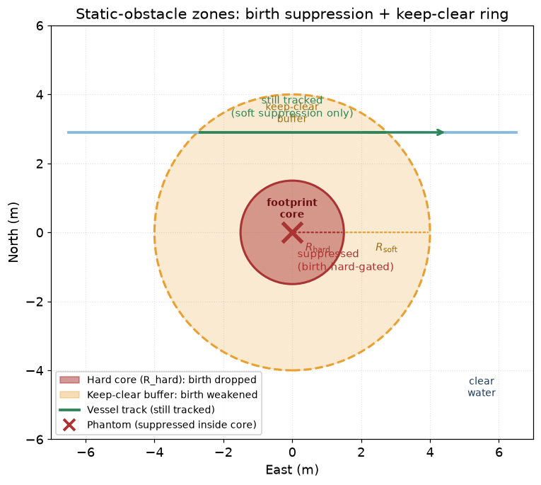

# 26 — Static obstacles: charted hazards as a vessel-birth prior

**Prerequisites:** [25 — Suppressing tracks on land: the coastline clutter prior](25-land-clutter-prior.md),
[23 — PMBM](23-pmbm.md). [18 — CPA and collision risk](18-cpa-and-collision-risk.md)
helps for the keep-clear alarm section but is not required.

---

## 1. What problem are we solving?

### 1.1 Two meanings of "static"

In plain English, "static" means "not moving." But in a tracker that must watch
a busy harbour, that one word covers two very different things:

**A stopped vessel.** A fishing boat at anchor. A tanker waiting at a berth.
These are *vessels*. They are hard collision hazards. They may move at any
moment. A tracker must keep a live track on them, including when their speed is
zero.

**Fixed infrastructure.** A pier. A rock. A concrete breakwater. A buoy on a
chain. These are *environment*. They will never move on their own. No sensible
system emits a "vessel track" for a pier.

The tracker does not know which is which just by looking at radar returns.
A stopped boat and a pier both produce a bright return in roughly the same
place, scan after scan.

### 1.2 What happens when the tracker does not know

Before this chapter's work, navtracker treated every strong radar return as a
potential vessel. The coastline prior (chapter 25) blocked births on land. But
a pier in the water, a rock off a headland, a floating buoy — these are **in
the water**, so the coastline prior does not stop them.

The result was the *philos over-count*: hundreds of phantom tracks appearing at
fixed structures in Boston inner harbour. The tracker was doing exactly what it
was designed to do — but it was treating the pier as a ship.

### 1.3 The fix: tell the tracker where the hazards are

If we know where a rock or a pier is — from a nautical chart — we can tell the
tracker: "if you see a new radar return here, be very careful. A real vessel
passing through this spot should be tracked; but a return that is *always exactly
here* is probably the rock, not a ship."

That is the static-obstacle birth prior.

---

## 2. How it works

### 2.1 The charted obstacle

A **charted obstacle** is a discrete hazard listed on a nautical chart: a rock,
a wreck, a pile, a beacon, a platform. It is different from the coastline
(which is a large region). A charted obstacle is a specific *point* in the water
with a known position and a known extent.

In navtracker, each charted obstacle is a `StaticObstacle` with:

- **`position`** — its exact location in WGS84 latitude/longitude (the geodetic
  position from the chart).
- **`footprint_radius_m`** — how big the physical object is, in metres.
- **`position_uncertainty_m`** — how precise the chart position is. This is added
  to the footprint to form the *hard core*.
- **`keep_clear_radius_m`** — the safety margin the operator requires. This is
  larger than the footprint. It is the *keep-clear ring*.
- **`category`** — rock, wreck, pile, buoy, etc. (from the S-57 chart standard).
- **`depth_m`**, **`lit`**, **`aton`** — additional chart attributes.

### 2.2 The three zones

Around every obstacle there are three zones. The figure below shows them:



**Zone 1 — the footprint core (red).**
This is the physical object, plus the chart uncertainty.
Radius: `R_hard = footprint_radius_m + position_uncertainty_m`.
A vessel *cannot* be inside this zone — the structure is there. So the tracker
applies a *hard suppression*: any birth candidate inside this radius gets a
suppression of `c = 1.0`. Because `c = 1.0` exceeds the hard gate (0.95 by
default), the birth is dropped. No Bernoulli is created. The phantom track
never forms.

**Zone 2 — the keep-clear buffer (amber).**
This is the ring from `R_hard` out to `R_soft = max(keep_clear_radius_m, R_hard)`.
A vessel *can* be in this zone — it is open water — but it is also possible that
the radar return here is from the edge of the structure.
The tracker applies a *soft suppression*: a linear ramp that falls from
`soft_max = 0.9` at the inner edge (`R_hard`) down to 0.0 at the outer edge
(`R_soft`):

```
c(d) = soft_max · (R_soft − d) / (R_soft − R_hard)
```

where `d` is the distance from the obstacle centre to the birth candidate.

This means a birth candidate just inside the outer edge starts very weak (`c ≈ 0`)
and a candidate just outside the hard core starts at nearly full suppression
(`c ≈ 0.9`). But `c = 0.9` is less than the hard gate (0.95), so the birth
candidate is **not dropped** — it is scaled down, not eliminated.

**Zone 3 — clear water (beyond R_soft).**
No suppression. `c = 0`. Births proceed exactly as normal.

### 2.3 The passing-vessel protection

A real vessel passing through the keep-clear ring will be weakened but not
blocked. Each radar scan where the vessel produces a detection, the tracker
sees a weak birth candidate. Over several scans, the evidence accumulates and
the track confirms. The vessel is still tracked.

This is the key difference from folding the obstacle into the coastline polygon.
A coastline polygon creates a hard yes/no edge: inside = blocked. A ring around
an obstacle using this ramp creates a gradient: closer = weaker, but never
fully blocked until you are inside the physical structure.

### 2.4 How the birth scale is computed

The PMBM tracker combines the land prior and the static-obstacle prior in one
step, called `birthScale`:

```
scale = (1 − c_land) · (1 − c_static)
```

- `c_land` is the land prior from chapter 25 (0 in open water, 1 well inland).
- `c_static` is the obstacle prior from the ramp above (0 in clear water, 1
  inside the hard core).

The birth intensity is multiplied by `scale`. If `scale = 0.7`, the birth starts
at 70% of normal strength. If `scale = 0`, the birth is dropped (hard gate).

The two priors multiply rather than add because they work on different problems:
being near a rock AND near the shore suppresses births more than either alone.
If only one model is wired, the other contributes 0 and the formula reduces to
just the one that is active.

**Safe by construction.** If no obstacle model is wired (`use_static_obstacle_model = false`),
then `c_static = 0` and `scale = (1 − c_land)` — bit-identical to what the
tracker did before Stage 1. Turning the model off restores the old behaviour
exactly.

### 2.5 Multiple obstacles

If there are several obstacles in the area, the tracker takes the maximum
suppression across all of them at each birth-candidate position:

```
c_static = max( c₁, c₂, …, cN )
```

One obstacle never cancels another. The strongest suppression wins.

### 2.6 Where the position comes from (geodetic → ENU)

The chart stores positions in latitude/longitude (WGS84). The tracker works in
ENU metres (east, north, up) around a local origin called the datum.

When the tracker starts — or when own-ship moves far enough that the datum
recenters (every 30 km) — the obstacle model converts each obstacle's
geodetic position into ENU metres and caches it. All proximity checks during a
processing cycle use these cached ENU positions. No slow geodetic maths on the
hot path.

---

## 3. The keep-clear alarm

The birth prior is a *passive* tool: it shapes what the tracker believes. There
is also an *active* alarm: the **keep-clear proximity alarm**.

`StaticHazardEvaluator` checks, each processing cycle, whether own-ship is inside
the keep-clear ring of any charted obstacle:

- **Entered**: own-ship distance to obstacle drops below `keep_clear_radius_m`.
- **Updated**: while inside (optional, configurable).
- **Exited**: own-ship distance exceeds `keep_clear_radius_m × exit_hysteresis`
  (default 1.1 — a 10% buffer to prevent flapping at the boundary).

This is a simple range check. It is **not** a CPA (Closest Point of Approach)
calculation. CPA requires knowing a velocity; a rock has no velocity. The alarm
says: "you are currently inside the keep-clear ring." That is the right signal
for a fixed hazard.

The CPA calculation (chapter 18) is for dynamic vessel tracks — moving targets
with estimated speed and course. Do not mix the two up: the static-hazard alarm
and the vessel CPA alarm are separate outputs and serve different purposes.

---

## 4. Why this matters

### 4.1 The philos problem

The Boston inner-harbour (philos) replay showed the tracker creating hundreds of
phantom tracks. Investigation of the raw radar returns showed that ~1,940 non-AIS
returns per 20 seconds were from **persistent, fixed structures**: piers, breakwaters,
shoreline. A motion check found zero coherent non-AIS moving boats. The returns
looked exactly like dense vessel traffic to the tracker.

The land prior (chapter 25) suppresses births *on land*. But piers are in the
water. Only a discrete obstacle model can suppress births *at a pier*.

### 4.2 Vessel-vs-environment, not moving-vs-stationary

The key design rule is: the tracker tracks **vessels**, not **fixed environment**,
regardless of speed. A stopped boat is still a vessel. A moving buoy that broke
its chain is still environment (it was charted; its motion is unplanned and
unusual). The discriminator is what the object *is*, not how fast it is going.

This is why "just flag slow tracks as environment" does not work. An anchored
vessel has exactly zero speed — the same as a rock. Deleting slow tracks would
silently drop anchored ships, which are the exact targets most in need of a CPA
alert when own-ship is manoeuvring in a crowded anchorage.

---

## 5. What we assume

1. **The chart is approximately correct.** The model relies on a `StaticObstacle`
   list provided at startup. The tracker cannot check the chart for errors. The
   `position_uncertainty_m` field absorbs small chart errors, but a grossly wrong
   position will suppress births in the wrong place.

2. **Obstacles do not move.** A charted obstacle is treated as permanent and fixed.
   An obstacle that moves (a barge dragged off-position by a storm, a floating
   platform relocated by the port authority) will produce an incorrect prior until
   the chart is updated.

3. **Datum recenters are wired.** The ENU cache must be rebuilt whenever the datum
   shifts. The `StaticObstacleModel` registers itself as a `IDatumChangeSink`;
   the caller must pass it to `OwnShipProvider::registerDatumSink(...)`. If this
   is not wired, the obstacle positions drift in ENU space and the suppression
   fires in the wrong location.

4. **`soft_max` is strictly below the hard gate.** The default values (0.9 and
   0.95 respectively) satisfy this. If a configuration sets `soft_max ≥ 0.95`,
   the keep-clear buffer becomes a hard gate and real vessels in the ring are
   suppressed rather than softened.

---

## 6. What we did not pick, and why

**Fold charted obstacles into the coastline polygon.**
A polygon creates a hard yes/no edge. A small polygon around a rock would create
a tiny no-birth zone and silently suppress real vessels passing close. It also
cannot carry depth, category, or AtoN attributes. The discrete `StaticObstacle`
type was chosen specifically to avoid these problems.

**Use a CPA alarm for fixed hazards.**
CPA needs a velocity. A rock has no velocity. A proximity range check is the
correct and simpler primitive for a fixed hazard. This also keeps the
static-obstacle output distinct from the vessel-track CPA output so consumers
know which signal they are reading.

**Learn the obstacles from the radar (no chart).**
This is Stage 1b / Stage 2 (not yet built). Learning static occupancy from the
radar requires accumulating persistent-return evidence over many scans and
building an occupancy grid. The charted input is cheaper: it gives correct
positions immediately with no learning latency. Stage 2 extends this to
**uncharted** hazards once the live learning pipeline is built.

---

## 7. Where this lives in the repo

| File | What it does |
|---|---|
| `core/types/StaticObstacle.hpp` | The charted-obstacle data type: position, radii, category, depth, AtoN |
| `ports/IStaticObstacleModel.hpp` | The port interface: `birthSuppression(enu_xy) → double` + `obstacles()` |
| `core/static/StaticObstacleModel.hpp` | Concrete model: geodetic → ENU cache, ramp logic, `IDatumChangeSink` |
| `core/output/StaticHazardOutput.hpp` | Drainable output type; `staticHazardId` / `toStaticHazardOutput` helpers |
| `core/collision/StaticHazardEvaluator.hpp` | Proximity alarm: Entered/Exited/Updated events with hysteresis |
| `ports/IStaticHazardSink.hpp` | Push-style sink for proximity events |
| `core/pmbm/PmbmTracker.hpp` | `birthScale()` — combines land + static-obstacle prior multiplicatively |

Algorithm-level reference (four-section doc with equations):
[`docs/algorithms/static-obstacle-birth-prior.md`](../algorithms/static-obstacle-birth-prior.md).

Design sketch (incl. the "we move" caveat and staging list):
[design spec §14.10](../superpowers/specs/2026-05-28-maritime-sensor-fusion-design.md#1410-static-objects-track-vessels-map-the-environment).

Scope decision: [ADR 0002](../adr/0002-static-objects-track-vessels-map-environment.md).

---

## 8. What comes next: learning statics from the sensors

Stage 1 (this chapter) uses only **charted** hazards. A chart is never complete.
Uncharted objects — a sunken container, a disconnected pipeline, a temporary
construction barge — are not on any chart.

Stage 1b (open) will reframe the existing clutter-map primitive: the PMBM tracker
already tracks how likely each spatial cell is to produce unclaimed returns (the
dominant-hypothesis `1 − r` labeling design). Routing that accumulated evidence
into an explicit **static-occupancy output** (a `StaticHazardOutput` with
`is_charted = false`) gives the first live-learned hazard layer — without a full
occupancy grid.

Stage 2 (future) is a proper Dempster-Shafer occupancy grid: each cell carries
a mass for "free", "static-occupied", "dynamic-occupied", and "unknown". The
"unknown" mass is the honest fix for the ADR 0001 near-shore problem — instead
of blanket-suppressing births near shore when the sensor has not observed that
cell, the grid carries "we do not know yet." This is a substantial new subsystem.

---

Previous: [25 — Suppressing tracks on land: the coastline clutter prior](25-land-clutter-prior.md)
Back to: [Index](00-index.md)
