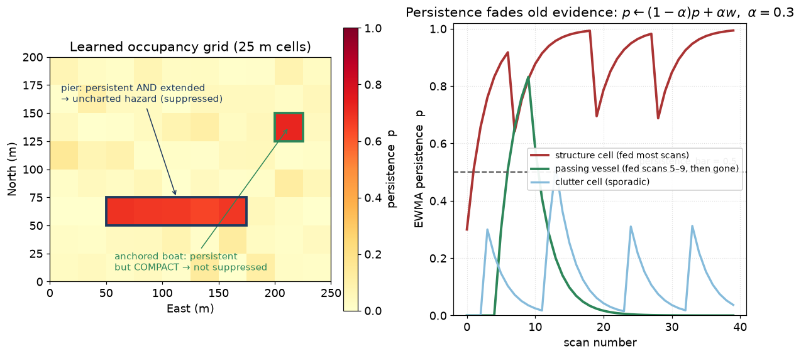
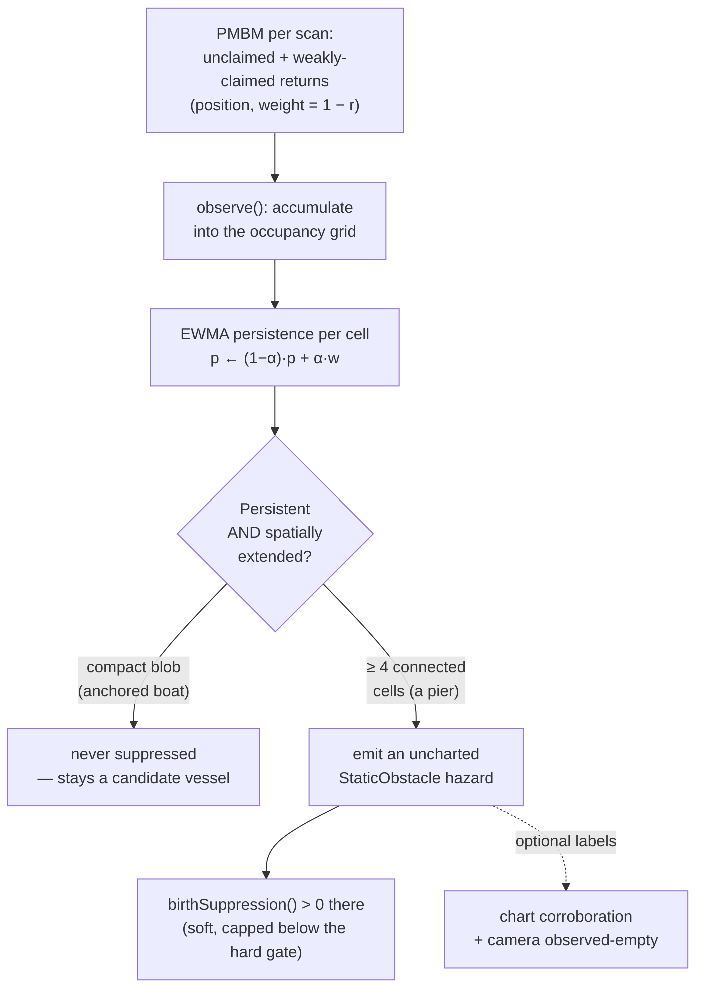

# 27 — Learning uncharted structure: the live occupancy grid

**Prerequisites:** [26 — Static obstacles: charted hazards as a vessel-birth prior](26-static-obstacles.md),
[23 — PMBM](23-pmbm.md), [24 — Coverage / Visibility Channel](24-coverage-visibility-channel.md).
[25 — Suppressing tracks on land](25-land-clutter-prior.md) is helpful background.

The precise algorithm reference (equations, four-section template) is
[`docs/algorithms/live-static-occupancy.md`](../algorithms/live-static-occupancy.md).

---

## 1. What problem are we solving?

Chapter 26 taught the tracker where fixed hazards are by **reading a chart**.
That works — but only for things that are *on* the chart.

A chart is never complete. Some real, fixed structures are simply not listed:

- a new pier or floating dock the chart has not caught up with;
- a breakwater under construction;
- a fish farm, a mooring field, a wreck that was never surveyed.

To the radar, these look exactly like the charted piers of chapter 26: a bright
return that comes back **in the same place, scan after scan**. The chart-based
prior cannot help, because the chart does not know they are there.

So we ask a different question:

> *Can the tracker **learn** where the fixed structure is, purely from the
> pattern of returns it keeps seeing — with no chart at all?*

That is what the **live occupancy grid** does. It is the shipped implementation
of what chapter 26 §8 called "Stage 1b": learning uncharted static structure
from the sensor feed itself, and using it to suppress phantom vessel births in
exactly the same soft way the charted prior does.

### 1.1 The philos over-count, again

Chapter 26 §4.1 described the *philos over-count*: the Boston inner-harbour
replay produced hundreds of phantom tracks at fixed piers and breakwaters. The
charted prior fixes the ones that are on the chart. The live occupancy grid is
the safety net for the ones that are **not**.

---

## 2. Background: what is an occupancy grid?

An **occupancy grid** is one of the oldest ideas in robotics. Cut the world
into a regular grid of square cells (here, 25 m × 25 m). For each cell, keep a
single number: *how strongly do I believe there is fixed stuff in this cell?*

That is the whole idea. A map of the world becomes a map of numbers, one per
cell. In navtracker each number is a **persistence** value — a running score
that goes up when returns keep landing in the cell and fades when they stop.

```
   N ↑
     ┌────┬────┬────┬────┬────┐
     │0.01│0.02│0.00│0.00│0.00│
     ├────┼────┼────┼────┼────┤
     │0.03│0.71│0.68│0.66│0.02│   ← a pier: high, and spread across cells
     ├────┼────┼────┼────┼────┤
     │0.00│0.04│0.55│0.03│0.01│
     └────┴────┴────┴────┴────┘  → E
```

The grid is anchored to a fixed geographic origin (the **datum**, chapter 10),
so a cell always means the same patch of sea, even as own-ship moves.

The figure below shows the two halves of the idea. On the left, a learned
occupancy grid: an extended pier lights up as a line of high-persistence cells
(emitted as a hazard), a lone anchored boat is a single hot cell (persistent but
*compact* → never suppressed), and scattered transient clutter never builds up.
On the right, the EWMA persistence of three cells over successive scans — the
structure cell climbs to a plateau, a passing vessel spikes once and fades, and
clutter stays in the noise.



---

## 3. How it works

The model wears **two faces on one object** (`LiveOccupancyModel`):

- as an `ILiveOccupancyFeed` it **eats** the tracker's per-scan clutter feed
  (`observe(...)`) and updates the grid;
- as an `IStaticObstacleModel` it **emits** learned hazards and a birth
  suppression (`birthSuppression(...)`, `obstacles()`) — the *same* interface
  the charted model of chapter 26 uses.

That second point matters: once the grid has learned a structure, the rest of
the tracker suppresses births there through the identical soft-ramp machinery
of chapter 26. The learned map plugs into the same socket as the chart.

The pipeline has five steps. The diagram shows the flow; the sub-sections
explain each box.



### 3.1 The input: the PMBM clutter feed (position + `1 − r`)

The tracker does not tell the grid "there is structure here." It only tells it
what it *saw* and how much of it looked like a real vessel. Each scan, the PMBM
hands the grid a bundle of returns per sensor, each with a **weight**:

- a return **no track claimed** → weight `1.0` (pure "unexplained" evidence);
- a return **weakly claimed** by an uncertain Bernoulli of existence `r` →
  weight `1 − r` (only the leftover, unexplained part counts);
- a return **claimed by a near-certain track** (`r ≈ 1`) → weight `0`, so it is
  excluded.

Plain words: *the more confident the tracker already is that a return belongs to
a real moving vessel, the less that return counts as evidence of structure.* The
grid only accumulates the part of the scene the vessel tracker could **not**
explain. This is the "`1 − r` labelling" you met in chapter 23 — here it is
re-used as evidence of *fixed* stuff.

Crucially, this feed goes in through a **dedicated port** (`ILiveOccupancyFeed`),
**not** the detection model. The learned map is allowed to influence the *birth*
channel only. It must never touch clutter density `λ_C` or detection probability
`p_D` — coupling a learned map into association indiscriminately is exactly the
mistake an earlier "clutter-map" experiment made, and it regressed dense-clutter
scenes. Keep the two apart: **occupancy shapes birth, never association.**

### 3.2 The persistence score: an EWMA that fades

For each cell the grid keeps one number, updated with an **Exponentially
Weighted Moving Average (EWMA)** — a running average that trusts recent evidence
more than old evidence. Every scan:

```
decay:   p ← (1 − α) · p        (for every cell that was OBSERVABLE this scan)
bump:    p ← p + α · w           (for a cell that received a return of weight w)
```

with `α = ewma_alpha` (default `0.3`). Read it as: *keep 70 % of what I believed,
mix in 30 % of what I just saw.*

Why an EWMA and not a plain count? Because it **forgets**. A cell that stops
getting returns decays back toward zero on its own. A structure that is really
there gets topped up every scan and holds a high value; a one-off blip fades in
a handful of scans. No cleanup pass, no timestamps to manage — the average does
it. (You already met EWMA in the adaptive clutter map, chapter 13.)

**Coverage-aware decay (the subtle part).** A cell only decays when it was
actually **observable** this scan — inside some sensor's coverage footprint (the
coverage idea from [chapter 24](24-coverage-visibility-channel.md)). If no
sensor was looking at that patch of sea, its score is **frozen**, not faded.
Absence of returns where nobody looked is *not* evidence of vacancy. This is
what lets the model tell a **departed vessel** (returns cease while the cell is
still swept → it decays, evidence of leaving) from a cell that merely **left
coverage** (returns cease because nobody is looking → frozen, no false "it left"
signal).

**Where does the footprint come from? The producer self-estimates it.** Nobody
hands the grid a coverage sector from outside. Each scan the occupancy producer
(`PmbmTracker`) looks at *where this scan's returns actually landed* and fits a
wedge (a `CoverageSector`: a centre bearing, an angular width, and a max range
about the sensor) to them. That wedge is its honest guess at "the arc the sensor
actually swept this scan." A cell inside the wedge is observable and decays; a
cell outside it is frozen. This is the same self-estimation idea as the
clutter-adaptive bar (§3.3): learn the parameter from the feed, so nothing has
to be configured per dataset. (It is turned on by the `estimate_coverage_sector`
knob — a per-burst radar like philos turns it on; the synthetic bench, which
uses one fixed full-coverage frame, leaves it off and behaves bit-identically.)

**Two rules make the self-estimate *safe*, both pushing the same way — toward
under-claiming coverage:**

1. **Keep the largest cluster of returns, not the gap between clusters.** A
   single physical burst sweeps only a small arc, but several bursts can share
   one timestamp — so a scan's returns can fall into *separate* angular clusters
   with a wide empty gap between them (measured on philos: 5–17 % of bursts, with
   80–169° internal gaps). If the model fit one big wedge spanning both clusters,
   it would claim the empty gap in the middle as "swept" — and then **decay cells
   there that the sensor never looked at**. That is the *unsafe* direction: it
   forgets real structure. So the fit keeps only the **largest** contiguous
   cluster of returns; the others are credited by their own narrower bursts. This
   under-estimates coverage on purpose. Under-estimating is safe: a cell wrongly
   left out of the wedge just doesn't decay this scan, so a hazard persists a
   little longer — never the reverse.

2. **Exclude non-scanning sources (AIS, Cooperative, RemoteTrack).** These
   sources do **not** sweep an arc. They *report a position*: an AIS transponder,
   a fleet-partner GNSS fix, or a shore/VTS station's filtered track. Fitting a
   wedge to a scatter of reported positions would invent a swept arc that was
   never swept — again over-claiming coverage and driving the unsafe decay
   direction. So the producer excludes them from the sector fit
   (`isNonScanningSource` in `core/types/Ids.hpp`) and estimates the swept sector
   from **scanning-source returns only** (radar/ARPA, lidar, the camera FOV).
   (Those same excluded fixes are *reused* for a different job — the suppression
   veto of §3.5 — because a reported position is exactly the kind of "we know a
   platform is here" evidence a veto wants.)

### 3.3 The test: persistent AND spatially extended

A high persistence value alone is not enough to call something "structure."
An **anchored boat** also sits in one place scan after scan, so its cell also
climbs to a high persistence — but a boat is a *vessel*, and chapter 26 §1.1 is
adamant that we must never suppress a vessel into nothing.

The discriminator is **size**. A boat occupies a compact spot — one or a couple
of cells. A pier, a breakwater, a shoreline occupies a **line or a patch of many
connected cells**. So the model classifies a region as structure only when both
hold:

1. **persistent** — each cell's EWMA is at or above `persistence_bar`
   (default `0.5`); and
2. **spatially extended** — the persistent cells form a 4-connected blob of at
   least `extended_cells_min` cells (default `4`).

The connected-component search is a plain flood fill over the persistent cells,
run in sorted order so the result is deterministic (replay determinism, CLAUDE.md
invariant 4). A compact 1–3 cell blob fails the extent test and is **dropped** —
it stays a candidate vessel, free to become a track. Only the extended blobs
become hazards.

There is an optional **clutter-adaptive** bar (`clutter_adaptive`, default off):
instead of a fixed `0.5`, raise the bar above the *estimated clutter background*
(a factor times the median live-cell persistence). This lets sparse structure
that sits far above its own local clutter still classify, even in a scene where
uniform dense clutter would otherwise reach the fixed bar. It is a refinement of
the same "persistent-and-extended" rule; see the algorithm doc.

### 3.4 The output: an uncharted static hazard

Each surviving structure component becomes **one** synthesised
`StaticObstacle`, exactly the type chapter 26 uses — tagged `source_id =
"live_occupancy"` to mark it learned-not-charted (when drained to a
`StaticHazardOutput` it surfaces as `is_charted = false`). Its footprint
is sized to enclose every cell in the component; its keep-clear ring adds the
usual soft ramp. From that point on, `birthSuppression()` is derived **entirely
from the emitted hazards** — so suppression is applied only where a hazard is
actually reported. You can never suppress a birth in a spot the operator cannot
see a pin for. That equality is the ADR-0002 conservation invariant, built into
the structure of the code rather than merely hoped for.

And because it flows through the chapter-26 machinery, the suppression is
**soft**: capped at `suppression_max` (0.9), strictly below the tracker's hard
gate (0.95). A **real vessel** passing through a learned structure region is
weakened, not blocked — over a few scans its evidence still accumulates and the
track confirms. The exact same passing-vessel protection as chapter 26 §2.3.

### 3.5 Corroboration and eviction (optional labels)

Three optional inputs refine a learned pin. The first two are pure **labels** —
they make a pin more or less trustworthy without touching the suppression maths;
the third is a **veto** that can cancel suppression outright (called out
explicitly below):

- **Chart corroboration.** If a charted structure point lies within
  `chart_corroboration_radius_m` (~100 m) of a learned hazard's centroid, the
  hazard is flagged **corroborated** — the chart and the live evidence agree.
- **Camera "observed-empty" eviction.** If a live camera frame keeps looking at
  a learned structure cell and sees **nothing** there (in its field of view, no
  detection near the cell's bearing) for at least `camera_empty_sustain_s`, the
  cell is flagged **camera-observed-empty**. Absence is only evidence when the
  camera was actually looking — the same coverage-aware-absence principle as
  §3.2.

- **AIS / cooperative suppression veto (active in production).** This third
  input is stronger than a label: it can *cancel* suppression. A birth is
  **never** suppressed within `veto_radius_m` (default **100 m**, ≈ one coarse
  cell — enough to cover the vessel plus its fix uncertainty) of a **recent**
  AIS or cooperative vessel fix. Feed the fixes via `observeVesselFix(...)`; a
  fix vetoes only while it is within `veto_window_s` (default **60 s**, matching
  typical AIS/cooperative report cadence) of the current scan, after which it is
  **pruned**. Where an AIS/cooperative/remote report tells us a *known platform*
  sits, the occupancy layer must not quietly suppress its birth into a static
  hazard — this is the concrete mechanism behind the ADR-0002 amendment's rule
  *"where we CAN identify a platform, it must track, never be suppressed"* (the
  reported-position sources of §3.2, reused here as the strongest vessel
  discriminator). It only ever **reduces** suppression to 0, never raises it, so
  the ADR-0002 conservation invariant of §3.4 still holds. And because a stale
  fix is pruned, an anchored vessel whose transponder goes quiet gracefully
  falls back to the accepted **static-hazard degraded mode** until its next fix
  re-asserts the veto — presence is preserved either way, never suppressed into
  nothing. Since commit 0472eae this is wired end-to-end: `PmbmTracker` extracts
  `isNonScanningSource` positions each scan and routes them to the veto (before
  that it was reachable only from unit tests).

The first two (chart + camera) combine into an **eviction policy** for the classic false pin: a
vessel that anchored long enough to pin a cell and then **departed**. Such a pin
has no chart backing (uncorroborated) and the camera now sees empty water
(observed-empty). With `evict_camera_empty` on, its accumulated persistence is
**spent** (erased), so the frozen score cannot re-emit the hazard next scan — the
departed vessel's pin is retired and the cell starts fresh. A chart-confirmed
component is always **held**, camera or no camera. Evidence outranks absence
when the chart agrees.

### 3.6 Datum re-anchoring

The grid is anchored to a fixed datum at construction. Incoming ENU positions
arrive relative to the tracker's **current** datum, which can shift when
own-ship travels far (the auto-recenter of chapter 10 / the CLAUDE.md
auto-datum pattern). `LiveOccupancyModel` implements `IDatumChangeSink`: on a
recenter it updates its current-datum transform, and every incoming position is
re-expressed into the fixed anchor frame before it touches the grid. The
learned persistence stays attached to **geography**, not to a moving origin.

**You must wire this.** If you use auto-recenter, register the occupancy model
as a datum sink (`provider.registerDatumSink(&occupancy_model)`), exactly as
CLAUDE.md warns — otherwise its grid silently goes stale after a recenter and
the suppression map becomes wrong. (With a single fixed datum — the bench case —
no recenter ever fires and the transform is the identity.)

---

## 4. Why it works

The whole method rests on one honest asymmetry between a **vessel** and
**structure**:

| | anchored / stopped vessel | fixed structure (pier, breakwater) |
|---|---|---|
| stays in one place | yes | yes |
| high cell persistence | yes | yes |
| **spatially extended** | **no** (compact) | **yes** (many connected cells) |
| moves eventually | maybe | never |

Persistence alone cannot separate the first two rows — that is why the naive
"delete anything that never moves" rule fails (chapter 26 §4.2). Adding the
**extent** test separates them on the one axis where they genuinely differ:
*shape*. A boat is a dot; a pier is a line. The grid measures shape directly.

And because the output is soft suppression, being wrong is cheap: if the grid
mislabels a cluster of anchored boats as structure, a real vessel there is only
*weakened*, and its repeated detections still confirm a track. The failure mode
is "a bit slower to confirm," never "silently disappeared" — which is the
promise the "presence over classification" invariant demands.

---

## 5. What we assume

1. **Structure is spatially larger than a single vessel.** The whole
   discrimination is `extended_cells_min` connected cells. A structure smaller
   than that (a lone piling) will not classify; a very dense raft of anchored
   boats packed into ≥ 4 connected cells could mis-classify (mitigated by the
   soft, reversible suppression and by camera eviction).

2. **The clutter feed is dominated by clutter, not structure.** The
   clutter-adaptive bar estimates the background from the median live-cell
   persistence, which is only meaningful if most fed cells are clutter/structure
   rather than confirmed vessels. In a scene that is almost all confirmed traffic
   the feed is nearly empty and the model simply does little.

3. **The self-estimated sector is a usable proxy for what was swept.** The
   coverage footprint is **not** supplied from outside — the producer estimates
   it each scan from that scan's scanning-source returns (§3.2). The
   departed-vessel-vs-left-coverage distinction only works when this estimation
   is enabled (`estimate_coverage_sector`); if it is off, or a scan carries no
   valid sector, the model assumes full coverage and every cell decays each scan
   (the legacy behaviour). The self-estimate is deliberately biased to
   *under-claim* coverage (largest-cluster-only, non-scanning sources excluded),
   which is the safe direction — an unobserved cell simply does not decay.

4. **Datum recenters are wired as a sink** (§3.6). Otherwise the grid drifts
   in ENU space after a recenter.

5. **The map shapes birth only.** By construction the feed never touches `λ_C`
   or `p_D`. If a future change routed it into association, the dense-clutter
   regression the design explicitly rejects would return.

---

## 6. Why we can use this here

navtracker's PMBM already computes, every scan, exactly the evidence this needs:
the unclaimed and weakly-claimed (`1 − r`) returns. No new detector, no new
sensor — the occupancy layer is a **free rider** on labelling the tracker does
anyway (chapter 23). The maritime scenes we care about (Boston harbour / philos)
are dominated by *extended* fixed structure producing dense persistent returns,
which is the exact signal shape the extent test keys on. And the soft,
reversible, birth-only output means the layer can be wired **on** by default with
a bounded downside, satisfying ADR-0002: an object is either a vessel track or a
static hazard, never suppressed into nothing.

---

## 7. Where this lives in the repo

| File | What it does |
|---|---|
| `core/static/LiveOccupancyModel.hpp` / `.cpp` | The grid: EWMA persistence, extent test, hazard emission, corroboration, eviction, datum re-anchor |
| `ports/ILiveOccupancyFeed.hpp` | The feed port: `observe(by_sensor)` — the per-scan clutter bundle, birth-channel only |
| `ports/IStaticObstacleModel.hpp` | The emit face: `birthSuppression(enu_xy)` + `obstacles()` (shared with chapter 26) |
| `core/types/StaticObstacle.hpp` | The hazard type emitted (`source_id = "live_occupancy"`, uncharted) |
| `core/pmbm/PmbmTracker.hpp` | Wiring: `setLiveOccupancyFeed(...)` (feed) and `setStaticObstacleModel(...)` (suppression) |
| `tests/static/test_live_occupancy_model.cpp` | Unit tests: extent gate, EWMA fade, coverage-aware decay, corroboration, eviction |

Algorithm-level reference (equations, four-section doc):
[`docs/algorithms/live-static-occupancy.md`](../algorithms/live-static-occupancy.md).

The charted counterpart and the shared suppression machinery are in
[chapter 26](26-static-obstacles.md); the `1 − r` labelling this rides on is in
[chapter 23](23-pmbm.md); the coverage-aware-absence principle is in
[chapter 24](24-coverage-visibility-channel.md).

---

## 8. What we did not pick, and why

**A full Dempster-Shafer / DOGMa occupancy grid (Stage 2).**
The honest next step is a grid where each cell carries a *mass* for "free",
"static-occupied", "dynamic-occupied", and "unknown" — the "unknown" mass being
the principled fix for suppressing births near shore where the sensor has not
looked yet (chapter 26 §8). That is a substantial new subsystem. This chapter's
single-number EWMA grid is the cheaper first cut: it delivers the uncharted-
hazard layer now, and its coverage-aware freeze already captures the most
important "we did not look here" case without the full mass bookkeeping.

**Feed the learned map into λ_C / p_D (association).**
Rejected on evidence: an earlier clutter-map experiment coupled learned spatial
clutter into association and regressed dense-clutter scenes. The occupancy layer
is deliberately confined to the birth channel through a separate port (§3.1).

**Delete tracks that never move.**
The same trap chapter 26 §4.2 warns about: an anchored vessel has zero speed,
identical to a pier. Deleting slow tracks silently drops anchored ships — the
exact targets that most need a collision alert in a crowded anchorage. The
extent test discriminates on *shape*, not speed, and the output is soft.

---

Previous: [26 — Static obstacles: charted hazards as a vessel-birth prior](26-static-obstacles.md)
Back to: [Index](00-index.md)
</content>
</invoke>
