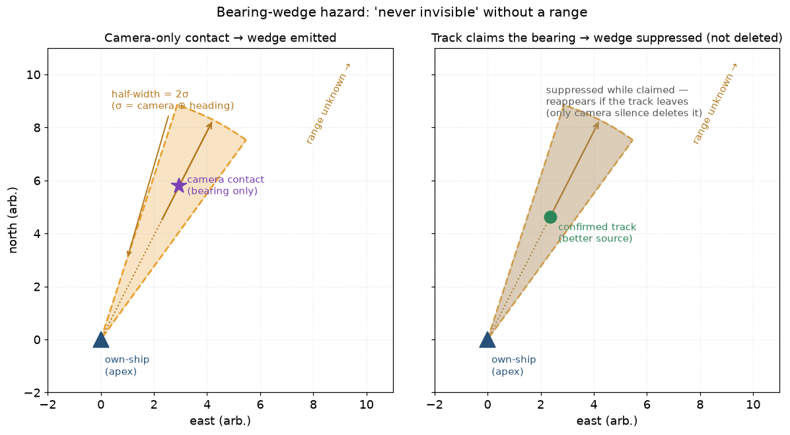
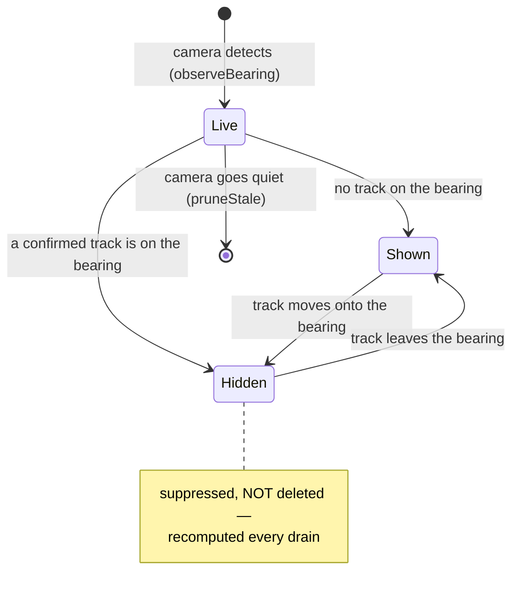

# 28 · The bearing-wedge hazard: "never invisible" without a range

## The problem in one picture

Some boats are too small for radar — a kayak, a wooden dinghy. The **camera**
sees them, but a camera alone gives only a **direction** (a *bearing*), not a
distance. One direction is not enough to place a dot on the map. So the tracker
cannot start a track for that boat.

Our golden rule (ADR 0002) says: *every real object must show up as **something**
— a vessel track or a hazard — never as nothing.* A camera-only boat that becomes
nothing breaks the rule in the worst way. It is right there, and the screen is
blank.

The clean fix is a **range sensor** on the camera (distance + direction = a
position, done). This chapter is the **safety net** for when there is no range:
if we cannot say *where* the boat is, we can still say *which way* it lies.

## The idea: draw the direction, not the point

We draw a **wedge** — a slice of pie — starting at own-ship and opening along the
detection bearing:

- **Apex** = own-ship, where the camera is.
- **Centre line** = the measured bearing.
- **Half-width** = how unsure we are of the angle (more on this below).
- **Length** = usually *unknown* (the wedge is open-ended), because we have no
  range. That is the whole point.

The operator reads it as **"keep clear of that line."** You cannot compute a CPA
(Closest Point of Approach) for a wedge — CPA needs a position and a speed, and a
wedge has neither. That is fine: a direction is still actionable.

## How wide is the wedge?

The half-width is `2 × σ`, where `σ` is how uncertain the bearing is. Two things
add to that uncertainty, and you must include **both**:

- the **camera's** own angle error, and
- the **own-ship heading** error — because the bearing we feed is *relative
  bearing + heading*. If the ship's heading is off by a degree, so is the
  bearing.

So `σ = σ_camera ⊕ σ_heading` (added in quadrature — the "⊕"). On our calibrated
camera the typical error was about 0.45°, but the *bad* frames reached 1.32°. To
stop an over-optimistic σ from drawing a needle-thin wedge, we also apply a
**floor** (a minimum half-width, ~1.5°). A slightly-too-wide wedge is safe; a
too-thin one can miss the boat.

## Handover: when a real track takes over

Later, a better sensor (radar, or the camera plus a range unit) may start a real
track on that same bearing. Now the wedge is redundant — the boat has a proper
dot. So we **hand over**: while a confirmed track sits inside the wedge's angle,
we **hide** the wedge.

The subtle part — and the easy bug — is *how* we hide it. We do **not** delete it.

> **Why not delete?** Imagine a near ferry crossing *in front of* a far
> camera-only kayak. For a moment the ferry sits on the kayak's bearing and would
> "claim" the wedge. If we deleted the wedge, the ferry sails on — and the kayak,
> which the camera still sees, is now **nothing** on the screen. That is exactly
> the forbidden failure.

So instead: we **recompute** the claim every time we draw the output. If a track
is on the bearing right now, the wedge is suppressed *this frame only*. The moment
the track moves off the bearing, the wedge comes straight back — no memory, no
state machine. The wedge is only truly removed when the **camera stops seeing the
contact** (it goes stale). Presence beats absence.

This is the same shape as the occupancy layer's corroboration veto (chapter 27):
suppression is *recomputed*, never *latched*.

## Keeping the same contact's identity honest

Each wedge has a stable id, so the display can follow one contact over time. The
camera's own contact number is *not* reliable for this: cameras reuse a number
after they lose and re-find a target. So if a number goes quiet and later comes
back, we treat it as a **new** contact and give it a **new** wedge id — we never
resurrect a dead one. (If increment 3's swap-suspicion flag is set, we bump the id
immediately, without even waiting for the gap.)

## What this is and is not

- It **is** a safety net: direction-only presence for a target we cannot place.
- It is **not** a position, a velocity, or a CPA.
- It is **standalone** for now: something feeds it the camera bearings and the
  current track list each cycle. Wiring it straight into the tracker is the next
  step.

The precise reference — equations, the claim test, the anchor-frame datum
handling — is in
[`docs/algorithms/bearing-wedge-hazard.md`](../algorithms/bearing-wedge-hazard.md).
The two richer camera options (waterline range; range-parameterised bearing-only
initiation) are in backlog #17.
