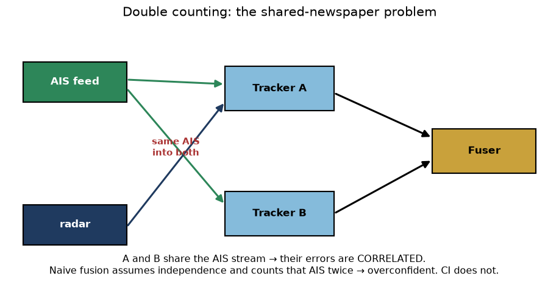
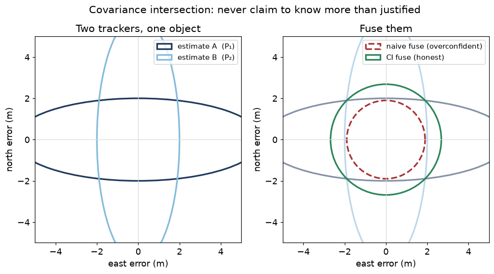

# 29. Fusing trackers: track-to-track fusion and covariance intersection

So far every chapter turned **raw sensor readings** into tracks. This
chapter is different. Here the *inputs are already tracks* — made by
**other tracking systems** — and we want to merge them into one
agreed picture. This is **track-to-track fusion** (T2T for short).

Why would you have tracks from other trackers? Because a real ship
often carries more than one system: its own radar tracker, an AIS
receiver's tracker, maybe a partner vessel's feed. Each hands you
*its* set of tracks. You want **one** authoritative set, not three
overlapping ones.

The hard part is not the merging. It is that **you usually do not
know what those other trackers used to make their tracks.** Two of
them may have quietly used the *same* AIS receiver. If you forget
that, you will fool yourself. This chapter is about not fooling
yourself.

## The shared-newspaper problem (double counting)

Imagine you want to know if it will rain tomorrow. You ask two
friends. Both say "yes, 90% sure." Two independent opinions agreeing
should make you *more* sure than either one alone — that is the whole
point of asking two people.

But now suppose both friends read the **same** weather forecast in the
**same** newspaper this morning. They are not two opinions. They are
one opinion, repeated. If you treat them as independent and get
*extra* confident, you are **double counting** the newspaper.

Trackers do the same thing. If tracker A and tracker B both fused the
**same AIS stream**, their track errors move together — they are
**correlated**. Merging them as if they were independent makes the
result look far more certain than it really is. That is the single
biggest trap in track-to-track fusion.



The picture shows it: the AIS feed goes into **both** trackers. So A
and B are partly the same information wearing two hats.

## Why "I don't know" has to be a real answer

The honest fix would be to ask each tracker: *which sensors did you
use?* We call that answer a **pedigree**. For each sensor stream, a
tracker can say one of three things:

- **Used** — "I fused this stream."
- **Not used** — "I did not touch this stream."
- **Unknown** — "I cannot tell you."

That third answer is not a cop-out. It is the truth for most
real-world feeds, and it must be **first class**. Here is why. If we
secretly rewrote "unknown" as "not used," we would happily merge two
trackers as independent — and double count whenever we were wrong. If
we rewrote "unknown" as "used," we could never take advantage of two
genuinely independent trackers. Both rewrites are lies with opposite
costs. So we keep **Unknown** as its own answer, and — this is the key
design choice — **when in doubt, we fuse the safe way anyway.** A
missing pedigree is treated exactly like all-Unknown.

## Covariance intersection: never claim to know more than your most careful friend

We need a merge rule that is **safe even when we do not know the
correlation.** That rule is **covariance intersection (CI)**.

Recall (chapter 4) that a track carries a mean `x` (best guess) and a
covariance `P` (how unsure it is — a bigger `P` is a bigger cloud of
doubt). We work with the **information form**, `P⁻¹`, which you can
read as "how much I *know*." CI blends the two knowledges with a single
weight `ω` between 0 and 1:

```
P_f⁻¹ = ω · P₁⁻¹ + (1 − ω) · P₂⁻¹
x_f   = P_f · ( ω · P₁⁻¹ · x₁ + (1 − ω) · P₂⁻¹ · x₂ )
```

In plain words: **CI takes a weighted average of the two knowledges,
and the weights add up to one.** The naive (independence-assuming)
merge instead *adds* the two knowledges (`P₁⁻¹ + P₂⁻¹`), with no
weights holding it back. Adding is where the double counting sneaks
in: if both inputs are the same newspaper, adding counts it twice.

Because CI's weights sum to one, the fused knowledge is never larger
than what a careful blend justifies. Put the other way round: **CI
never claims to know more than a weighted mix of its two inputs.** It
is the mathematical version of "I will not be more confident than my
most careful friend."

We pick `ω` to make the fused cloud of doubt as small as we honestly
can — we minimise the *size* of `P_f` (its trace). The search is a few
fixed steps so that replaying the same log always gives the same
answer (determinism, chapter 10).



Read the figure left to right. On the **left**, two trackers describe
the same object: A is sure north–south but unsure east–west; B is the
opposite. On the **right** we merge them. The **red dashed** ellipse is
the naive merge — tiny, because it added both knowledges. If A and B
secretly shared a sensor, that tiny ellipse is a **lie**: the true
error is much bigger. The **green** ellipse is CI — larger, and *honest
whatever the correlation.* When we truly do not know what the other
trackers shared, honest-but-loose beats tight-but-wrong every time.

## What the fuser actually does

Each cycle the fuser:

1. **lines the inputs up in time** (predict each source's track forward
   to the current instant, chapter 8);
2. **decides which input tracks are the same object** — track-to-track
   association, using a gate and the Hungarian assignment (chapter 11),
   with the pedigree's MMSI used only as a *soft* nudge, never as the
   key (kinematics always win);
3. **fuses each matched group with CI**;
4. **keeps a stable fused identity** — the fused track gets its own id
   that never changes and is never reused, independent of the source
   tracks' ids (this is the stable-identity invariant, one level up);
5. **runs a lifecycle** — a fused track is born, confirmed, coasts when
   its sources go quiet, and is deleted after they stay quiet too long.

Point (4) matters: if AIS drops out for a minute and comes back, the
fused track keeps its identity — the operator does not see a "new"
vessel appear where the old one was.

## Pedigree changes the *label*, not the *math* (in v1)

An important honesty note. In this first version, the pedigree only
sets a **diagnostic label** on the fused track — `ProvablyIndependent`,
`PossiblyCorrelated`, or `SingleSource`. It does **not** change the
fusion arithmetic: we always use CI, because CI is safe in every case.
The label tells a future, tighter rule *where it would be allowed* to
do better — but that rule only ships with measured proof (see the
"ways to improve" section of the reference doc).

## What CI does and does not protect you from

CI protects you from **not knowing the correlation** between two
trackers. That was the design goal, and it delivers it.

CI does **not** protect you from a tracker that is simply **wrong and
confident** — one that reports a position off by 150 m while claiming
5 m of accuracy. CI will still be pulled toward that bad input (though
it stays less over-confident about the result than the naive merge
would). Defending against a lying-confident source is a *different*
job — watching each source's recent errors and de-weighting the ones
that look implausible — and it is listed as future work, not claimed
here. Being clear about what a method does *not* do is part of using
it safely.

## Where to go next

- The precise reference — exact equations, assumptions, the `ω`
  search, the association math, and the full "ways to improve" list —
  is [`docs/algorithms/t2t-fusion.md`](../algorithms/t2t-fusion.md).
- If you are *wiring* this into your own system (feeding in other
  trackers' tracks, declaring pedigrees, draining fused output), see
  the "You have tracks from other trackers" section of
  [`docs/integration-guide.md`](../integration-guide.md).
- Related concepts already covered: the Kalman covariance
  (chapter 4), gating and Hungarian assignment (chapter 11), track
  lifecycle (chapter 15), and consistency checking with NEES
  (chapter 16) — which is exactly how we *measured* that CI stays
  honest while the naive merge does not.
